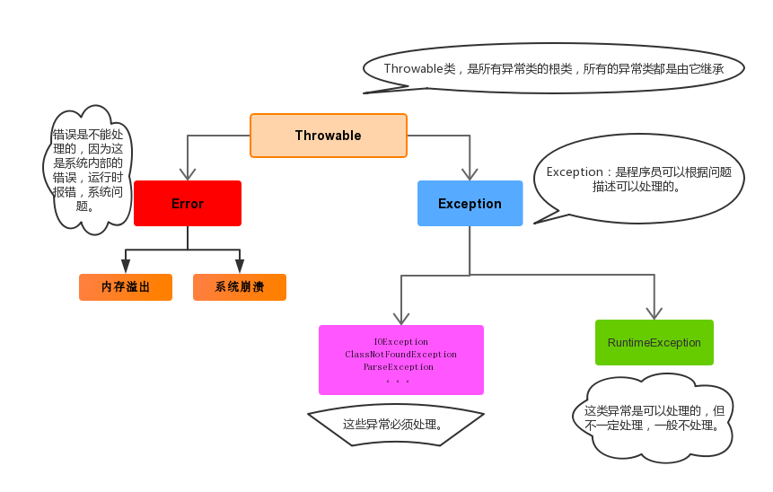

## JavaSE复习笔记

# 第一章 Java概述

## 一、计算机语言

1. 机器语言
2. 汇编语言
3. 高级语言

## 二、Java语言的跨平台性（移植性）

### 1、跨平台性

在一台计算机上开发的java程序可以在任意架构的计算机系统上直接运行

### 2、如何实现跨平台？

借助JVM实现跨平台，java程序实际上是运行在不同系统上安装的jvm上


## 三、JDK、JRE和JVM之间关系

1. JDK：Java开发工具集，包含JRE和一些开发工具，比如java.exe,javac.exe等
2. JRE：Java运行时环境，包含JVM和一些核心类库
3. JVM：Java虚拟机

## 四、搭建开发环境

1. 下载JDK

2. 安装JDK

3. 配置环境变量

   配置环境变量的目的是在任意目录下可以直接使用java,javac等命令

   推荐使用JAVA_HOME方式配置。

4. 测试

   javac   或 java -version 

## 五、Java程序开发步骤

1. 编写源代码，保存为后缀为.java的源文件

2. 编译源文件产生后缀为.class的字节码文件

3. 运行字节码文件产生结果

   


# 第二章 Java基础语法

## 一、注释

给程序员看的对代码的解释说明性文字

1. 单行注释：//注释内容
2. 多行注释：/*  注释内容*/
3. 文档注释:   /\**  注释内容*/

## 二、关键字

Java赋予了特殊含义的一些单词或字符串，比如public ,static,void ,class等

- 保留字：const，goto
- 特殊值：true，false，null

关键字，保留字和特殊值共同的特点：都是小写字母组成，有特殊含义，不能随意使用。


### 三、标识符

给变量、类、接口等等起名字用的字符序列都是标识符

#### 1、命名规则（必须遵守）

1. 由大小写字母、数字、下划线_和美元符号$组成
2. 不能由数字开头
3. 不能使用关键字保留字和特殊值

#### 2、命名规范（建议遵守）

（1）见名知意

（2）类名、接口名等：每个单词的首字母都大写（大驼峰法则），形式：XxxYyyZzz，

例如：HelloWorld，String，System等

（3）变量、方法名等：从第二个单词开始首字母大写（小驼峰法则），其余字母小写，形式：xxxYyyZzz，

例如：age,name,bookName,main

（4）包名等：每一个单词都小写，单词之间使用点.分割，形式：xxx.yyy.zzz，

例如：java.lang

（5）常量名等：每一个单词都大写，单词之间使用下划线_分割，形式：XXX_YYY_ZZZ，

例如：MAX_VALUE,PI


### 四、字面量

**字面量是基本数据类型、String类型、null类型的值在源代码中的一种表示形式。比如：字面量10表示整数十，"hello"表示文本字符串”hello"**。

字面量表示的数据值在编译时就可以确定，并且在程序执行的过程中其值不可以发生改变。也称为**字面值**，**字面常量**。

|  字面量分类  |           举例           |
| :----------: | :----------------------: |
| 字符串字面量 |  "HelloWorld"，""，"a"   |
|  整数字面量  | 12，-23，123_456，12345L |
|  浮点字面量  |    1.2，3.45F，-10.5D    |
|  字符字面量  |   'a'，'A'，'0'，'好'    |
|  布尔字面量  |       true，false        |
|  空值字面量  |           null           |

## 五、变量

### 1、 变量的作用

用于存储一个数据

### 2、变量的三要素

数据类型，变量名，值

### 3、变量的声明与赋值

1. 声明的同时赋值

   ```java
   String name = "tom";
   int age = 18;
   ```

2. 先声明再赋值

   ```java
   char gender;
   gender = '男';
   gender = '女';
   ```

   

3. 同时声明多个同类型变量的简化写法

   ```java
   int a,b,c=3;
   ```

   

### 4、变量的使用注意事项

1. 变量必须先声明才能使用
2. 变量必须有初始值才能使用
3. 变量有作用域，其范围是声明变量所在的括号内
4. 同一个范围内，不能声明多个同名变量

## 六、最终变量、常量

定义的变量使用final修饰，就是最终变量，其特点是只能赋值一次，一旦赋值不可修改，所以也称为常量。

```java
final int VALUE = 123;
VALUE = 456;//失败，不可重新赋值。
```

## 七、计算机如何存储不同类型的数据（理解）

### 1、进制

1. 十进制
2. 二进制
3. 八进制
4. 十六进制

### 2、计算机存储容量单位

- **字节（Byte）：**是计算机信息技术用于计量存储容量的一种计量单位，1字节等于8位。

- **位（bit）：**是数据存储的最小单位，也就是一个二进制位。其中8 bit(比特) 就称为1个字节(Byte)。

- **转换关系：**

  8 bit = 1 Byte

  1024 Byte = 1 KB

  1024 KB = 1 MB

  1024 MB = 1 GB

  1024 GB = 1 TB

### 3、不同类型数据的存储

1. 整数的存储

   存储的是二进制补码形式，要知道补码必须先求出原码和反码

   原码：最高位为符号位，0表示正数，1表示负数，其他位数值位，按照进制转换直接转换而来。

   反码：正数反码和原码一致，负数的反码是其原码基础上，符号位不变，其他位按位取反，0变1,1变0.

   补码：正数的补码与原码一致，负数的补码是在其反码基础上+1

2. 小数的存储

   float和double存储的小数是近似值

   同样字节数存储小数的范围要大于存储整数的范围。

3. 字符的存储

   借助字符集编码表来存储字符，Java的字符char类型支持的是Unicode编码表。

   ASCII码表

   Java字符的表示形式：

   - 使用单引号：'a','中'
   - 使用转义字符\  : '\\''
   - 使用\u+Unicode编码值的十六进制（了解）

   

## 八、基本数据类型

四类八种：

- **整数字面常量值默认都是int类型**，占用4个字节空间。
  - 语法上可以直接把一个byte范围内的整数常量值直接赋给byte类型变量。short，char同理。byte b = 10;

  - 整数常量值后加后缀L表示long类型数值，如果整数常量值的范围超过int范围必须加后缀L才能正确表示为long数值，否则编译报错。

- **小数字面常量值默认都是double类型**，只有在其后F，才表示是float类型数值。
  - 可以在整数或小数值后加D或F分别表示double类型数值和float类型数值。

### 1、基本数据类型转换

除布尔类型外的七种数值类型之间可以相互转换。自动转换和强制转换


### 2、自动类型转换

1. 数值范围小的类型转换为数值范围大的类型会发生自动转换

   ```java
   int a = 'a'; 
   double b = a;
   ```

2. 不同类型之间混合运算时会发生自动转换，全部转换为其中最大的类型

   ```java
   byte a = 1;
   int b = 2;
   double c = 3;
   
   double d = a+b+c;
   ```

3. byte、short和char混合与运算时，全部转换为int类型再运算

   ```java
   byte a = 1;
   byte b = 2;
   int c = a+b;
   ```

### 3、强制类型转换

语法形式：**（目标类型）变量或值**

1. 数值范围的类型转换为数值范围小的类型,必须进行强制转换

   ```java
   int a = (int)12.345;
   char c = (int)a;
   
   int b = 128;
   byte d = (byte)b;//-128
   ```

2. 强制类型提升

   ```java
   int i=1;
   int j=2;
   double x = (double)i/j;
   ```

3. 注意：强制类型转换有风险，不要随意使用


## 九、运算符

### 1、运算符分类

|       分类       |                运算符                 |
| :--------------: | :-----------------------------------: |
|    算术运算符    |  `+`、`-`、`*`、`/`、`%`、`++`、`--`  |
|    赋值运算符    |  `=`、`+=`、`-=`、`*=`、`/=`、`%=`等  |
|    关系运算符    |   `>`、`>=`、`<`、`<=`、`==`、`!=`    |
|    逻辑运算符    |    `&`、`|`、`^`、`!`、`&&`、`||`     |
|    条件运算符    |     `(条件表达式)?结果1:结果2；`      |
| 位运算符（了解） | `&`、`|`、`~`、`^`、`<<`、`>>`、`>>>` |

### 2、算术运算符

`+`、`-`、`*`、`/`、`%`、`++`、`--`

自增自减运算符：自增++，自减--  是单目运算符

作用：使操作数自己增加1，或自己减少1

使用方式：可以用在操作数前和操作数后

1. 单独使用时：前置和后置效果相同

   ```java
   int a = 10;
   a++;
   ++a;
   ```

2. 组合使用时:前置和后置效果不同

   - 前置自增自减:先自增自减，再取值

     ```java
     int a = 10;
     int b = ++a;
     System.out.println(a);//11
     System.out.println(b);//11
     ```

   - 后置自增自减

     ```java
     int a = 10;
     int b = a++;
     System.out.println(a);//11
     System.out.println(b);//10
     ```


### 3、赋值运算符

`=`、`+=`、`-=`、`*=`、`/=`、`%=`等  

运算符的左边一定是变量。扩展运算符底层有强制转换

```java
byte a = 127;
//a = a + 1;//编译失败
a += 1;
a = (byte)(a+1);
System.out.println(a);//-128
```

### 4、关系运算符、比较运算符

`>`、`>=`、`<`、`<=`、`==`、`!=`

关系运算符的结果一定是boolean类型

```java
String s = "abc";
String s2 = "Abc";
boolean b = s.equals(s2);//比较两个字符串是否相等
```

### 5、逻辑运算符

`&`、`|`、`^`、`!`、`&&`、`||`

特点：逻辑运算符的操作数是booelan类型，运算结果也是boolean类型

1. 逻辑与&：并且的意思，两边都为真，结果才为真。
2. 逻辑或|：或这的意思，一边为真，结果就为真。
3. 异或^：两边相同结果为假，两边不同结果为真。
4. 非!：取反的意思，真变假，假变真

**双与&&，双或||与单与单或的比较：**

- 相同点：
  - 执行最终的结果双与、单与一样，双或、单或一样。
- 区别：
  - 单与，单或运算符左右两边一定都会执行。
  - 双与、双或执行时，如果通过运算符左边可以判断出最终结果，那么右边不再执行，效率高，推荐使用。

### 6、条件运算符

1. 语法格式：

   **`(条件表达式) ? 结果1 : 结果2;`**

2. 执行流程：

   条件表达式结果为true，最终结果为结果1，否则为结果2

3. 特点：

   冒号两边的结果会自动转换为同一类型。

### 7、位运算符（了解）

`&`、`|`、`~`、`^`、`<<`、`>>`、`>>>`

按照对应二进制位进行运算的运算符。

- `<<`左移： 一个数左移n位，结果为这个数乘以2的n次幂

- `>>`右移：一个数右移n位，结果为这个数除以2的n次幂，除不尽向下取整，右移时，最高为是0补0，是1补1.

- `>>>`无符号右移：右移时，最高为永远补0. 即，结果一定是正数。

注意：位运算符运算效率高

右移n位运算超过了数据类型所占位数m，按照n%m位移运算


## 十、键盘录入Scanner

java.util.Scanner用于从键盘读取数据。

使用步骤：

```java
//1.导包，在类之前
import java.util.Scanner;
public class Demo{
    public static void main(String[] args){
      //2.创建扫描器  
       Scanner sc = new Scanner(System.in);
       //3.提示信息
       System.out.println("请输入数据：");
       //4.接收键盘录入的数据
       int a =  sc.nextInt();//接收一个int整数       
       System.out.println(a);
       String s = sc.next();//接收一个字符串，遇到空白字符结束
       String s2 = sc.nextLine();//接收一行字符串，遇到回车键结束。注意此句会接受之前输入的回车键
       //5.关闭扫描器
       sc.close();    
    }
}

```


# 第三章  流程控制

## 一、流程控制语句结构

1. 顺序结构：代码自上而下顺序执行。
2. 分支结构：根据条件执行某些特定代码
3. 循环结构：根据条件重复执行某些特定代码

## 二、分支结构语句if

### 1、格式一

```java
if(条件表达式){
    语句块;
}
//执行流程：如果表达式结果为true才会执行其后大括号内的代码
```

### 2、格式二

```java
if(关系表达式) { 
  	语句体1;
}else {
  	语句体2;
}
//执行流程：如果表达式结果为true执行其后大括号内的代码块1，否则else后执行大括号内的代码块2
```

### 3、格式三

```java
if (判断条件1) {
  	执行语句1;
} else if (判断条件2) {
  	执行语句2;
}
...
}else if (判断条件n) {
 	执行语句n;
}【 else {
  	执行语句n+1;
}】
   //执行流程：条件表达式为true执行其后代码块结束，如果为false才会继续判断下一个条件表达式，如果都为false那么执行else语句块
```

### 4、if的嵌套使用

在if的语句块中，或者是在else语句块中，
又包含了另外一个条件判断（可以是单分支、双分支、多分支）

执行的特点：
（1）如果是嵌套在if语句块中的
只有当外部的if条件满足，才会去判断内部的条件
（2）如果是嵌套在else语句块中的
只有当外部的if条件不满足，进入else后，才会去判断内部的条件


## 三、选择结构语句switch

### 1、语法格式

```java
switch(表达式){
    case 常量值1:
        语句块1;
        【break;】
    case 常量值2:
        语句块2;
        【break;】  
    ...
   	default:
        语句块n+1;
        【break;】  
}
```

### 2、执行流程

小括号内表达式与case后的常量值匹配时，执行其后语句块，如果都不匹配执行default分支。执行完case后语句块如果有break结束switch语句否则继续执行下一个case后语句。

### 3、使用注意事项：

1. 小括号内的表达式结果类型必须是以下类型之一：byte、short、int、char，枚举，String
2. case后必须是常量，并且不能重复
3. break用于跳出switch语句，如果没有break会继续执行下一个分支内语句块。
4. default分支是可选的，位置任意，当所有case值不匹配时执行default分支。

### 4、if和switch比较

- if语句的条件是一个布尔类型值，通常根据某个判断结果进入分支，使用范围更广。
- switch语句的条件是一个常量值（byte,short,int,char,枚举,String），一般条件是几个固定的常量值时使用switch语句。
- 如果根据进入分支的条件是几个固定的常量值，这时使用if和switch都可以，如果条件选项比较多时，适合使用switch语句（效率高）。

比如：当条件是x>0时，进入某分支执行代码，这时适合使用if语句，不适合使用switch语句。

## 四、循环语句

### 1、for循环

```java
   for(初始化语句①; 循环条件语句②; 迭代语句④){
   		循环体语句③
   }
//执行流程：1234 234 234 ... 2
```

```java
for(int i=0;i<5;i++){
    System.out.println(i);
}
//01234
```


### 2、while循环

```java
while (循环条件语句①) {
    循环体语句②；
}
//执行流程：12 12 12... 1
```

```java
int i=0;
while(i<5){
    System.out.println(i);
    i++;
}
//01234
```


### 3、do while循环

```java
do {
    循环体语句①；
} while (循环条件语句②);
//执行流程：12 12 12 ...2
   
```

```java
int i = 0;
do{
    System.out.println(i);
    i++;
}while(i<5);
//01234
```

### 4、循环语句比较

1. **从循环次数角度分析**

- do...while循环至少执行一次循环体语句

- for和while循环先判断循环条件语句是否成立，然后决定是否执行循环体，至少执行零次循环体语句

3. **如何选择**

   - 遍历有明显的循环次数（范围）的需求，选择for循环

   - 遍历没有明显的循环次数（范围）的需求，循环while循环

   - 如果循环体语句块至少执行一次，可以考虑使用do...while循环

   - 本质上：三种循环之间是可以互相转换的，都能实现循环的功能

4. **三种循环结构都具有四要素：**

- （1）循环变量的初始化表达式

- （2）循环条件

- （3）循环变量的修改的迭代表达式

- （4）循环体语句块


### 5、死循环

语法格式：

```java
while(true){
    //循环体
}

for(;;){
    //循环体
}

```

### 6、循环嵌套

一个循环内嵌套了另一个循结构

```java
for(int i=0;i<5;i++){
    for(int j=0;j<5;j++){
        System.out.print("*");
    }
    System.out.println();//换行
}
```

## 五、break和continue关键字

### 1、break关键字的应用场景与作用

1. 用在switch语句中，用于跳出switch语句
2. 用在循环体中，用于跳出当前循环体

### 2、continue关键字的应用场景与作用

1. 用在循环体中，用于跳出本次循环，即执行了continue不再执行本次循环剩余代码继续执行下一次循环

```java
for(int i=0;i<5;i++){
    if(i==2)
        break;//跳出循环体
    System.out.pritnln(i);
}
//01
```

```java
for(int i=0;i<5;i++){
    if(i==2)
        continue;//跳出本次循环
    System.out.pritnln(i);
}
//0134
```


# 第四章 数组

## 一、数组概述

### 1、数组相关概念

1. 数组：数据容器，用于存储多个同类型的数据

2. 数组名：也是变量名，属于标识符，用于访问数组

3. 数组的元素：数组中存储的数据

4. 数组的长度：数组可以存储的元素的个数

5. 数组的索引、脚标、下标：是从0开始的编号，用于访问数组的元素

   

### 2、数组的特点

1. 数组一旦创建长度不可改变
2. 数组是一块连续的内存空间，数组名中存储的是数组的内存首地址
3. 数组可以通过索引快速访问元素
4. 数组可以存储基本数据类型的元素，也可以存储引用数据类型的元素。

## 二、数组的声明和初始化

### 1、数组声明

**数据类型[]  数组名;**

```java
String[] names;
int[] ages;
```

### 2、数组初始化

数组初始化即在内存中开辟空间创建数组，数组初始化时会确定数组的长度和元素初始值。

1. **静态初始化**：我们指定了元素的初始值，长度由系统觉得

   **数据类型[]  数组名 = new 数据类型[]{元素1，元素2，....};**

   **数据类型[]  数组名 = {元素1，元素2，....};**

   ```java
   String[] names = new String[]{"tom","jack","rose"};
   int[] ages = {18,19,20};
   ```

2. **动态初始化**：我们指定了数组的长度，元素初始值由系统给出（元素默认初始值）

   **数据类型[]  数组名 = new 数据类型[长度]**

   ```java
   String[] names = new String[5];
   int[] ages = new int[3];
   ```


## 三、数组元素的访问与数组遍历

### 1、数组元素的访问

通过数组名加索引的方式访问数组的元素

1. 获取数组元素：数组名[索引]

   ```java\
   int[] arr ={11,22,33};
   System.out.println(arr[0]);
   int num = arr[1];
   ```

2. 给数组元素赋值（设置修改值）:数组名[索引] =  元素值

   ```java
   int[] arr = new int[3];
   arr[0] = 11;
   arr[1] = 22;
   ```

### 2、获取数组的长度

**数组名.length**

```java
int[] arr = new int[3];
int len = arr.length;
System.out.prinltn(len);//3
```

### 3、数组的遍历

逐个获取数组的每个元素

```java
int[] arr ={11,22,33};

for(int i=0;i<arr.length;i++){
    System.out.prinltn(arr[i]);
}
```

## 四、数组元素的默认初始值与数组的内存分析

### 1、数组的元素默认初始值

当动态初始化数组时，我们只是指定了数组的长度，数组元素初始值是由系统给出，即数组元素的默认初始值。不同类型的元素默认初始值不同。


### 2、数组的内存分析


## 五、数组的相关算法

### 1、统计相关算法：

- 累加求和，统计元素个数，求平均值等

### 2、查找相关算法

- 查找最大、最小值，及其位置
- 查找指定的目标元素及其位置
  - 顺序查找法
  - 二分查找法：前提数组元素是已经排序

### 3、排序相关算法

- 冒泡排序：两两相邻的元素比较大小，大的交换到后面，每轮确定一个最大元素到最后位置，依次进行多轮比较。
- 直接选择排序：每轮查找一个最小元素与本轮第一个元素交换位置，依次进行多轮比较。
- 快速排序：

## 六、二维数组（理解）

### 1、概念理解：本质上是元素为一维数组的数组。

### 2、二维数组的声明

```java
数据类型[][] 数组名;
```

```java
int[][] arr;
```

### 3、二维数组初始化

1. 静态初始化

```java
数据类型[][] 数组名 = new 数据类型[][]{{元素1,元素2,...},{元素1,元素2,...},....};
数据类型[][] 数组名 = {{元素1,元素2,...},{元素1,元素2,...},....};//简化写法
```

```java
int[][] arr = {{1,2,3},{4,5},{6}};
```


2. 动态初始化

   ```java
   数据类型[][] 数组名 = new 数据类型[m][n];//m表示二维数组的长度，n表示其中每个一维数组的长度
   数据类型[][] 数组名 = new 数据类型[m][];//m表示二维数组的长度，其中每个一维数组未初始化
   ```

   ```java
   int[][] arr = new int[3][2];
   int[][] arr = new int[3][];
   
   ```

   

#### 4、二维数组的元素的访问

通过数组名和索引组合的方式访问数组元素

```java
int[][] arr = {{1,2,3},{4,5},{6}};
System.out.println(arr[0][0]);//1
System.out.println(arr[1][1]);//5
arr[2][0] = 10;//给元素赋值
```


# 第五章 方法

## 一、方法概述

### 1、方法的概念：

也称为函数，是一个特定功能的代码块，把功能封装到方法中的目的是重复利用代码，简化了代码，提高了可读性，可维护性。

### 2、方法的分类：

1. 静态方法-类方法：有static关键字修饰，通常使用类名来调用方法。
2. 非静态方法-实例方法：没有static修饰的方法，必须通过对象来调用方法。

## 二、方法的声明与调用

### 1、方法的声明

1. 语法格式：

   ```java
   【修饰符】返回值类型 方法名(【参数列表】)【异常列表】{
       方法体;
       【return 返回值】    
   }
   ```

2. 格式说明：

   - 方法可以分为两部分：头部和方法体
   - 修饰符：可以是public、static等后面讲
   - 返回值类型：表示方法执行完后返回的数据的类型。如果方法无需返回任何数据这里使用void。
   - 方法名：属于标识符符合标识符的命名规则和规范。用于访问方法定义的功能。
   - 参数列表：表示使用方法时给方法传递的数据的个数、类型以及顺序。
   - 5.异常列表：后面讲
   - 6.方法体：实现功能的代码
   - 7.return关键字：①结束方法②返回数据：执行完方法后需要返回的数据，其类型必须与方法声明上返回值类型一致

3. 注意：方法必须直接声明在类中，方法的声明不能嵌套，即一个方法内不能声明另一个方法，多个方法的声明是并列关系。

4. 示例：

   ```java
   public class MyTools{
       
       //1.无参数，无返回值方法
       public static  void hello(){
           System.out.pintln("hello。。。");
       }
        //2.有参数无返回值方法：打印矩形
       public static void printRectangle(int n) {
           for (int i = 0; i < n; i++) {
               for (int j = 0; j < n; j++) {
                   System.out.print("*");
               }
               System.out.println();//换行
           }
       }
       //3.无参有返回值方法:返回[1,100]的随机整数
       public static int getRandom() {
             return (int) (Math.random() * 100) + 1;;
       }
       
       //4.有参有返回值的方法：求两个整数和
       static int getSum(int a, int b) {    
           return a + b;
       }
       
   }
   ```

### 2、方法的调用

调用方式：**类名.方法名(【实参列表】)**

方法调用注意事项：

* 方法不调用不执行，调用一次执行一次。
* 实参列表必须与形参列表保持一致
* **形参与实参**
  * 形参：是指声明在方法上的参数
  * 实参：是调用方法时传递的实际参数
* 方法有返回值可以使用变量接收或直接处理，否则返回值将丢失。
* 如果方法没有返回值，不能使用变量接收也不能直接处理

```java
public class Demo4InvokeMethod {
    public static void main(String[] args) {
        //1.
        MyTools.hello();
        //2.
        MyTools.printRectangle(5);
        //3.
       int num =  MyTools.getRandom();
		System.out.println(num);
        //4.
        int sum = MyTools.getSum(11,22);
        System.out.println(sum);
        System.out.println(getSum(1,2));
    }
}
```

### 3、方法调用内存分析


## 三、方法重载（Overload）

### 1、概念理解

方法重载：同一个类中，方法名相同，参数列表不同的情况。参数列表不同指的是参数的个数、类型或顺序不同。

### 2、代码示例

```java
public class MyClass{
    void show(){}
    int show(int a,String s){}
    int show(String a,int b){}
    void show(int x){}
    
}
```


## 四、方法的可变参数

当一个方法的参数是同一种类型，并且个数可以是任意个时，我们可以它声明为可变参数。

语法格式：**数据类型... 参数名**

```java
public class MyClass{
    //可变参数int... arr ：表示实参可以是0个或多个int值。
    public static int sum(String s,int... arr){//底层会创建一个int数组
        System.out.println(arr);//这是一个数组
    }
}
```

可变参数的使用注意事项：

1. 一个方法最多只能有一个可变参数，
2. 如果方法有可变参数也有其他参数，可变参数必须是最后一个
3. 方法的形参为可变参数，实参可以是任意个同类型的数据值，也可以是同类型的数组
4. 方法的可变参底层会创建一个同类型的数组。

## 五、参数值传递机制

方法的参数传递机制：Java中方法只有值传递，形参为基本数据类型传递的是数据值，形参为引用数据类型传递是地址值。

- 形参为基本数据类型，形参的改变不会影响实参。
- 形参为引用数据类型，形参的改变可能会影响实参。
- 形参为String类型或包装类类型都是引用数据类型，形参的改变不会影响实参。


## 六、方法递归

* **递归：指在当前方法内调用自己的这种现象。**
* **递归的分类:递归分为两种，直接递归和间接递归。**
  * **直接递归称为方法自身调用自己。**
  * **间接递归可以A方法调用B方法，B方法调用C方法，C方法调用A方法。**
* **注意事项：**
  * **递归一定要有条件限定，保证递归能够停止下来，否则会发生栈内存溢出。(无穷递归，类似死循环)**
  * **在递归中虽然有限定条件，但是递归次数不能太多。否则也会发生栈内存溢出。**


# 第六章 面向对象（上）

## 一、面向对象概述

1. 概念理解：

   面向对象是一种编程思想：参照现实生活中的事物，把事物通过两个维度描述，属性和功能，在程序中抽象为Java类和对象。

2. 面向对象和面向过程的区别：

   1. 面向对象：我们是指挥者，关注的是类和对象
   2. 面向过程：我们是执行执行者，关注的过程

## 二、类与对象

1. 类的概念

   Java程序中万事万物都可以通过两个维度描述：属性和功能，类是一类具体共同特征的事物的抽象描述。

2. 对象

   对象是指的一个具体的事物

3. 类与对象的关系

   - 类是抽象的，是对象的模板
   - 对象是具体的，是类的实例
   - 通过类来创建对象，这个过程称为实例化

4. 类的定义

   ```java
   【修饰符】 class 类名{
       //属性：成员变量
       //功能：成员方法
   }
   ```

   ```java
   public class Student{
       String name;
       int age;
       
       void study(){
           System.out.println("study。。。");
       }
   }
   ```

5. 对象的创建

   ```java
     类名 对象名 = new 类名();
   ```

   ```java
   new Student();//匿名对象
   
   Student s = new Student();
   s.name = "tom";
   s.age = 18;
   ```

6. 对象的内存分析

   

## 三、包package


### 1、包的作用：

1. 避免类同名的问题。这时类的全名是：包名+类名：比如：oop.Student,oop2.Student
2. 分类管理众多的类。比如：java.lang核心类，java.util工具类，java.net网络编程相关类

可以配合权限修饰符实现访问权限管理。

### 2、 包的声明：

定义在包下的类，必须在类文件第一行使用package关键字声明此类所在的包

比如：package com.atguigu.test01;//声明包,必须在第一行

### 3、跨包使用类的问题：

正常使用一个类需要使用：包名+类名，同一个包下可以省略包名直接使用类名
如果要使用其他包下的类,必须使用包名+类名的方式或者先导包再使用类名
如果使用的是java.lang包下的类无需导包可以直接使用类名,比如java.lang.Math;java.lang.String

### 4、 包名的一般定义规范：

全部小写字母组成，用点隔开
包名+类名尽量做到全球唯一，通常使用公司域名的倒置方式：比如com.atguigu.crm.xxx;com.atguigu.erp.xxx


## 四、实例变量

### 1、 变量的分类

1. 局部变量：定义在方法、构造器等类的局部区域内
2. 成员变量：定义在类的成员位置
   1. 静态变量-类变量：有static修饰
   2. 非静态变量-实例变量：没有static修饰

### 2、实例变量的特点

1. 每个对象独有一份实例变量值
2. 实例变量必须通过对象来访问，对象.实例变量
3. 实例变量有默认初始值，类似数组元素默认初始值

### 3、实例变量内存分析


### 4、实例变量与局部变量的区别

|                  | **实例变量**             | **局部变量**                                                 |
| ---------------- | ------------------------ | ------------------------------------------------------------ |
| **声明的位置**   | 直接声明在类的成员位置   | 声明在方法体中或其他局部区域内（方法声明上，构造方法，代码块等） |
| **修饰符**       | public、private、final等 | 不能使用访问权限修饰符，可以使用final                        |
| **内存加载位置** | 堆                       | 栈                                                           |
| **初始化值**     | 有默认初始化值           | 无默认初始化值                                               |
| **生命周期**     | 同对象的生命周期         | 随着方法的调用而存在，方法调用完毕即消失                     |

## 五、实例方法

### 1、方法的分类

1. 静态方法-类方法：有static修饰，通常使用类名来调用
2. 非静态方法-实例方法：没有static修饰，必须通过对象来调用。

### 2、实例变量的调用

```java
对象.实例方法(【实参列表】)
```

### 3、同一个类内实例变量和实例方法的访问

```java
public class Student{
    Sting name;
    int age;
    
    void show(){
        String name="tom";
        System.out.println(this.name);//this代表当前对象，即谁调用此方法
        System.out.println(name);//访问的是局部变量
        System.out.println(age);//直接调用本类实例变量
    }
    
    void test(){
        show();//直接调用本来的其他实例方法
    }
    
}
```

## 六、封装性

面向对象的三大特征：封装、继承、多态

### 1、封装的理解

把事物内存的细节隐藏起来不让外界轻易访问，以避免出现安全隐患等问题，同时提供对外开放的必要的访问途径。

简单理解就是把该隐藏的隐藏，该暴露的暴露

### 2、类的封装

把类的属性使用private修饰，并提供public修饰的的get和set方法来访问属性值

```java
public class Person {
    //私有的属性
    private String name;
    private int age;
    private char gender;

    //提供公共的getter 和setter
    //使用IDEA模板快速生成：
    // （fn）+alt+insert ->getter and setter->选择属性->ok
    public String getName() {
        return name;
    }

    public void setName(String name) {
        this.name = name;
    }

    public int getAge() {
        return age;
    }

    public void setAge(int age) {
        this.age = age;
    }

    public char getGender() {
        return gender;
    }

    public void setGender(char gender) {
        this.gender = gender;
    }
}
```

## 七、构造器

### 1、构造器的作用：

主要用于在创建对象时直接为实例变量赋值

### 2、语法格式

```
【权限修饰符】 构造器名称(【形参列表】){
     //构造体
}
```

### 3、格式说明

构造器定义在类的成员位置，格式与方法类似，也称为构造方法，也有明显的区别：

1. 构造器的修饰符只能是权限修饰符
2. 构造器没有返回值类型，void也不能用
3. 构造器的名称必须与当前类名相同
4. 构造器也可以重载

### 4、构造器的使用注意事项：

1. 每个类默认自带一个隐藏的空参构造器
2. 一旦显示给出任意一个构造器，默认隐藏的空参构造器不再存在，建议每个类显示给出空参构造器
3. this(【参数】)可以调用本类其他构造器，但是必须在构造体内第一行。注意不要递归调用。

## 八、标准JavaBean

1. 类必须是公共的具体的
2. 属性全部使用private修饰，并提供public的getter和setter
3. 提供空参构造器
4. 实现序列化接口Serializable

```java
public class Student implements Serializable {
    private String name;
    private int age;
    private char gender;
    private double score;

    //构造器：使用IDEA快捷模板
    //alt+insert->constructor->选择属性-》ok
    public Student() {
    }

    public Student(String name) {
        this.name = name;
    }

    public Student(String name, int age, char gender, double score) {
        this.name = name;
        this.age = age;
        this.gender = gender;
        this.score = score;
    }

    //getter and setter

    public String getName() {
        return name;
    }

    public void setName(String name) {
        this.name = name;
    }

    public int getAge() {
        return age;
    }

    public void setAge(int age) {
        this.age = age;
    }

    public char getGender() {
        return gender;
    }

    public void setGender(char gender) {
        this.gender = gender;
    }

    public double getScore() {
        return score;
    }

    public void setScore(double score) {
        this.score = score;
    }
}

```

# 第七章 面向对象（中）

## 一、继承

### 1、概念理解：

java类有父类与子类之分，子类会继承父类的成员变量和方法。

### 2、继承的好处

1. 提高代码的复用性

2. 提高了代码的扩展性

3. 是多态的前提

   弊端：增强类与类之间的耦合度。

### 3、语法格式

先有父类再有子类，在定义子类时使用关键字**extends**确定与父类的继承关系。

```java
【修饰符】 class 子类 extends 父类{
    
}
```

```java
//父类-超类-基类
public class Animal{
   private String name;
    int age;
    void eat(){}
    
    public void getName(){
        return name;
    }
}
//子类-派生类
public class Cat extends 父类{
    
} 


```

### 4、继承的特点

1. 子类会继承父类的所有成员变量，除private修饰的之外可以直接访问，如果要访问私有的成员，可以通过继承父类的public的方法来访问。
2. Java类支持单继承。即一个类只能有一个父类
3. 一个类可以有多个子类
4. Java类支持多层继承，一个类A可以继承B，B可以继承C。

### 5、继承中构造器的特点

1. 子类构造器中可以使用**super(【实参】)**来访问父类的构造器，此句必须构造体内第一行。
2. 每个类的任意构造器中默认自带隐藏的**super()**用于访问父类的空参构造器
3. 构造器中一旦显示给出**super(【实参】)**或者**this(【参数】)**那么默认的**super()**不再存在。
4. **总之，子类任意构造器在执行时一定会先直接或间接访问到父类的某个构造器**。


## 二、四种访问权限修饰符

权限修饰符共有4种，分别为public，protected、缺省、private；权限修饰符可以使得数据在一定范围内可见或者隐藏。

| 修饰符        | 本类 | 本包 | 其他包子类 | 任意位置 |
| ------------- | ---- | ---- | ---------- | -------- |
| **private**   | √    | ×    | ×          | ×        |
| **缺省**      | √    | √    | ×          | ×        |
| **protected** | √    | √    | √          | ×        |
| **public**    | √    | √    | √          | √        |

权限修饰符可以修饰：

外部类：public和缺省

成员变量、成员方法、构造器、成员内部类：public,protected,缺省,private

## 三、方法重写Override

### 1、概念：

子类中定义了与父类相同的方法，通常方法体不同，这就称为方法重写。

具体要求：

1. 子类方法必须与父类方法名称和参数列表完全相同。
2. 子类方法的修饰符权限范围不能比父类的小,范围大小public>protected>缺省>private
3. 子类方法的返回值类型不能比父类的大，这里的大小指的是继承关系：父类>子类
4. 子类声明的异常不能比父类的大（后面异常讲）

我们可以使用@Override注解判断方法是否是重写的方法。

```java
pulbic class Animal{
    public void eat(){
        System.out.println("吃饭");
    }
}

public class Cat extends Animal{
    public void eat(){
        System.out.println("猫吃鱼...");
    }
}
```

### 2、不属于方法重写的情况：

1. 静态方法不属于重写
2. final修饰的方法不能重写
3. private修饰的方法不能重写

可以重写的方法一定都是实例方法，并且子类可以继承。

## 四、this和super关键字

### 一、this关键字

表示当前对象的引用

1. 应用场景
   实例方法、构造器、构造代码块
2. 使用方式
   - this.实例变量/实例方法：表示调用本类内的实例变量和方法
   - this(【实参】)：调用本类内的构造器，必须用在构造体内第一行

### 二、super关键字

super用于访问父类的数据

1. 应用场景
   实例方法、构造器、构造代码块
2. 使用方式：
   - super.实例变量/实例方法：表示调用父类的实例变量和实例方法
   - super(【实参】)：表示调用父类的构造器，必须用在构造体内第一行

### 三、继承关系内存分析


## 五、Object类

java.lang.Object类是所有Java类的超类，即所有的Java类都直接或间接继承自Object类。

1. ```
   1. int hashCode()  返回该对象的哈希码值。Object类的hashCode方法实际返回的是对象的内存地址转换而来的一个整数值。
   ```

2. ```
   2. Class<?> getClass()   返回此对象的运行时类型。
   对象.getClass().getName();//返回对象的运行时类型字符串名称。
   ```

3. ```
   3. String toString()   返回该对象的字符串表示。Object类的此方法返回的是对象的运行时类型名称+“@”+对象的哈希值的十六进制
   建议子类都重写此方法，用于返回对象的属性信息。
   使用输出语句System.out.println()打印对象时，会自动先调用对象的toString方法。
   如何重写？使用IDEA模板alt+insert->toString->选择属性
   ```

4. ```
   4. boolean equals(Object obj) 指示其他某个对象是否与此对象“相等”。
   Object类的此方法默认比较的是两个对象的内存地址是否相等。
   通常子类重写此方法，用于比较两个对象的属性内容是否相同。
   ```

## 六、对象数组

数组的元素是引用数据类型，即元素是对象。

```java
//创建Student数组用于存储多个Student对象
Student[] stus = new Student[5]; 
//创建Student对象存入数组中
stus[0] = new Student();
stus[1] = new Student();
stus[2] = new Student();
```


## 七、多态

### 1、多态：

Java中的变量在编译和运行时呈现了不同的行为状态。

### 2、语法形式

父类类型的引用执行其子类对象

```java
父类类型 变量 = 子类类型变量或对象
```

### 3、多态的表现

编译看左边，运行看右边

```java
public class Demo{
    
    public static void main(String[] args){
        //多态形式
        Animal a = new Cat();
        //表现特征：
        a.eat();//编译时调用的左边是父类Animal中的eat方法，运行时执行的是右边子类Cat中的eat方法
    }
    
}

//----------------------------------------


public class Animal{
    public void eat(){
        System.out.println("动物吃饭...");
    }
}

public class Cat extends Animal{
    public void eat(){
        System.out.println("猫吃鱼...");
    }
}
```

### 4、多态的好处

1. 提高了代码的扩展性
2. 降低了类与类之间的耦合度

### 5、多态的应用场景（形式）

1. 多态应用在成员变量或方法的参数上
2. 多态应用在数组
3. 多态应用在方法的返回值类型

### 6、向上转型与向下转型

1. 向上转型：子类类型对象或变量可以自动转换为其父类类型

2. 向下转型：父类类型变量要转换为其子类类型，必须进行强制类型转换。

   ```java
   Animal  a = new Cat();//向上转型
   Object obj = a;//Animal类型自动转换为Object类型
   
   obj.eat();//obj是Object类型，它没有eat方法，编译失败。
   
   Animal an = (Animal)obj;//强制向下转型
   an.eat();
   //an.catchMouse();//无法调用Cat中的特有方法
   Cat c = (Cat)an;//强制向下转型
   c.catchMouse();//调用Cat中的特有方法
   
   
   ```

### 7、instanceof关键字

强制向下转型有风险，可能出现类型转换异常，导致程序崩溃，所以应该先判断类型再强制转换。

此关键字用于判断对象或变量的运行时类型是否属于某种类型。

```java
Animal  a = new Cat();//
if( a instanceof Cat ){
    Cat c = (Cat)a;//强制向下转型
}else if(a instanceof Dog){
    Dog d = (Dog)a;//强制向下转型
}
```


## 八、静态static

static静态的意思，可以修饰成员变量，成员方法，代码块，内部类。

### 一、静态变量

#### 1、变量的分类：

1. 局部变量：定义在类的方法中，构造器中等局部区域内

2. 成员变量：定义在类的成员位置，与方法并列

   - 静态变量-类变量：有static修饰的成员变量

     特点：类的所有对象共享一份静态变量值，通常推荐使用类名类访问静态变量：类名.静态变量

   - 非静态变量-实例变量：没有static修饰的变量

     每个对象独有一份实例变量值，必须通过对象来访问实例变量：对象.实例变量。

#### 2、内存分析


#### 3、实例变量、静态变量、局部变量的比较

|                | 静态变量                                   | **实例变量**                 | **局部变量**                                                 |
| -------------- | ------------------------------------------ | ---------------------------- | ------------------------------------------------------------ |
| **声明的位置** | 直接声明在类的成员位置                     | 直接声明在类的成员位置       | 声明在方法体中或其他局部区域内（方法声明上，构造方法，代码块等） |
| **修饰符**     | 必须static，还可以public、private、final等 | 可以public、private、final等 | 不能使用访问权限修饰符，可以使用final                        |
| **内存位置**   | **方法区**                                 | **堆**                       | **栈**                                                       |
| **初始化值**   | 有默认初始化值                             | 有默认初始化值               | 无默认初始化值                                               |
| **生命周期**   | 和类相同                                   | 同对象的生命周期             | 随着方法的调用而存在，方法调用完毕即消失                     |


### 二、静态方法

方法的分类：

1. 静态方法-类方法：有static修饰的方法

   通常推荐使用类名来访问，类名.静态方法。

2. 非静态方法-实例方法，没有static修饰符的方法

   必须通过对象来访问，对象.实例方法。

### 三、静态与非静态之间互相直接访问问题

**静态的不能直接访问非静态的**，因为静态的是随着类的加载而加载，并且先于对象出现在内存中。

```java
class MyClass {
    static int x = 123;//静态变量
    int y = 456;//实例变量

    //静态方法
    static void staticMethod(){
        System.out.println("静态方法...");
    }
    //实例方法
    void instanceMethod(){
        System.out.println("实例方法...");
    }

    //在静态方法中访问其他成员
    static void test1(){
        System.out.println(x);//可以直接访问静态变量
//        System.out.println(y);//不可以直接访问实例变量值
        staticMethod();//可以直接访问静态方法
//        instanceMethod();//不可以直接调用实例方法
    }
    //在实例方法中访问其他成员
    void test2(){
        System.out.println(x);//可以直接访问静态变量
        System.out.println(y);//可以直接访问实例变量值
        staticMethod();//可以直接访问静态方法
        instanceMethod();//可以直接调用实例方法
    }

}
```

## 九、final关键字

表示最终的，不可改变的

1. 修饰的变量是常量，不可重复赋值
2. 修饰的方法不能被重写
3. 修饰的类不能被继承


# 第八章 面向对象（下）

## 一、抽象类

### 1、概念理解

由关键字**abstract**修饰的类称为抽象类

### 2、语法格式

```java
//抽象类
public abstract class Animal{
    //抽象方法：由abstract修饰，没有方法体
    public abstract void eat();
}
```

### 3、抽象类的特点

1. 抽象类有构造器，但是不能创建对象。
2. 抽象类可以有抽象方法，也可以没有抽象方法
3. 有抽象方法的类必须是抽象类
4. 抽象类的子类必须重写父类的所有抽象方法，除非子类也是抽象类

## 二、接口

### 1、概念理解

接口是一种规范，契约。

### 2、接口的定义语法

使用关键字**interface**定义接口，类似与Java类的定义：

```java
public interface Danceable{
    //接口的成员：
    //1.静态常量
    int VALUE = 123;//默认自带修饰符public static final

    //2.抽象方法
    void dance();//默认自带修饰符public abstract
  
    //JDK8开始：
    //3.静态方法
    static void staticMethod() {//默认自带修饰符public
        System.out.println("静态方法...");
    }

    //4.默认方法
    default void defaultMethod() {//默认自带修饰符public,实现类会继承此方法，当然也可以选择重写或不重写此方法。
        System.out.println("默认方法...");
    }
    //JDK9开始：
    //5.私有方法
    private void privateMethod(){
        System.out.println("私有方法...");
    }
}
```

### 3、接口的实现

接口需要类来实现，在定义类时实现接口，这时这个类称为接口的实现类

```java
【修饰符】 class 类名 implements 接口1【,接口2，...】{
}
//---------
【修饰符】 class 类名 extends 父类 implements 接口名{
 }
```

```java
//Cat类实现Danceable接口
public class Cat implements Danceable {
    //必须重写接口的抽象方法
    @Override
    public void dance() {
        System.out.println("猫跳舞....");
    }

    //可以选择重写默认方法
    @Override
    public void defaultMethod() {
        System.out.println("重写后的默认方法。。。");
    }
}

//----------------------
//Dog类继承动物类，并实现接口Dancealbe
class Dog extends Animal implements Danceable {
    //重写父类的eat方法
    @Override
    public void eat() {
        System.out.println("狗啃骨头...");
    }

    //重写接口中的dance方法
    @Override
    public void dance() {
        System.out.println("狗跳舞...");
    }
}

```

### 4、接口成员的访问

1. 接口的抽象方法，必须通过创建实现类对象来访问

2. 接口的default方法，必须通过创建实现类对象来访问

3. 访问接口的静态常量，通常使用接口名来访问

4. 访问接口的静态方法，必须通过接口名来访问

   ```java
   public class Demo {
       public static void main(String[] args) {
           //1.访问抽象方法
           Cat cat = new Cat();
           cat.dance();
           //2.访问默认方法
           cat.defaultMethod();
           //3.访问静态常量
           System.out.println(Danceable.VALUE);
           //4.访问静态方法
           Danceable.staticMethod();
   //        cat.staticMethod();
   
       }
   }
   ```

### 5、接口的多态语法形式

接口类型的引用指向其实现类对象

```java
接口类型 变量 = 实现类对象或变量
```

```java
Danceable d = new Cat();
d.dance();//编译看左边运行看右边
```

### 6、接口的多继承与多实现

1. 接口的多实现指的是一个类可以同时实现多个接口
2. 接口的多继承指的是一个接口可以同时继承自多个接口

- 类与类之间可以是继承关系，一个类只能有一个父类，但是可以有多个子类
- 类与接口之间的可以实现关系，一个类可以同时实现多个接口，一个接口可以有多个实现类
- 接口与接口之间可以是继承关系，一个接口可以同时继承自多个接口，一个接口也可以有多个子接口

### 7、接口特点小结

1. 接口没有构造器，也不能创建对象
2. 接口的成员必须是：①静态常量②抽象方法，JDK8开始：③静态方法④默认方法，JDK9开始：⑤私有方法
3. 接口支持多继承和多实现
4. 接口的实现类必须重写接口的所有抽象方法，除非实现类是抽象类。
5. 接口的默认方法实现类可以重写或不重写，接口的静态方法不能重写，并且必须通过接口名来访问。

### 8、经典接口

1. java.lang.Comparable接口：实现了此接口的类的对象可以使用comparaTo方法比较大小，继而进行排序。称为自然排序方式
1. java.util.Comparator接口：实现了此接口的类就是一个比较器，创建比较器对象调用compare方法来比较两个指定类型的对象。称为定制排序方式。
1. java.lang.Cloneable接口：实现了此接口的类的对象可以被克隆，可以被Object类的clone方法进行克隆（要求被克隆的对象重写此方法）。

## 三、内部类

### 1、概念理解

内部类即定义在另一个类内部的类

### 2、内部类分类

- 成员内部类:定义在外部类的成员位置

  - 静态内部类：有static修饰

    特点：不能直接访问外部类的非静态成员，可以使用四种权限修饰符

  - 非静态内部类：没有static

    特点：JDK9之前不能定义静态成员，但是可以定义静态常量；可以使用四种权限修饰符

- 局部内部类：定义在外部类的方法中的类（如果使用到外部类的局部变量，这个局部变量必须是final效果的）

  - 普通局部内部类
  - 匿名内部类: 没有名字的内部类

### 3、匿名内部类

当一个类只使用一次就不再使用时，可以使用匿名内部类方式创建。创建匿名内部类对象：

- 语法格式：

  ```java
  new 父类或接口(){
      //子类或实现类成员
  }
  ```

- 示例

  ```java
  //创建Danceable接口的实现类对象
  new Danceable(){
      @Override
     public void dance(){
         System.out.println("....");
     } 
  };
  //----------------------
  //创建Animal的子类对象
  new  Animal(){
      @Overrider
      public void eat(){
          System.out.println("....");
      }
  };
  
  ```


## 四、非静态代码块和静态代码块

### 1、非静态代码块（了解）

- 语法格式示例：

  ```java
  public class MyClass{
      int a;//实例变量
      //非静态代码块
      {
          System.out.println("非静态代码块....");
          a = 123;//为实例变量赋值
      }
  
  }
  ```

- 执行特点

  当每次使用类的任意构造器new对象时，都会先执行非静态代码块，所以也称为构造器代码块或实例代码块

### 2、静态代码块

- 语法格式实例

  ```java
  public class MyClass{
     static int a;//静态变量
      //静态代码块
      static{
          System.out.println("静态代码块....");
          a = 123;//为静态变量赋值
      }
  
  }
  ```

- 执行特点：

  静态代码块会在类加载时执行，并且执行一次

  

## 五、类的初始化与实例化（理解）

### 1、实例初始化

实例初始化的过程其实就是在new对象的过程中为实例变量赋有效初始值的过程

- 为实例变量赋值的方式：

  1. 实例变量的直接显示赋值

  2. 非静态代码块中语句赋值

  3. 构造器中赋值

     注意：即便没有以上方式为实例变量赋值，实例变量也有默认初始值。

- 当使用任意构造器new对象时都会在底层执行一个初始化方法init{}，此方法会执行以下部分代码：

  0. 构造器中的第一行语句：默认是隐藏的super()语句或显示的super(【参数】)或this(【参数】)语句
  1. 实例变量的直接显示赋值语句
  2. 非静态代码块中的语句
  3. 构造器中的其余代码

  其中一定先执行0部分代码，1、2部分根据书写先后顺序执行，最后执行构造器中其余代码

- 实例初始化特点：

  - 每次使用任意构造器new对象都会执行一次实例初始化

### 2、类的初始化

类的初始化的主要目的就是为静态变量初始化值。

- 为静态变量赋值的方式：

  1. 静态变量的直接显示赋值

  2. 静态代码块的中赋值

     注意：如果未使用以上方式为静态变量赋值，静态变量也有默认初始值

- 类的初始化是在加载过程中执行的，类初始化时会在底层执行一个初始化方法cinit{},此方法执行包含以下代码：

  1. 静态变量的直接显示赋值语句
  2. 静态代码块中的语句
     其中这两部分代码按照书写先后顺序执行。

- 类初始化的特点：

  - 一个类初始化只执行一次
  - 一个类要初始化，如果发现其父类未初始化一定先初始化父类。
  - 类的初始化优先于实例初始化


## 六、单例模式

设计模式：是一套开发经验的总结。

单例模式：保证内存中只有某个类的一个实例。

### 1、饿汉式

```java
public class Singleton{
    //私有的静态常量:随着类的加载创建对象，因为是静态只有一份。
    private static final Singleton instance = new Singleton();
    //私有构造器
    private Singleton(){}
    //公共的静态方法
    public static Singleton getInstance(){
        return instance;
    } 
}
```

### 2、懒汉式

有线程安全问题，讲多线程时解决

```java
public class Singleton{
    //私有的静态变量:
    private static  Singleton instance = null;
    //私有构造器
    private Singleton(){}
    //公共的静态方法
    public static Singleton getInstance(){
        if(instance == null)
            instance = new Singleton();
        return instance;
    } 
}
```

# 第九章  异常

## 一、异常概述

### 1、异常理解

异常指的是程序运行过程中发生的不正常情况，如果未处理，JVM就会终止（程序崩溃）。

### 2、Java异常体系

Java使用不同的类来表示不同类型的异常。所有的异常类都继承自异常超类Throwable类。

- java.lang.Throwable异常超类

  - java.lang.Error错误类：表示严重的问题，无法处理的问题。

  - java.lang.Exception异常类：表示一般的问题，可以处理的问题。

    - 受检异常：指的是必须处理的异常，否则编译失败，更无法运行，所以也称编译期异常。

      除了java.lang.RuntimeException代表的异常都是编译期异常。

      这类异常往往都是程序之外的因素导致产生的（网络异常，IO异常等），程序员容易忽略这类问题的处理，所以强制要求程序员来处理这类异常。

    - 非受检异常：可以选择处理或不处理的问题，都可以直接运行，也称为运行时异常。

      java.lang.RuntimeException类及其子类表示的异常都属于运行时异常。

      这类问题往往是因为我们的代码不够严谨导致的，所以应该尽量通过修正优化代码逻辑来避免此类问题的发生。

  

## 二、异常的抛出机制

程序运行过程中，如果发生了异常我们是如何得知的？

当程序发生异常时，JVM会在异常发生处自动创建一个对应类型的异常类对象，把异常对象向方法的调用处逐层抛出，最后抛给JVM，
这时JVM会在控制打印异常对象中包含的异常信息，然后JVM终止(程序崩溃)，这时我们才知道发生了异常。

异常的抛出方式：

### 1、JVM自动创建异常对象并抛出

### 2、手动使用关键字throw抛出异常对象

```java
throw new NullPointerException("空指针异常");
```

## 三、异常的处理机制

异常处理的首要目的就是避免程序发生异常后崩溃。如何避免异常发生后程序不会崩溃呢？

使用try...catch语句来捕获异常对象：在异常对象产生后，并被终止抛给JVM之前将其捕获，可以避免程序崩溃。

```java
try{
     编写可能会出现异常的代码
}catch(异常类型1|异常类型2  e){
    捕获异常后的代码
     //记录日志/打印异常信息/继续抛出异常
}catch(异常类型3  e){
    捕获异常后的代码
     //记录日志/打印异常信息/继续抛出异常
}
....
finally{
    //最终会执行的代码，通常用于释放资源等收尾工作
}
```

注意：

1. 针对运行时异常我们要尽量提高代码的严谨度避免这类异常的发生。

2. 针对编译期异常，不管会不会发生，我们必须要处理，否则无法编译通过：

   - ①这时我们可以选择try...catch捕获异常，让代码编译同，

   - ②或者使用关键字**throws**在方法上声明异常，表示此方法可能发生的异常类型，这样以便能编译通过，这时就要求调用者来处理此异常。

     ```java
     // throws FileNotFoundException 表示此方法可能发生的异常类型，谁调用此方法谁来处理此异常。 
     public static void readFile(String filePath) throws FileNotFoundException {
             FileInputStream fis = new FileInputStream(filePath);
      }
     ```

     

## 四、自定义异常

1. **为什么需要自定义异常类:**

   异常表示程序运行中出现的不正常的情况，我们说了Java中不同的异常类,分别表示着某一种具体的异常情况，我们在使用也是尽量使用Java这些异常类型。但在大型系统的开发中总是有些不正常的情况是Java没有定义好的类不好表示的，此时我们可以根据自己业务的异常情况来自定义异常类。例如年龄负数问题，考试成绩负数问题等等，我们都可以通过自定义异常类来表示。

2. **异常类如何定义:**

   保持一个合理的异常体系是很重要的，一般自定义一个异常比如UserException作为“根异常”，然后在此基础上再派生出不同的异常类型，自定义的“根异常”需要从一个合适的现有异常中派生出来，通常建议派生自`java.lang.RuntimeException`。

   "根异常"：

   ```java
   public class UserException extends RuntimeException {
    }
   ```

   其他异常从”根异常“派生出来：

   ```java
   public class UserExistedException extends UserException {
   }
   
   public class UserNotFoundException extends UserException {
   }
   ...
   ```

   自定义的“根异常”通常提供多个构造方法，直接调用父类的即可：

   ```java
   //用户异常类
   public class UserException extends RuntimeException {
       public UserException() {
       }
   
       public UserException(String message) {
           super(message);
       }
   
       public UserException(String message, Throwable cause) {
           super(message, cause);
       }
   
       public UserException(Throwable cause) {
           super(cause);
       }
   
   }
   ```

   派生出的异常，提供简单两个构造方法，够用即可：

   ```java
   //用户已经存在异常类
   public class UserExistedException extends UserException {
       public UserExistedException() {
       }
   	
       public UserExistedException(String message) {
           super(message);
       }
   }
   ```

## 五、异常关键字和注意事项总结

1. **异常处理中的5个关键字**

   

2. **异常处理注意事项**

   * 编译期异常必须处理，要么捕获处理，要么声明在方法上，让调用者处理。
   * 运行时异常被抛出可以不处理。即不捕获也不声明抛出。
   * try语句范围要尽量小的包围在可能出现异常的一行或几行代码上，不要把大量无异常的代码一起包起来，虽然这样很省事。
   * catch语句捕获的异常类型要尽量小，尽量精准，好针对性的做处理。
   * 如果finally有return语句,永远返回finally中的结果,但要避免该情况. 
   * 如果父类方法抛出了多个异常,子类重写父类方法时不能抛出更大异常,可以抛出和父类相同的异常或者是父类异常的子类或者不抛出异常。
   * 父类方法没有抛出异常，子类重写父类该方法时也不可抛出异常。


# 第十章 常用类

## 一、String类

java.lang.String类表示字符串，因为字符串太常用，所以字符串字面量"abc"也表示这个了的实例。

### 1、字符串的特点

1. 字符串是常量，即字符串对象不可变，指的是同一个字符串对象的内容不可改变。
2. String类内部使用char[]来存储字符序列，JDK9之后改为byte[]
3. 字符串字面量理解为存储在字符串常量池中，并且内容相同的字符串只有一份。
4. String类是final修饰的不能被继承

### 2、String对象的创建方式

- String s = "abc";//使用字符串字面量
- `public String() ` ：初始化新创建的 String对象，以使其表示空字符序列。
- ` String(String original)`： 初始化一个新创建的 `String` 对象，使其表示一个与参数相同的字符序列；换句话说，新创建的字符串是该参数字符串的副本。
- `public String(char[] value) ` ：通过当前参数中的字符数组来构造新的String。
- `public String(char[] value,int offset, int count) ` ：通过字符数组的一部分来构造新的String。
- `public String(byte[] bytes) ` ：通过使用平台的默认字符集解码当前参数中的字节数组来构造新的String。
- `public String(byte[] bytes,String charsetName) ` ：通过使用指定的字符集解码当前参数中的字节数组来构造新的String。
- Strin s = ""+123;//字符串与任意类型使用+连接结果都是字符串类型

### 3、字符串的常用方法

#### 系列1：基本操作

（1）boolean isEmpty()：字符串是否为空

（2）int length()：返回字符串的长度

（3）String concat(xx)：拼接，等价于+

（4）boolean equals(Object obj)：比较字符串是否相等，区分大小写

（5）boolean equalsIgnoreCase(Object obj)：比较字符串是否相等，不区分大小写

（6）int compareTo(String other)：比较字符串大小，区分大小写，按照Unicode编码值比较大小

（7）int compareToIgnoreCase(String other)：比较字符串大小，不区分大小写

（8）String toLowerCase()：将字符串中大写字母转为小写

（9）String toUpperCase()：将字符串中小写字母转为大写

（10）String trim()：去掉字符串前后空白符

#### 系列2：查找

（11）boolean contains(String xx)：是否包含xx

（12）int indexOf(String xx)：从前往后找当前字符串中xx，即如果有返回第一次出现的下标，要是没有返回-1

（13）int lastIndexOf(String xx)：从前往后找当前字符串中xx，即如果有返回最后一次出现的下标，要是没有返回-1

（13）int indexOf(String xx, int from )：从from位置开始找当前字符串中xx，即如果有返回第一次出现的下标，要是没有返回-1

#### 系列3：字符串截取

（14）String substring(int beginIndex) ：返回一个新的字符串，它是此字符串的从beginIndex开始截取到最后的一个子字符串。 

（15）String substring(int beginIndex, int endIndex) ：返回一个新字符串，它是此字符串从beginIndex开始截取到endIndex(不包含)的一个子字符串。 

#### 系列4：和字符相关

（16）char charAt(index)：返回[index]位置的字符

（17）char[] toCharArray()： 将此字符串转换为一个新的字符数组返回

（18）String(char[] value)：返回指定数组中表示该字符序列的 String。 

（19）String(char[] value, int offset, int count)：返回指定数组中表示该字符序列的 String。

（20）static String copyValueOf(char[] data)： 返回指定数组中表示该字符序列的 String

（21）static String copyValueOf(char[] data, int offset, int count)：返回指定数组中表示该字符序列的 String

（22）static String valueOf(char[] data, int offset, int count) ： 返回指定数组中表示该字符序列的 String

（23）static String valueOf(char[] data)  ：返回指定数组中表示该字符序列的 String

#### 系列5：编码与解码

（24）byte[] getBytes()：编码，把字符串变为字节数组，按照平台默认的字符编码进行编码

​			byte[] getBytes(字符编码方式)：按照指定的编码方式进行编码

（25）new String(byte[] ) 或 new String(byte[], int, int)：解码，按照平台默认的字符编码进行解码

​           new String(byte[]，字符编码方式 ) 或 new String(byte[], int, int，字符编码方式)：解码，按照指定的编码方式进行解码

#### 系列6：开头与结尾

（26）boolean startsWith(xx)：是否以xx开头

（27）boolean endsWith(xx)：是否以xx结尾

系列7：正则匹配（不讲）

（28）boolean matches(正则表达式)：判断当前字符串是否匹配某个正则表达式

#### 系列8：替换

（29）String replace(xx,xx)：不支持正则

（30）String replaceFirst(正则，value)：替换第一个匹配部分

（31）String repalceAll(正则， value)：替换所有匹配部分

#### 系列9：拆分

（32）String[] split(正则)：按照某种规则进行拆分


### 4、字符串内存分析


## 二、StringBuilder和StringBuffer类

String类表示的字符串是不可变的，如果需要频繁修改字符串的内容，那么会不断创建新的String对象，影响性能，所有Java提供了可变字符串StringBuilder和StringBuffer类，它们表示的字符串对象可以改变，如果需要频繁修改字符串可以使用它们，效率高。

**StringBuffer：**老的，线程安全的（因为它的方法有synchronized修饰），效率低

**StringBuilder：**线程不安全的，效率高

### 常用API

常用的API，StringBuilder、StringBuffer的API是完全一致的

（1）StringBuffer append(xx)：拼接，追加

（2）StringBuffer insert(int index, xx)：在[index]位置插入xx

（3）StringBuffer delete(int start, int end)：删除[start,end)之间字符

StringBuffer deleteCharAt(int index)：删除[index]位置字符

（4）void setCharAt(int index, xx)：替换[index]位置字符

（5）StringBuffer reverse()：反转

（6）void setLength(int newLength) ：设置当前字符序列长度为newLength

（7）StringBuffer replace(int start, int end, String str)：替换[start,end)范围的字符序列为str

（8）int indexOf(String str)：在当前字符序列中查询str的第一次出现下标

​          int indexOf(String str, int fromIndex)：在当前字符序列[fromIndex,最后]中查询str的第一次出现下标

​         int lastIndexOf(String str)：在当前字符序列中查询str的最后一次出现下标

​         int lastIndexOf(String str, int fromIndex)：在当前字符序列[fromIndex,最后]中查询str的最后一次出现下标

（9）String substring(int start)：截取当前字符序列[start,最后]

（10）String substring(int start, int end)：截取当前字符序列[start,end)

（11）String toString()：返回此序列中数据的字符串表示形式

```java
//创建对象
StringBuilder sb = new StringBuilder();//创建空字符串
StringBuilder sb1 = new StringBuilder("hello");
//拼接字符串
sb.append("world");
sb.append("java").append(123).append(true);
//反转字符串
sb.reverse();
//转换为String
sb.toString();

```

## 三、数学相关类

### 1、Math数学类

`java.lang.Math` 类包含用于执行基本数学运算的方法，如初等指数、对数、平方根和三角函数。类似这样的工具类，其所有方法均为静态方法，并且不会创建对象，调用起来非常简单。

- public static final double PI：返回圆周率

* `public static double abs(double a) ` ：返回 double 值的绝对值。 

* `public static double ceil(double a)` ：返回大于等于参数的最小的整数。

* `public static double floor(double a) ` ：返回小于等于参数最大的整数。

* `public static long round(double a)` ：返回最接近参数的 long。(相当于四舍五入方法)  

* `public static double pow(double a,double b)`：返回a的b幂次方法
* `public static double sqrt(double a)`：返回a的平方根
* `public static double random()`：返回[0,1)的随机值
* `public static double max(double x, double y)`：返回x,y中的最大值
* `public static double min(double x, double y)`：返回x,y中的最小值

### 2、Random随机数类

用于产生随机数

- public Random():创建一个新的随机数生成器。此构造方法将随机数生成器的种子设置为某个值，该值与此构造方法的所有其他调用所用的值完全不同。(没有真正的随机数，需要种子产生随机数，同一个种子产生的伪随机数序列相同)
- public Random(long seed):使用单个 long 种子创建一个新的随机数生成器。该种子是伪随机数生成器的内部状态的初始值，该生成器可通过方法 next(int) 维护。 

* boolean nextBoolean():返回下一个伪随机数，它是取自此随机数生成器序列的均匀分布的 boolean 值。 
* void nextBytes(byte[] bytes):生成随机字节并将其置于用户提供的 byte 数组中。 
* double nextDouble():返回下一个伪随机数，它是取自此随机数生成器序列的、在 0.0 和 1.0 之间均匀分布的 double 值。 
* float nextFloat():返回下一个伪随机数，它是取自此随机数生成器序列的、在 0.0 和 1.0 之间均匀分布的 float 值。 
* double nextGaussian():返回下一个伪随机数，它是取自此随机数生成器序列的、呈高斯（“正态”）分布的 double 值，其平均值是 0.0，标准差是 1.0。 
* int nextInt():返回下一个伪随机数，它是此随机数生成器的序列中均匀分布的 int 值。 
* int nextInt(int n):返回一个伪随机数，它是取自此随机数生成器序列的、在 0（包括）和指定值（不包括）之间均匀分布的 int 值。 
* long nextLong():返回下一个伪随机数，它是取自此随机数生成器序列的均匀分布的 long 值。 

```java
//创建Random对象
Random r = new Random();
//产生随机整数
int num = r.nextInt();
//产生一个指定范围的随机整数
int num2 = r.nextInt(10);//范围：[0,10）
```

### 3、BigInteger类

不可变的任意精度的整数。

* BigInteger(String val) 
* BigInteger add(BigInteger val)  
* BigInteger subtract(BigInteger val)
* BigInteger multiply(BigInteger val) 
* BigInteger divide(BigInteger val) 
* BigInteger remainder(BigInteger val)
* int intValue():将此 BigInteger 转换为 int。 
* long longValue():将此 BigInteger 转换为 long。 
* float floatValue():将此 BigInteger 转换为 float。 
* ....

### 4、BigDecimal类

不可变的、任意精度的有符号十进制数。

* BigDecimal(String val) 
* BigDecimal add(BigDecimal val) 
* BigDecimal subtract(BigDecimal val)
* BigDecimal multiply(BigDecimal val) 
* BigDecimal divide(BigDecimal val) 
* BigDecimal divide(BigDecimal divisor, int roundingMode) 
* BigDecimal divide(BigDecimal divisor, int scale, RoundingMode roundingMode) 
* BigDecimal remainder(BigDecimal val) 
* double doubleValue():将此 BigDecimal 转换为 double。 
* ....

## 四、日期相关类

### 1、Date日期类

这个类的实例表示一个时间点，精确到毫秒。

```java
//创建对象
Date d = new Date();//表示当前系统时间
//获取毫秒值,从1970.1.1 8:0:0 到当前的毫秒值
long time = d.getTime();

//根据指定的毫秒值创建Date对象
Date d2 = new Date(123L);
```

### 2、Calendar日历类

`Calendar` 类是一个抽象类，它为特定瞬间与一组诸如  `YEAR`、`MONTH`、`DAY_OF_MONTH`、`HOUR`  等 [`日历字段`](../../java/util/Calendar.html#fields)之间的转换提供了一些方法，并为操作日历字段（例如获得下星期的日期）提供了一些方法。瞬间可用毫秒值来表示，它是距*历元*（即格林威治标准时间 1970 年 1 月 1 日的 00:00:00.000，格里高利历）的偏移量。与其他语言环境敏感类一样，`Calendar` 提供了一个类方法  `getInstance`，以获得此类型的一个通用的对象。

（1）getInstance()：得到Calendar的对象

（2）get(常量)

```java
//创建Calendar对象
Calendar c = Calendar.getInstance();
//获取不同字段信息
int year = c.get(Calendar.YEAR);
int month = c.get(Calendar.MONTH);
....
```

### 3、SimpleDateFormat格式化类

```java
//创建格式化类对象，并指定一种格式
SimpleDateFormat sdf = new SimpleDateFormat("yyyy-MM-dd HH:mm:ss");
//格式化：把Date对象转换为指定格式的字符串
String str = sdf.format(new Date());//"1999-09-09 10:10:10"

//解析：把指定格式的字符串转换为Date对象
Date date = sdf.parse("1999-09-09 10:10:10");
```

### 4、JDK8日期时间API

Java1.0中包含了一个Date类，但是它的大多数方法已经在Java 1.1引入Calendar类之后被弃用了。而Calendar并不比Date好多少。它们面临的问题是：

* 可变性：象日期和时间这样的类对象应该是不可变的。Calendar类中可以使用三种方法更改日历字段：set()、add() 和 roll()。
* 偏移性：Date中的年份是从1900开始的，而月份都是从0开始的。
* 格式化：格式化只对Date有用，Calendar则不行。
* 此外，它们也不是线程安全的等。

可以说，对日期和时间的操作一直是Java程序员最痛苦的地方之一。第三次引入的API是成功的，并且java 8中引入的java.time API 已经纠正了过去的缺陷，将来很长一段时间内它都会为我们服务。

Java 8 吸收了 Joda-Time （第三方开发）的精华，以一个新的开始为 Java 创建优秀的 API。

* java.time – 包含值对象的基础包
* java.time.chrono – 提供对不同的日历系统的访问。
* java.time.format – 格式化和解析时间和日期
* java.time.temporal – 包括底层框架和扩展特性
* java.time.zone – 包含时区支持的类

Java 8 吸收了 Joda-Time 的精华，以一个新的开始为 Java 创建优秀的 API。新的 java.time 中包含了所有关于时钟（Clock），本地日期（LocalDate）、本地时间（LocalTime）、本地日期时间（LocalDateTime）、时区（ZonedDateTime）和持续时间（Duration）的类。

#### 1、LocalDate、LocalTime、LocalDateTime

本地日期时间类

| 方法                                                         | **描述**                                                     |
| ------------------------------------------------------------ | ------------------------------------------------------------ |
| **now() / now(ZoneId zone)**                                 | 静态方法，根据当前时间创建对象/指定时区的对象                |
| **of()**                                                     | 静态方法，根据指定日期/时间创建对象                          |
| getDayOfMonth()/getDayOfYear()                               | 获得月份天数(1-31) /获得年份天数(1-366)                      |
| getDayOfWeek()                                               | 获得星期几(返回一个 DayOfWeek 枚举值)                        |
| getMonth()                                                   | 获得月份, 返回一个 Month 枚举值                              |
| getMonthValue() / getYear()                                  | 获得月份(1-12) /获得年份                                     |
| getHours()/getMinute()/getSecond()                           | 获得当前对象对应的小时、分钟、秒                             |
| withDayOfMonth()/withDayOfYear()/withMonth()/withYear()      | 将月份天数、年份天数、月份、年份修改为指定的值并返回新的对象 |
| with(TemporalAdjuster  t)                                    | 将当前日期时间设置为校对器指定的日期时间                     |
| plusDays(), plusWeeks(), plusMonths(), plusYears(),plusHours() | 向当前对象添加几天、几周、几个月、几年、几小时               |
| minusMonths() / minusWeeks()/minusDays()/minusYears()/minusHours() | 从当前对象减去几月、几周、几天、几年、几小时                 |
| plus(TemporalAmount t)/minus(TemporalAmount t)               | 添加或减少一个 Duration 或 Period                            |
| isBefore()/isAfter()                                         | 比较两个 LocalDate                                           |
| isLeapYear()                                                 | 判断是否是闰年（在LocalDate类中声明）                        |
| **format(DateTimeFormatter  t)**                             | 格式化本地日期、时间，返回一个字符串                         |
| **parse(Charsequence text)**                                 | 将指定格式的字符串解析为日期、时间                           |

#### 2、持续日期/时间：Period和Duration

Period:用于计算两个“日期”间隔

#### 3、DateTimeFormatter：日期时间格式化

该类提供了三种格式化方法：

预定义的标准格式。如：`DateTimeFormatter.ISO_DATE_TIME;`	`ISO_DATE`

本地化相关的格式。如：`DateTimeFormatter.ofLocalizedDate(FormatStyle.MEDIUM)`

自定义的格式。如：`DateTimeFormatter.ofPattern(“yyyy-MM-dd hh:mm:ss”)`


## 五、系统相关类

### 1、java.lang.System系统类

系统类中很多好用的方法，其中几个如下：

* static long currentTimeMillis() ：返回当前系统时间距离1970-1-1 0:0:0的毫秒值

* static void exit(int status) ：退出当前系统

* static void gc() ：运行垃圾回收器。

* static String getProperty(String key)：获取某个系统属性

* ...、

### 2、java.lang.Runtime运行时类

每个 Java 应用程序都有一个 `Runtime` 类实例，使应用程序能够与其运行的环境相连接。可以通过  `getRuntime` 方法获取当前运行时。  应用程序不能创建自己的 Runtime 类实例。

public static Runtime getRuntime()： 返回与当前 Java 应用程序相关的运行时对象。

public long totalMemory()：返回 Java 虚拟机中的内存总量。此方法返回的值可能随时间的推移而变化，这取决于主机环境。

public long freeMemory()：回 Java 虚拟机中的空闲内存量。调用 gc 方法可能导致 freeMemory 返回值的增加。

public long maxMemory():   返回 Java 虚拟机试图使用的最大内存量。 

Process exec(String command):在单独的进程中执行指定的字符串命令。 

## 六、数组工具类

java.util.Arrays数组工具类，提供了很多静态方法来对数组进行操作，而且如下每一个方法都有各种重载形式，以下只列出int[]类型的，其他类型的数组类推：

* static int binarySearch(int[] a, int key) ：要求数组有序，在数组中查找key是否存在，如果存在返回第一次找到的下标，不存在返回负数

* static int[] copyOf(int[] original, int newLength)  ：根据original原数组复制一个长度为newLength的新数组，并返回新数组

* static int[] copyOfRange(int[] original, int from, int to) ：复制original原数组的[from,to)构成新数组，并返回新数组

* static boolean equals(int[] a, int[] a2) ：比较两个数组的长度、元素是否完全相同

* static void fill(int[] a, int val) ：用val填充整个a数组
* static void fill(int[] a, int fromIndex, int toIndex, int val)：将a数组[fromIndex,toIndex)部分填充为val 
* static void sort(int[] a) ：将a数组按照从小到大进行排序
* static void sort(int[] a, int fromIndex, int toIndex) ：将a数组的[fromIndex, toIndex)部分按照升序排列
* static String toString(int[] a) ：把a数组的元素，拼接为一个字符串，形式为：[元素1，元素2，元素3。。。]

## 七、包装类

Java提供了两大类数据类型，基本类型与引用类型，使用基本类型在于效率，但是缺少像引用数据类型一样的丰富API，那么Java提供了针对基本数据类型的包装类，以提供更加便捷的操作功能，包装类就是把基本数据类型包装成对应的引用数据类型。

| 序号 | 基本数据类型 | 包装类（java.lang包） |
| ---- | ------------ | --------------------- |
| 1    | byte         | Byte                  |
| 2    | short        | Short                 |
| 3    | int          | **Integer**           |
| 4    | long         | Long                  |
| 5    | float        | Float                 |
| 6    | double       | Double                |
| 7    | char         | **Character**         |
| 8    | boolean      | Boolean               |
| 9    | void         | Void                  |

### 1.  装箱与拆箱

 装箱：把基本数据类型转为包装类对象。

转为包装类的对象，是为了使用专门为对象设计的API和特性

拆箱：把包装类对象拆为基本数据类型。

转为基本数据类型，一般是因为需要运算，Java中的大多数运算符是为基本数据类型设计的。比较、算术等

```java
int a = 10;
Integer b = a;//自动装箱
int c = b;//自动拆箱
```

### 2、包装类相关API

```java
//整数转为字符串
@Test
public void test1(){
    String s = "" + 123;
    Integer i = 456;
    String s1 = i.toString();
    String s2 = Integer.toString(789);
    String s3 = String.valueOf(111);
    System.out.println("s3 = " + s3);
}
//字符串转整数
@Test
public void test2(){
    Integer i = new Integer("123");
    System.out.println("i = " + i);
    int i1 = Integer.parseInt("456");
    System.out.println("i1 = " + i1);
    Integer i2 = Integer.valueOf("789");
    System.out.println("i2 = " + i2);
}
```

1. #### 数据类型的最大最小值

   ```java
   Integer.MAX_VALUE和Integer.MIN_VALUE
   Long.MAX_VALUE和Long.MIN_VALUE
   Double.MAX_VALUE和Double.MIN_VALUE
   ```

2. #### 字符转大小写

   ```java
   Character.toUpperCase('x');
   Character.toLowerCase('X');
   ```

3. #### 整数转进制

   ```java
   Integer.toBinaryString(int i) 
   Integer.toHexString(int i)
   Integer.toOctalString(int i)
   ```

### 3、包装类对象的缓存问题

包装类的数据在缓存数值范围内时，直接从内存中取出对象，超过范围会创建新的对象

| 包装类    | 缓存对象    |
| --------- | ----------- |
| Byte      | -128~127    |
| Short     | -128~127    |
| Integer   | -128~127    |
| Long      | -128~127    |
| Float     | 没有        |
| Double    | 没有        |
| Character | 0~127       |
| Boolean   | true和false |

```java
int a = 10;
int b = 10;
System.out.println(a==b);//true;

Integer i = 10;//从缓存中取出
Integer j = 10;//从缓存中取出
System.out.println(i==j);//true;

Integer x = 200;//新创建的对象
Integer y = 200;//新创建的对象
System.out.println(x==y);//false

Double d = 1.0;
Double e = 1.0;
System.out.println(d==e);//false

//注意要比较包装类对象的值的大小一定要用equals方法比较.
```

注意：包装类对象不可变

## 八、枚举类

枚举类表示只有固定的几个对象

在JDK1.5之后，Java支持**enum关键字**来快速的定义枚举类型。

**枚举类型本质上也是一种类，只不过是这个类的对象是固定的几个，而不能随意让用户创建。**

#### 1、枚举类型的定义

语法格式：

```java
【修饰符】 enum 枚举类名{
    常量对象列表
}

【修饰符】 enum 枚举类名{
    常量对象列表;
    
    其他成员列表;
}
```

```java
//定义枚举类型
public enum Season{
    SPRING,SUMMER,AUTUMN,WINTER
}
```


#### **2、 枚举类的要求和特点**

* 枚举类的常量对象列表必须在枚举类的首行，因为是常量，所以建议大写。
* 如果常量对象列表后面没有其他代码，那么“；”可以省略，否则不可以省略“；”。
* 编译器给枚举类默认提供private的无参构造
* 如果需要也可以定义有参构造，默认也是private修饰，常量对象名后面加(实参列表)调用有参构造器。
* 枚举类默认继承自java.lang.Enum类，不能再继承其他的类型；枚举类默认是final修饰的也不能被继承。
* JDK1.5之后switch，提供支持枚举类型，case后面可以写枚举常量名。
* 枚举类型如有其它属性，建议这些属性也声明为final的，因为常量对象在逻辑意义上应该不可变。

#### 3、 枚举类型常用方法

- String toString(): 默认返回的是常量名（对象名），可以继续手动重写该方法！
- String name():返回的是常量名（对象名）
- int ordinal():返回常量的次序号，默认从0开始
- 枚举类型[] values():返回该枚举类的所有的常量对象，返回类型是当前枚举的数组类型，是一个静态方法
- 枚举类型 valueOf(String name)：静态方法，根据枚举常量对象名称获取枚举对象


# 第十一章 集合

## 一、集合概述

### 1、集合概念理解

集合是数据容器，用于存储对象。

### 2、集合的特点（对比数组）

1. 数组一旦创建长度不可改变，集合长度可变
2. 数组的功能单一，集合提供了丰富API功能
3. 数组的存储元素的特点单一，不同的集合有不同的存储特点
4. 数组可以存储基本数据类型元素或引用数据类型元素，集合只能存储引用数据类型元素。

### 3、集合的框架体系


## 二、Collection接口

java.util.Collection是一个顶层接口，Collection集合表示一组对象。

### Collection集合的相关方法

#### **1、添加元素**

（1）add(E obj)：添加元素对象到当前集合中

（2）addAll(Collection<? extends E> other)：添加other集合中的所有元素对象到当前集合中，即this = this ∪ other

#### **2、删除元素**

（1） boolean remove(Object obj) ：从当前集合中删除第一个找到的与obj对象equals返回true的元素。

（2）boolean removeAll(Collection<?> coll)：从当前集合中删除所有与coll集合中相同的元素。即this = this - this ∩ coll

（3）boolean retainAll(Collection<?> coll)：从当前集合中删除两个集合中不同的元素，使得当前集合仅保留与c集合中的元素相同的元素，即当前集合中仅保留两个集合的交集；

（4） void clear(); 清空集合

#### **3、其他操作**

（1）int size()：获取当前集合中实际存储的元素个数

（2）boolean isEmpty()：判断当前集合是否为空集合。

（3）boolean contains(Object obj)：判断当前集合中是否存在一个与obj对象equals返回true的元素。

（4）boolean containsAll(Collection<?> c)：判断c集合中的元素是否在当前集合中都存在。即c集合是否是当前集合的“子集”。

（5）Object[] toArray()：返回包含当前集合中所有元素的数组

## 三、Iterator迭代器

java.util.Iterator是一个迭代器接口，用于遍历Collection集合，此接口的常用方法：

- boolean hasNext();//判断是否有下一个元素
- Object next();//取出下一个元素
- void remove();//移除当前元素

### 1、迭代器的基本使用

```java
//创建Collection集合
Collection c  = new ArrayList();
c.add(11);
c.add(22);
c.add(33);
c.add(44);
//使用迭代器遍历集合：
//1.通过集合的iterator方法创建迭代器
Iterator it = c.iterator();
//2.循环判断并取出元素
while(it.hasNext()){//判断是否有下一个元素
   Object obj = it.next();
}
```

### 2、迭代器使用原理


### 3、foreach循环

foreach循环式JDK5的新特性，也称为增强for循环。用于遍历数组和Collection集合。

1. 语法格式：

```java
for(元素类型  变量  : 数组或Collection集合){//这里的变量代表每个元素
    //循环体
}
```

2. 代码示例

```java
int[] arr = {11,22,33,44};
//遍历数组
for(int i : arr){
    System.out.println(i);//输出每个元素：11 22 33 44
}


//----------------------------
Collection c  = new ArrayList();
c.add(11);
c.add(22);
c.add(33);
c.add(44);
//遍历集合
for(Object obj : c){
    System.out.println(obj);
}
```

3. foreach循环底层原理

   foreach循环在遍历Collection集合是底层是通过Iterator迭代器实现的。通过Debug观察可知。

   遍历数组时，底层是普通for循环。

4. foreach循环与Iterable接口的关系

   实现了Iterable接口的类都可以使用foreach循环遍历。


### 4、迭代器的快速失败机制failfast

当使用迭代器在遍历集合时，如果使用迭代器之外的方法来增、删元素会导致最终数据错误，所以迭代器为了避免此操作会立即抛出并发修改异常，阻止此操作以免将来产生更大的问题。

迭代器的快速失败机制是如何实现的？

借助集合的属性modCount，此属性用与记录集合增加删除元素的修改次数，当创建了迭代器后，迭代器会记录当前的modCount值，每次取元素时都会判断此值是否修改过，如果修改过就立即抛ConcurrentModifiationException并发修改异常。

注意：迭代器快速失败机制无法得到保证。


## 四、List集合

java.util.List接口是Collection的典型子接口。

### 1、List集合的特点：

1. 元素有序
2. 元素可以重复
3. 可以通过索引访问元素

### 2、List集合的特有方法

List接口中新增的方法主要是与索引相关的方法

1、添加元素

* void add(int index, E ele)
* boolean addAll(int index, Collection<? extends E> eles)

2、获取元素

* E get(int index)
* List subList(int fromIndex, int toIndex)

3、获取元素索引

* int indexOf(Object obj)
* int lastIndexOf(Object obj)

4、删除和替换元素

* E remove(int index)
* E set(int index, E ele)

### 3、List集合的遍历方式

1. Iterator迭代器（遍历所有的Collection集合）

2. foreach循环（遍历所有的Collection集合）

3. 普通for循环（遍历List集合）

4. ListIterator迭代器（只能遍历List集合）

   List 集合额外提供了一个 listIterator() 方法，该方法返回一个 ListIterator 列表迭代器对象， ListIterator 接口继承了 Iterator 接口，提供了专门操作 List 的方法：

   * void add()：通过迭代器添加元素到对应集合
   * void set(Object obj)：通过迭代器替换正迭代的元素
   * void remove()：通过迭代器删除刚迭代的元素
   * boolean hasPrevious()：如果以逆向遍历列表，往前是否还有元素。
   * Object previous()：返回列表中的前一个元素。
   * int previousIndex()：返回列表中的前一个元素的索引
   * boolean hasNext()：判断是否有下一个元素
   * Object next()：获取下一个元素
   * int nextIndex()：返回元素的索引

### 4、ArrayList集合

java.util.ArrayList实现类是List接口的典型实现类。

- 底层结构：数组

  

- 效率：增删慢，查询快（通过索引查询）

- 源码分析：

  ```
  ArrayList底层实现：可变长的数组，有索引，查询效率高，增删效率低
      构造方法：
              new ArrayList（）：
                      jdk6中，空参构造直接创建10长度的数组。
                      jdk7(新版)、jdk8中，默认初始容量0，在添加第一元素时初始化容量为10
               new ArrayList(int initialCapacity):
                      指定初始化容量
      添加元素：add(E e);
      	首次添加元素，初始化容量为10
          每次添加修改modCount属性值
          每次添加检查容量是否足够，容量不足时需要扩容，扩容大小为原容量的1.5倍
      移除元素：remove(E e);
          每次成功移除元素，修改modCount值
          每次成功移除需要需要移动元素，以保证所以元素是连续存储的（删除操作效率低的原因）
  ------------------------------
  Vector实现类的不点：
  	初始容量为10，容量不足时扩容，如果capacityIncrement为0 扩容增加为原来的2倍,否则容量为旧的长度+capacityIncrement。
  ```

- Vector集合对比ArrayList：Vector是线程安全的，相对低，不推荐使用。

### 5、LinkedList集合

java.uitl.LinkedList实现类是List接口的典型实现类

- 底层结构：双向链表

- 效率：增删快，查询慢（首尾元素操作效率高）

  

- LinkedList特有方法（首尾元素操作方法）

  - void  addFirst(Object obj )
  - void  addLast(Object obj )
  - Object getFirst()
  - Object getLast()
  - Object removeFirst()
  - Object removeLast ()

### 6、队列与栈结构


## 五、Set集合

java.util.Set接口是Collection接口的典型子接口

### 1、Set集合的特点

- 元素唯一
- 通常无序

### 2、Set集合的遍历

- Iterator迭代器
- foreach循环

### 3、HashSet集合

- 特点：元素唯一，无序
- 底层结构：哈希表
- 效率：综合效率较高
- HashSet判断元素重复的依据是：
  - 先比较元素的HashCode值，如果哈希值相同
  - 再对元素进行equals比较，两者都相同则认为元素重复，不再添加。

### 4、LinkedHashSet集合

- 特点：元素唯一，有序
- 底层结构：哈希表+链表(用于保证元素的迭代顺序)
- 效率：略低于HashSet

### 5、TreeSet集合

- 特点：元素唯一，无序，实现了排序（大小顺序）
- 底层结构：红黑树-一种相对平衡的二叉搜索树
- 效率：查询效率高于链表
- 排序和去除原理：必须要求元素可以比较大小
  - 所有就要求元素必须实现Comparable接口
  - 或者创建TreeSet集合时通过构造器传入一个Comparator比较器，用于比较元素大小。

## 六、Map集合

java.lang.Map接口是一个顶层接口，表示一组键值对（key-value）

### 1、Map集合的特点

- 元素唯一（key唯一）
- 每个key都映射到一个value

### 2、Map集合的常用方法

1、添加操作

* V put(K key,V value)
* void putAll(Map<? extends K,? extends V> m)

2、删除

* void clear()
* V remove(Object key)

 3、元素查询的操作

* V get(Object key)
* boolean containsKey(Object key)
* boolean containsValue(Object value)
* boolean isEmpty()

 4、元视图操作的方法：

* Set\<K\> keySet()
* Collection\<V\> values()
* Set<Map.Entry<K,V>> entrySet()

 5、其他方法

* int size()

### 3、Map集合的遍历

```java
Map<String,Integer> map = new HashMap<>();
//添加元素
map.put("hello",123);
map.put("java",456);
map.put("world",789);
//遍历方式一：
Set<String>  set = map.keySet();
for(String key : set){
    Integer value = map.get(key);
    System.out.println(key+" = "+value);
}

//遍历方式二：
Set<Map.Entry<String,Integer>> entrySet = map.entrySet();
for(Map.Entry<String,Integer>  entry : entrySet){
    String key = entry.getKey();
    Integer value = entry.getValue();
    System.out.println(key+" = "+value);
}

```

### 4、HashMap集合

- key唯一，无序，key和value可以为null
- 底层结构：哈希表=数组+链表+红黑树（JDK8）
- 效率：综合效率高
- 判断key唯一的依据：先比较key的hash值，然后在进行equals比较，两者都相同则认为key重复。
- 
- 源码分析：
  - 使用空参构造器，未初始化容量，第一次添加元素初始化容量为16
  - 使用指定容量的有参构造器，并未初始化容量，只是计算了实际容量为比指定容量大的最小的2的次幂值。第一次添加元素时进行初始化容量。
  - 添加元素时如何计算元素的添加位置？先计算key的HashCode值，再使用HashCode值高低16位异或运算，最后与容量取模运算得到要添加的桶的位置。
  - 当链表长度达到8时并且容量超过64转换为红黑树，当红黑树节点降为6时退化为链表
  - 当元素个数超过扩容阈值（原容量*加载因子0.75）时，进行扩容，新容量为原容量的2倍。
- 对比Hashtable集合
  - 底层结构哈希表
  - 特点：key唯一，无序，key和value不可以为null，线程安全

### 5、LinkedHashMap集合

是HashMap的子类

- 特点：key唯一，有序
- 底层结构：哈希表基础上又维护一个链表用于保证元素的迭代顺序。

### 6、TreeMap集合

- 特点：key唯一，无序，实现了大小排序
- 底层结构：红黑树-一种相对平衡的二叉搜索树
- 排序原理：要求元素必须可以比较大小，那么就要求元素必须①实现Comparable接口②或者创建集合时传入一个Comparator比较器用于比较元素大小。
- 存取过程：存储过程：大的放右边，小的放左边，遍历过程：采用中序遍历，即左-中-右

### 7、Properties集合

是Hashtable的子类

- 特点：key和value都是String类型
- 特有方法：
  - void setProperty(String key,String value)；添加元素
  - String getProperty(String key);//根据key获取value

```java
Properties prop = new Properties();
prop.setProperty("name","tom");
prop.setProperty("age","18");
prop.setProperty("gender","male");
//获取属性值
String name = prop.getProperty("name");
System.out.println(name);//"tom"

```


