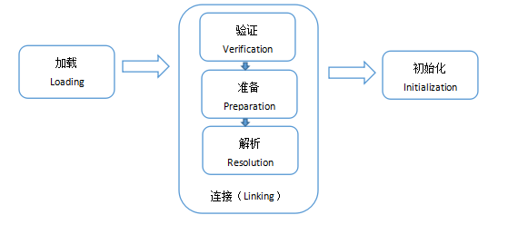

#  第16章 反射（Reflect）与注解（Annotation）

## 教学目标

* [ ] 了解类的加载过程
* [ ] 理解类初始化过程
* [ ] 了解类加载器
* [ ] 掌握获取Class对象的四种方式
* [ ] 能够运用反射获取类型的详细信息
* [ ] 能够运用反射动态创建对象
* [ ] 能够运用反射动态获取成员变量并使用
* [ ] 能够运用反射动态获取成员方法并使用
* [ ] 能够运用反射读取注解
* [ ] 能够运用反射获取泛型父类的类型参数

# 第16章 反射（Reflect）

## 16.1 类加载

类在内存中的生命周期：加载-->使用-->卸载

### 16.1.1 类的加载过程

当程序主动使用某个类时，如果该类还未被加载到内存中，系统会通过加载、链接、初始化三个步骤来对该类进行初始化，如果没有意外，JVM将会连续完成这三个步骤，所以有时也把这三个步骤统称为类加载。

类的加载又分为三个阶段：

**（1）加载：load**

- 就是指将类型的class字节码数据读入内存

**（2）链接：link**

- ①验证：校验被加载的class文件的合法性，并且不会危害虚拟机的自身安全（文件格式验证，语义分析等）

- ②准备：为类变量分配内存（在方法区中）并设置初始值（0,null,false），为静态常量赋初始值（常量池中）

  *比如：public static int sector = 3;类变量在此阶段会被设置默认初始值为0，而不是3.*

  *public static final int number = 3;静态常量在此阶段会被设置值为3*

- ③解析：把字节码中的符号引用替换为对应的直接地址引用

  *符号引用就是一组符号来描述目标，可以是任何字面量。*

  *直接引用就是直接指向目标的指针、相对偏移量或一个间接定位到目标的句柄*。

**（3）初始化：initialize**

- 为类的静态变量赋予正确的初始值，JVM负责对类进行初始化，主要对类变量进行初始化。

  *类初始化执行的是`<clinit>()`，该方法会执行①类变量的显式赋值代码②静态代码块中的代码，用于给类变量初始化值。*

  




```java
public class Demo {
    static int a = test();
    static int b = 10;
    static final int c=20;
    static {
        System.out.println("1-->"+a);
        System.out.println("2-->"+b);
        System.out.println("3-->"+c);
    }

    static int test(){

        System.out.println("4-->"+a);
        System.out.println("5-->"+b);
        System.out.println("6-->"+c);
        return 1;
    }
    
    public static void main(String[] args) {
        System.out.println("7-->"+a);
        System.out.println("8-->"+b);
        System.out.println("9-->"+c);
    }
}
```


### 16.1.2 类初始化

**1、哪些操作会导致类的初始化？**

（1）运行主方法所在的类，要先完成类初始化，再执行main方法

（2）第一次使用某个类型就是在new它的对象，此时这个类没有初始化的话，先完成类初始化再做实例初始化

（3）调用某个类的静态成员（类变量和类方法），此时这个类没有初始化的话，先完成类初始化

（4）子类初始化时，发现它的父类还没有初始化的话，那么先初始化父类

（5）通过反射操作某个类时，如果这个类没有初始化，也会导致该类先初始化

```java
class Father{
	static{
		System.out.println("main方法所在的类的父类(1)");//初始化子类时，会初始化父类
	}
}

public class TestClinit1 extends Father{
	static{
		System.out.println("main方法所在的类(2)");//主方法所在的类会初始化
	}
	
	public static void main(String[] args) throws ClassNotFoundException {
		new A();//第一次使用A就是创建它的对象，会初始化A类
		
		B.test();//直接使用B类的静态成员会初始化B类
		
		Class clazz = Class.forName("com.atguigu.test02.C");//通过反射操作C类，会初始化C类
	}
}
class A{
	static{
		System.out.println("A类初始化");
	}
}
class B{
	static{
		System.out.println("B类初始化");
	}
	public static void test(){
		System.out.println("B类的静态方法");
	}
}
class C{
	static{
		System.out.println("C类初始化");
	}
}
```

**2、哪些使用类的操作，但是不会导致类的初始化？**

（1）使用某个类的静态的常量（static  final）

（2）通过子类调用父类的静态变量，静态方法，只会导致父类初始化，不会导致子类初始化，即只有声明静态成员的类才会初始化

（3）用某个类型声明数组并创建数组对象时，不会导致这个类初始化

```java
public class TestClinit2 {
	public static void main(String[] args) {
		System.out.println(D.NUM);//D类不会初始化，因为NUM是final的
		
		System.out.println(F.num);
		F.test();//F类不会初始化，E类会初始化，因为num和test()是在E类中声明的
		
		//G类不会初始化，此时还没有正式用的G类
		G[] arr = new G[5];//没有创建G的对象，创建的是准备用来装G对象的数组对象
        //G[]是一种新的类型，是数组类型，动态编译生成的一种新的类型
        //G[].class
	}
}
class D{
	public static final int NUM = 10;
	static{
		System.out.println("D类的初始化");
	}
}
class E{
	static int num = 10;
	static{
		System.out.println("E父类的初始化");
	}
	public static void test(){
		System.out.println("父类的静态方法");
	}
}
class F extends E{
	static{
		System.out.println("F子类的初始化");
	}
}

class G{
	static{
		System.out.println("G类的初始化");
	}
}
```

### 16.1.3 类加载器

Java类如何加载到内存中？类的加载通过类加载器完成。JVM启动会先创建类加载器ClassLoader对象用来加载Java类。

**1、类加载器分为：**

（1）引导类加载器（Bootstrap ClassLoader）又称为根类加载器

```
它负责加载jre/lib/rt.jar核心库
它本身不是Java代码实现的（HotSpot VM 中C++实现的），也不是ClassLoader的子类，获取它的对象时往往返回null
```

（2）扩展类加载器（Extension ClassLoader,JDK9开始改为平台类加载器）

	它负责加载jre/lib/ext扩展库
	它是ClassLoader的子类
	Java代码编写

（3）应用程序类加载器（Application ClassLoader）

	也称为系统类加载器System Class Loader
	它负责加载项目的classpath路径下的类
	它是ClassLoader的子类
	Java代码编写

（4）自定义类加载器

	当你的程序需要加载“特定”目录下的类，可以自定义类加载器，必须继承自java.lang.ClassLoader类
	当你的程序的字节码文件需要加密时，那么往往会提供一个自定义类加载器对其进行解码
	tomcat服务器中会应用到
	Java编写

**2、Java系统类加载器的双亲委托模式**

1. 在JVM虚拟机中，当使用到一个类时，这个类本应该直接由对应的类加载器加载它，但是对应的类加载器收到这个类加载的请求时，这个类加载器却首先不会自己去尝试加载这个类，而是把这个请求委派给父类加载器完成。每个类加载器都是如此，只有当父加载器在自己的搜索范围内找不到指定的类时，子加载器才会尝试自己去加载，自己也加载不了那么会抛异常（即ClassNotFoundException）。

2. 也就是说，对于每个类加载器，只有父类（依次递归）找不到时，才自己加载 。这就是**双亲委派模式**


**为什么需要双亲委派模型呢？**

①这样可以避免重复加载

​	前面已经说明，当一个类要加载时先看父级类加载器是否加载，如果已经加载过，则无需再重复加载。

②考虑到安全因素

​	假设我们使用一个第三方Jar包，该Jar包中自定义了一个java.lang.String类，它的功能和系统String类的功能相同，但是加入了恶意代码。那么，JVM会加载这个自定义的String类，从而在我们所有用到String类的地方都会执行该恶意代码。如果有双亲委派模型，自定义的String类是不会被加载的，因为最顶层的类加载器会首先加载系统的java.lang.String类，而不会加载自定义的String类，防止了恶意代码的注入。

**3、获取类加载器的方式：**

```java
//通过类的Class实例获取加载此类的加载器
ClassLoader classLoader = Demo.class.getClassLoader();
//通过线程获取当前线程上下文类加载器
ClassLoader contextClassLoader = Thread.currentThread().getContextClassLoader();
//通过ClassLoader静态方法获取系统类加载器
ClassLoader systemClassLoader = ClassLoader.getSystemClassLoader();
```

示例：

```java
public class Demo {
    public static void main(String[] args) {
        ClassLoader classLoader = Thread.currentThread().getContextClassLoader();
        System.out.println(classLoader);
        System.out.println(classLoader.getParent());
        System.out.println(classLoader.getParent().getParent());
    }
}
```

运行结果：

```
sun.misc.Launcher$AppClassLoader@18b4aac2
sun.misc.Launcher$ExtClassLoader@4554617c
null
```


## 16.2  java.lang.Class类

万物皆对象，每个类编译后生成的字节码文件，即class文件，在类加载后JVM会为每个class文件创建一个对象，也就是Class类的一个对象。这个Class对象封装了类在方法区内的数据信息，并且向Java程序员提供了访问方法区内的类数据信息的接口。

**Java反射机制**是在运行状态中，对于任意一个类，都能够知道这个类的所有属性和方法；对于任意一个对象，都能够调用它的任意一个方法和属性；这种动态获取的信息以及动态调用对象的方法的功能称为Java语言的反射机制。

要想解剖一个类，必须先要获取到该类的Class对象。所以，**Class对象是反射的根源。**

**获取Class对象的四种方式**

1. 类型名.class

   要求编译期间已知类型，所有的Java类型都可通过此方式获取Class对象

2. 对象.getClass()

   获取对象的运行时类型

3. Class.forName(类型全名称)

   可以获取编译期间未知的类型

4. ClassLoader的类加载器对象.loadClass(类型全名称)

   可以用系统类加载对象或自定义加载器对象加载指定路径下的类型

```java
public class TestClass {
	@Test
	public void test05() throws ClassNotFoundException{
		Class c = TestClass.class;
		ClassLoader loader = c.getClassLoader();
		
		Class c2 = loader.loadClass("com.atguigu.test05.Employee");
		Class c3 = Employee.class;
		System.out.println(c2 == c3);
	}
	
	@Test
	public void test03() throws ClassNotFoundException{
		Class c2 = String.class;
		Class c1 = "".getClass();
		Class c3 = Class.forName("java.lang.String");
		
		System.out.println(c1 == c2);
		System.out.println(c1 == c3);
	}
}
```


## 16.3 反射的应用

### 16.3.1 获取类型的详细信息

可以获取：包、修饰符、类型名、父类（包括泛型父类）、父接口（包括泛型父接口）、成员（属性、构造器、方法）、注解（类上的、方法上的、属性上的）

示例代码获取常规信息：

```java
public class TestClassInfo {
	public static void main(String[] args) throws NoSuchFieldException, SecurityException {
		//1、先得到某个类型的Class对象
		Class clazz = String.class;
		//比喻clazz好比是镜子中的影子
		
		//2、获取类信息
		//（1）获取包对象，即所有java的包，都是Package的对象
		Package pkg = clazz.getPackage();
		System.out.println("包名：" + pkg.getName());
		
		//（2）获取修饰符
		//其实修饰符是Modifier，里面有很多常量值
		/*
		 * 0x是十六进制
		 * PUBLIC           = 0x00000001;  1    1
		 * PRIVATE          = 0x00000002;  2	10
		 * PROTECTED        = 0x00000004;  4	100
		 * STATIC           = 0x00000008;  8	1000
		 * FINAL            = 0x00000010;  16	10000
		 * ...
		 * 
		 * 设计的理念，就是用二进制的某一位是1，来代表一种修饰符，整个二进制中只有一位是1，其余都是0
		 * 
		 * mod = 17          0x00000011
		 * if ((mod & PUBLIC) != 0)  说明修饰符中有public
		 * if ((mod & FINAL) != 0)   说明修饰符中有final
		 */
		int mod = clazz.getModifiers();
		System.out.println(Modifier.toString(mod));
		
		//（3）类型名
		String name = clazz.getName();
		System.out.println(name);
		
		//（4）父类，父类也有父类对应的Class对象
		Class superclass = clazz.getSuperclass();
		System.out.println(superclass);
		
		//（5）父接口们
		Class[] interfaces = clazz.getInterfaces();
		for (Class class1 : interfaces) {
			System.out.println(class1);
		}
		
		//（6）类的属性，  你声明的一个属性，它是Field的对象
/*		Field clazz.getField(name)  根据属性名获取一个属性对象，但是只能得到公共的
		Field[] clazz.getFields();  获取所有公共的属性
		Field clazz.getDeclaredField(name)  根据属性名获取一个属性对象，可以获取已声明的
		Field[] clazz.getDeclaredFields()	获取所有已声明的属性
		*/
		Field valueField = clazz.getDeclaredField("value");
//		System.out.println("valueField = " +valueField);
		
		Field[] declaredFields = clazz.getDeclaredFields();
		for (Field field : declaredFields) {
			//修饰符、数据类型、属性名    
			int modifiers = field.getModifiers();
			System.out.println("属性的修饰符：" + Modifier.toString(modifiers));
			
			String name2 = field.getName();
			System.out.println("属性名：" + name2);
			
			Class<?> type = field.getType();
			System.out.println("属性的数据类型：" + type);
		}
		System.out.println("-------------------------");
		//（7）构造器们
		Constructor[] constructors = clazz.getDeclaredConstructors();
		for (Constructor constructor : constructors) {
			//修饰符、构造器名称、构造器形参列表  、抛出异常列表
			int modifiers = constructor.getModifiers();
			System.out.println("构造器的修饰符：" + Modifier.toString(modifiers));
			
			String name2 = constructor.getName();
			System.out.println("构造器名：" + name2);
			
			//形参列表
			System.out.println("形参列表：");
			Class[] parameterTypes = constructor.getParameterTypes();
			for (Class parameterType : parameterTypes) {
				System.out.println(parameterType);
			}
            
            //异常列表
			System.out.println("异常列表：");
			Class<?>[] exceptionTypes = constructor.getExceptionTypes();
			for (Class<?> exceptionType : exceptionTypes) {
				System.out.println(exceptionType);
			}
		}
		System.out.println("=--------------------------------");
		//(8)方法们
		Method[] declaredMethods = clazz.getDeclaredMethods();
		for (Method method : declaredMethods) {
			//修饰符、返回值类型、方法名、形参列表 、异常列表 
			int modifiers = method.getModifiers();
			System.out.println("方法的修饰符：" + Modifier.toString(modifiers));
			
			Class<?> returnType = method.getReturnType();
			System.out.println("返回值类型:" + returnType);
			
			String name2 = method.getName();
			System.out.println("方法名：" + name2);
			
			//形参列表
			System.out.println("形参列表：");
			Class[] parameterTypes = method.getParameterTypes();
			for (Class parameterType : parameterTypes) {
				System.out.println(parameterType);
			}
			
			//异常列表
			System.out.println("异常列表：");
			Class<?>[] exceptionTypes = method.getExceptionTypes();
			for (Class<?> exceptionType : exceptionTypes) {
				System.out.println(exceptionType);
			}
		}
		
	}
}
```


### 16.3.2  创建任意引用类型的对象

两种方式：

1、直接通过Class对象来实例化（要求必须有无参构造）

2、通过获取构造器对象来进行实例化

方式一的步骤：

（1）获取该类型的Class对象（2）创建对象

```java
	@Test
	public void test2()throws Exception{
		Class<?> clazz = Class.forName("com.atguigu.test.Student");
		//Caused by: java.lang.NoSuchMethodException: com.atguigu.test.Student.<init>()
		//即说明Student没有无参构造，就没有无参实例初始化方法<init>
		Object stu = clazz.newInstance();
		System.out.println(stu);
	}
	
	@Test
	public void test1() throws ClassNotFoundException, InstantiationException, IllegalAccessException{
//		AtGuigu obj = new AtGuigu();//编译期间无法创建
		
		Class<?> clazz = Class.forName("com.atguigu.test.AtGuigu");
		//clazz代表com.atguigu.test.AtGuigu类型
		//clazz.newInstance()创建的就是AtGuigu的对象
		Object obj = clazz.newInstance();
		System.out.println(obj);
	}
```

方式二的步骤：

（1）获取该类型的Class对象（2）获取构造器对象（3）创建对象

> 如果构造器的权限修饰符修饰的范围不可见，也可以调用setAccessible(true)

示例代码：

```java
public class TestNewInstance {
	@Test
	public void test3()throws Exception{
		//(1)获取Class对象
		Class<?> clazz = Class.forName("com.atguigu.test.Student");
		/*
		 * 获取Student类型中的有参构造
		 * 如果构造器有多个，我们通常是根据形参【类型】列表来获取指定的一个构造器的
		 * 例如：public Student(int id, String name) 
		 */
		//(2)获取构造器对象
		Constructor<?> constructor = clazz.getDeclaredConstructor(int.class,String.class);
		
		//(3)创建实例对象
		// T newInstance(Object... initargs)  这个Object...是在创建对象时，给有参构造的实参列表
		Object obj = constructor.newInstance(2,"张三");
		System.out.println(obj);
	}
	
}
```

### 16.3.3 操作任意类型的属性

（1）获取该类型的Class对象
Class clazz = Class.forName("com.atguigu.bean.User");

（2）获取属性对象
Field field = clazz.getDeclaredField("username");

（3）设置属性可访问

field.setAccessible(true);

（4）创建实例对象：如果操作的是非静态属性，需要创建实例对象
Object obj = clazz.newInstance();

（4）设置属性值

field.set(obj,"chai");
（5）获取属性值
Object value = field.get(obj);

> 如果操作静态变量，那么实例对象可以省略，用null表示

示例代码：

```java
public class TestField {
	public static void main(String[] args)throws Exception {
		//1、获取Student的Class对象
		Class clazz = Class.forName("com.atguigu.test.Student");
		
		//2、获取属性对象，例如：id属性
		Field idField = clazz.getDeclaredField("id");
        
        //3、如果id是私有的等在当前类中不可访问access的，我们需要做如下操作
		idField.setAccessible(true);
		
		//4、创建实例对象，即，创建Student对象
		Object stu = clazz.newInstance();
				
		//5、获取属性值
		/*
		 * 以前：int 变量= 学生对象.getId()
		 * 现在：Object id属性对象.get(学生对象)
		 */
		Object value = idField.get(stu);
		System.out.println("id = "+ value);
		
		//6、设置属性值
		/*
		 * 以前：学生对象.setId(值)
		 * 现在：id属性对象.set(学生对象,值)
		 */
		idField.set(stu, 2);
		
		value = idField.get(stu);
		System.out.println("id = "+ value);
	}
}
```

### 16.3.4 调用任意类型的方法

（1）获取该类型的Class对象
Class clazz = Class.forName("com.atguigu.service.UserService");
（2）获取方法对象
Method method = clazz.getDeclaredMethod("login",String.class,String.class);
（3）创建实例对象
Object obj = clazz.newInstance();
（4）调用方法
Object result = method.invoke(obj,"chai","123);

> 如果方法的权限修饰符修饰的范围不可见，也可以调用setAccessible(true)
>
> 如果方法是静态方法，实例对象也可以省略，用null代替

示例代码：

```java
public class TestMethod {
	@Test
	public void test()throws Exception {
		// 1、获取Student的Class对象
		Class<?> clazz = Class.forName("com.atguigu.test.Student");
		
		//2、获取方法对象
		/*
		 * 在一个类中，唯一定位到一个方法，需要：（1）方法名（2）形参列表，因为方法可能重载
		 * 
		 * 例如：void setName(String name)
		 */
		Method method = clazz.getDeclaredMethod("setName", String.class);
		
		//3、创建实例对象
		Object stu = clazz.newInstance();
		
		//4、调用方法
		/*
		 * 以前：学生对象.setName(值)
		 * 现在：方法对象.invoke(学生对象，值)
		 */
		method.invoke(stu, "张三");
		
		System.out.println(stu);
	}
}
```

### 16.3.5 获取泛型父类信息

示例代码获取泛型父类信息：

```java
/* Type：
 * （1）Class
 * （2）ParameterizedType   
 * 		例如：Father<String,Integer>
 * 			ArrayList<String>
 * （3）TypeVariable
 * 		例如：T，U,E,K,V
 * （4）WildcardType
 * 		例如：
 * 		ArrayList<?>
 * 		ArrayList<? super 下限>
 * 		ArrayList<? extends 上限>
 * （5）GenericArrayType
 * 		例如：T[]
 * 	
 */
public class TestGeneric {
	public static void main(String[] args) {
		//需求：在运行时，获取Son类型的泛型父类的泛型实参<String,Integer>
		
		//（1）还是先获取Class对象
		Class clazz = Son.class;//四种形式任意一种都可以
		
		//（2）获取泛型父类
//		Class sc = clazz.getSuperclass();
//		System.out.println(sc);
		/*
		 * getSuperclass()只能得到父类名，无法得到父类的泛型实参列表
		 */
		Type type = clazz.getGenericSuperclass();
		
		// Father<String,Integer>属于ParameterizedType
		ParameterizedType pt = (ParameterizedType) type;
		
		//（3）获取泛型父类的泛型实参列表
		Type[] typeArray = pt.getActualTypeArguments();
		for (Type type2 : typeArray) {
			System.out.println(type2);
		}
	}
}
//泛型形参：<T,U>
class Father<T,U>{
	
}
//泛型实参：<String,Integer>
class Son extends Father<String,Integer>{
	
}
```

### 16.3.6 读取注解信息

示例代码读取注解信息：

```java
public class TestAnnotation {
	public static void main(String[] args) {
		//需求：可以获取MyClass类型上面配置的注解@MyAnnotation的value值
		
		//读取注解
//		（1）获取Class对象
		Class<MyClass> clazz = MyClass.class;
		
		//（2）获取注解对象
		//获取指定注解对象
		MyAnnotation my = clazz.getAnnotation(MyAnnotation.class);
		
		//（3）获取配置参数值
		String value = my.value();
		System.out.println(value);
	}
}
//声明
@Retention(RetentionPolicy.RUNTIME)  //说明这个注解可以保留到运行时
@Target(ElementType.TYPE) //说明这个注解只能用在类型上面，包括类，接口，枚举等
@interface MyAnnotation{
	//配置参数，如果只有一个配置参数，并且名称是value，在赋值时可以省略value=
	String value();
}

//使用注解
@MyAnnotation("/login")
class MyClass{
	
}
```

### 16.3.7 获取内部类或外部类信息

public Class<?>[] getClasses()：返回所有公共内部类和内部接口。包括从超类继承的公共类和接口成员以及该类声明的公共类和接口成员。

public Class<?>[] getDeclaredClasses()：返回 Class 对象的一个数组，这些对象反映声明为此 Class 对象所表示的类的成员的所有类和接口。包括该类所声明的公共、保护、默认（包）访问及私有类和接口，但不包括继承的类和接口。

public Class<?> getDeclaringClass()：如果此 Class 对象所表示的类或接口是一个内部类或内部接口，则返回它的外部类或外部接口，否则返回null。

```java
	@Test
	public void test5(){
		Class<?> clazz = Map.class;
		Class<?>[] inners = clazz.getDeclaredClasses();
		for (Class<?> inner : inners) {
			System.out.println(inner);
		}
		
		Class<?> ec = Map.Entry.class;
		Class<?> outer = ec.getDeclaringClass();
		System.out.println(outer);
	}
```

### 16.3.8 动态创建和操作任意类型的数组

在java.lang.reflect包下还提供了一个Array类，Array对象可以代表所有的数组。程序可以通过使用Array类来动态的创建数组，操作数组元素等。

Array类提供了如下几个方法：

public static Object newInstance(Class<?> componentType, int... dimensions)：创建一个具有指定的组件类型和维度的新数组。

public static void setXxx(Object array,int index,xxx value)：将array数组中[index]元素的值修改为value。此处的Xxx对应8种基本数据类型，如果该属性的类型是引用数据类型，则直接使用set(Object array,int index, Object value)方法。

public static xxx getXxx(Object array,int index,xxx value)：将array数组中[index]元素的值返回。此处的Xxx对应8种基本数据类型，如果该属性的类型是引用数据类型，则直接使用get(Object array,int index)方法。

```java
import java.lang.reflect.Array;

public class TestArray {
	public static void main(String[] args) {
		Object arr = Array.newInstance(String.class, 5);
		Array.set(arr, 0, "尚硅谷");
		Array.set(arr, 1, "atguigu");
		System.out.println(Array.get(arr, 0));
		System.out.println(Array.get(arr, 1));
		System.out.println(Array.get(arr, 2));
	}
}
```

## 16.4注解（Annotation）

### 16.4.1 注解概述

**定义**：注解（Annotation）是一种代码级别的注释。它是JDK1.5及以后版本引入的一个特性，与类、接口、枚举是在同一个层次。它可以声明在包、类、字段、方法、局部变量、方法参数等的前面，用来对这些元素进行说明，注释。

> 虽然说注解也是一种注释，因为它们都不会改变程序原有的逻辑，只是对程序增加了某些注释性信息。不过它又不同于单行注释和多行注释，对于单行注释和多行注释是给程序员看的，而注解是可以被编译器或其他程序读取的一种注释，程序还可以根据注解的不同，做出相应的处理。所以注解是插入到代码中以便有工具可以对它们进行处理的标签。

**应用场景**：

- 编写文档：通过代码里标识的注解生成文档【例如，生成文档doc文档】
- 代码分析：通过代码里标识的注解对代码进行分析，处理【例如，注解的反射】
- 编译检查：通过代码里标识的注解让编译器能够实现基本的编译检查【例如，Override】

**常见注解**

1. **@author**：用来标识作者名
2. **@version**：用于标识对象的版本号，适用范围：文件、类、方法。
3. **@Override** ：用来修饰方法声明，告诉编译器该方法是重写父类中的方法，如果父类不存在该方法，则编译失败。
4. **@Deprecated** ：表示过时的，即由此注解注释的代码已过时，不再推荐使用
5. **@SupressWarning**：抑制警告

### 16.4.2 自定义注解

##### 1、定义格式

```java
元注解
public @interface 注解名称{
	属性列表;
}
```

注解本质上就是一个接口，该接口默认继承Annotation接口。

```java
public @interface MyAnno extends java.lang.annotation.Annotation {}
```

任何一个注解，都默认的继承Annotation接口。

##### 2、注解的属性

- **属性的作用**

  - 可以让用户在使用注解时传递参数，让注解的功能更加强大。

- **属性的格式**

  - **格式1：数据类型 属性名();**
  - **格式2：数据类型 属性名() default 默认值;**

- **属性定义示例**

  ```java
  public @interface MyAnno {
    String value(); 
    String name() default "java";
    int num() default 123;
      
  } 
  // 该注解就有了三个个属性：value,name,num
  ```

- **属性适用的数据类型**

  - 八种基本数据类型（**int,float,boolean,byte,double,char,long,short**)。
  - String类型，Class类型，枚举类型，注解类型。
  - 以上所有类型的一维数组。

### 16.4.3 使用自定义注解

#### 1、使用格式:

	@注解名(属性名=属性值,属性名=属性值,属性名=属性值...)

示例：

```java
@MyAnno(value="",name="abc",num=100)
public class MyClass{
    
}
```

#### 2、**使用注意事项**

- 如果属性有默认值，则使用注解的时候，这个属性可以不用赋值。
- 如果属性没有默认值，那么在使用注解时一定要给属性赋值。
- 特殊属性value
  - **当注解中只有一个属性且名称是value，在使用注解时给value属性赋值可以直接给属性值，即可以省略value属性名**

  - **如果注解中除了value属性还有其他属性，且至少有一个属性没有默认值，则在使用注解给属性赋值时，value属性名不能省略。**


### 16.4.4 元注解

元注解是由Java定义的注解，主要用在其他注解上来限制（增强）其他注解的使用情况。

默认情况下，注解可以用在任何地方，比如类，成员方法，构造方法，成员变量等地方。如果要限制注解的使用位置怎么办？那就可以使用元注解。

- **@Target**
- **@Retention**

#### 1、元注解之@Target

- **作用：指明此注解用在哪个位置，如果不写默认是任何地方都可以使用。**
  - 可选的参数值在枚举类**ElemenetType**中包括：

```properties
 TYPE： 用在类,接口上
 FIELD：用在成员变量上
 METHOD： 用在方法上
 PARAMETER：用在参数上
 CONSTRUCTOR：用在构造方法上
 LOCAL_VARIABLE：用在局部变量上
```

#### 2、元注解之@Retention

- **作用：定义该注解的生命周期(有效范围)。**
  - 可选的参数值在枚举类型RetentionPolicy中包括

```properties
SOURCE：注解只存在于Java源代码中，编译生成的字节码文件中就不存在了。
CLASS：注解存在于Java源代码、编译以后的字节码文件中，运行的时候内存中没有，默认值。
RUNTIME：注解存在于Java源代码中、编译以后的字节码文件中、运行时内存中，程序可以通过反射获取该注解。
```

### 16.4.5 注解解析

通过Java技术获取注解数据的过程则称为注解解析。通常通过反射获取注解及其属性值。

#### 1、与注解解析相关的接口

- **Anontation**：所有注解类型的公共接口，类似所有类的父类是Object。
- **AnnotatedElement**：定义了与注解解析相关的方法，常用方法以下四个：

```java
boolean isAnnotationPresent(Class annotationClass); 判断当前对象是否有指定的注解，有则返回true，否则返回false。
T getAnnotation(Class<T> annotationClass);  获得当前对象上指定的注解对象。
Annotation[] getAnnotations(); 获得当前对象及其从父类上继承的所有的注解对象。
Annotation[] getDeclaredAnnotations();获得当前对象上所有的注解对象，不包括父类的。
```

#### 2、解析步骤：

在程序中使用(解析)注解的步骤（获取注解中定义的属性值）：

1. 获取注解定义的位置的对象  （Class，Method,Field）

   注解作用在那个成员上，就通过反射获得该成员的对象来得到它的注解。

2. 获取指定的注解 `getAnnotation(Class)`

   如注解作用在方法上，就通过方法(Method)对象得到它的注解。

   ```java
    // 得到方法对象
    Method method = clazz.getDeclaredMethod("方法名"); 
    // 根据注解名得到方法上的注解对象
    MyAnno myAnno = method.getAnnotation(MyAnno.class); 
   ```

   如注解作用在类上，就通过Class对象得到它的注解。

   ```java
   // 获得Class对象
   Class c = 类名.class;
   // 根据注解的Class获得使用在类上的注解对象
    MyAnno myAnno = c.getAnnotation(MyAnno.class);
   ```

3. 调用注解中的抽象方法获取配置的属性值

   ```java
   //通过注解对象获取某个属性的值
   String value = myAnno.value();
   String name = myAnno.name();
   ```

**案例练习：**

**需求说明**

1. 定义注解Book，要求如下：
   - 包含属性：String value()   书名
   - 包含属性：double price()  价格，默认值为 100
   - 包含属性：String[] authors() 多位作者  
   - 限制注解使用的位置：类和成员方法上
   - 指定注解的有效范围：RUNTIME
2. 定义BookStore类，在类和成员方法上使用Book注解
3. 定义TestAnnotation测试类获取Book注解上的数据

**代码实现：**

**注解Book**

```java
@Target({ElementType.METHOD,ElementType.TYPE})
@Retention(RetentionPolicy.RUNTIME)
public @interface Book {
    // 书名
    String value();
    // 价格
    double price() default 100;
    // 作者
    String[] authors();
}
```

**BookStore类**

```java
@Book(value = "红楼梦",authors = "曹雪芹",price = 998)
public class BookStore {
}
```

**TestAnnotation类**

```java
public class TestAnnotation {
    public static void main(String[] args)  throws Exception{
        System.out.println("---------获取类上注解的数据----------");
        test();
    }

    /**
     * 获取BookStore类上使用的Book注解数据
     */
    public static void test(){
        // 获得BookStore类对应的Class对象
        Class c = BookStore.class;
        // 判断BookStore类是否使用了Book注解
        if(c.isAnnotationPresent(Book.class)) {
            // 根据注解Class对象获取注解对象
            Book book = (Book) c.getAnnotation(Book.class);
            // 输出book注解属性值
            System.out.println("书名：" + book.value());
            System.out.println("价格：" + book.price());
            System.out.println("作者：" + Arrays.toString(book.authors()));
        }
}
```

