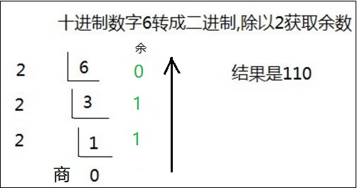
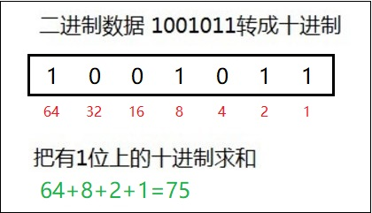
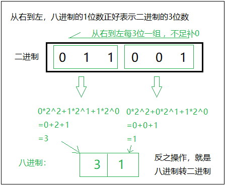
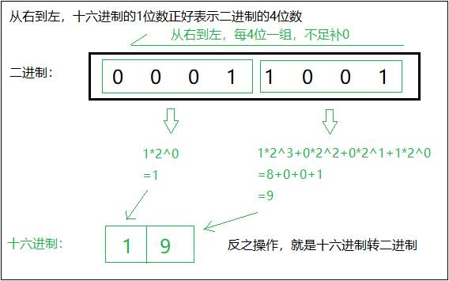
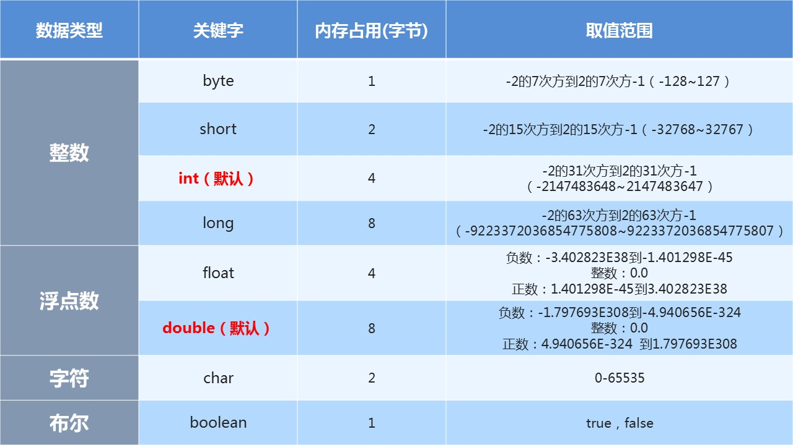
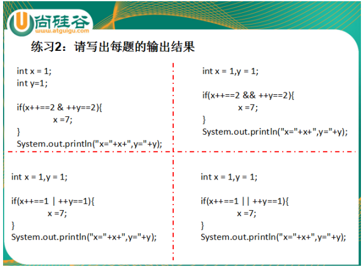
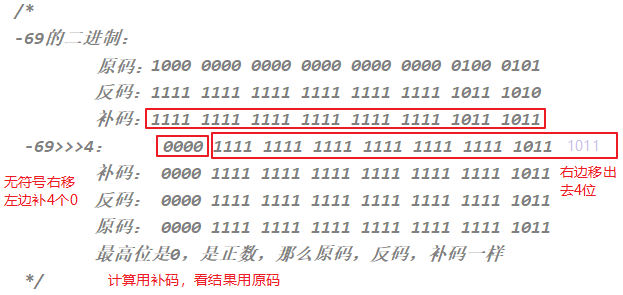
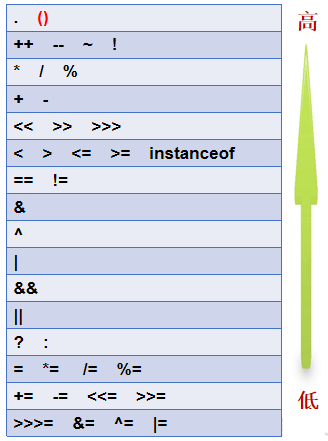

# JavaSE_第2章【Java基础语法】

## 学习目标

* [ ] 会使用单行注释和多行注释
* [ ] 能够辨识关键字
* [ ] 理解标识符的含义
* [ ] 理解Java中的基本数据类型分类
* [ ] 能够理解常量的概念
* [ ] 能够定义8种基本数据类型的变量
* [ ] 能够分清楚两种输出语句的区别
* [ ] 了解进制
* [ ] 理解基本数据类型的自动类型转换
* [ ] 理解基本数据类型的强制类型转换
* [ ] 了解ASCII编码表和Unicode编码表
* [ ] 理解int类型和char类型的运算原理
* [ ] 理解运算符++ --的运算方式
* [ ] 理解+符号在字符串中的作用
* [ ] 掌握算术运算符
* [ ] 掌握赋值运算符
* [ ] 掌握比较运算符
* [ ] 理解逻辑运算符
* [ ] 掌握三元运算符的格式和计算结果
* [ ] 了解位运算符

## 2.1 注释（*Comment*）（掌握）

- **注释**：就是对代码的解释和说明。其目的是让程序员能够更加轻松地了解代码。为代码添加注释，是十分必要的，它不影响程序的编译和运行。
- Java中有`单行注释`、`多行注释`和`文档注释`
  - 单行注释以 `//`开头，以`换行`结束，格式如下：
  
    ```java
    // 注释内容
    ```
  
  - 多行注释以 `/*`开头，以`*/`结束，格式如下：
  
    ```java
    /*
    	注释内容
    	注释内容
    */
    ```
  
  - 文档注释以`/**`开头，以`*/`结束 
  
    ```java
    /**
    	注释内容
    	@author   可指定 java java程序的作者
    	@version  可指定源文件的版本
    */
    ```
    
    文档注释可以被JDK提供的javadoc工具解析生成一套网页形式的说明文档，操作入下：
    
    ```shell
    D:\>javadoc -d mydoc -author -version Hello.java
    ```
    
    

## 2.2 关键字（*Keyword*）（掌握）

- **什么是关键字**：被java语言赋予了特殊含义的字符串（单词）。

  例如HelloWorld案例中，出现的关键字有 `public ` 、`class` 、 `static` 、  `void`  等，这些单词已经被Java定义，具有明确的含义。

- **关键字的特点**：全部都是`小写字母`。

- **Java有哪些关键字：**


## 2.3 标识符( Identifier)（掌握）

- **标识符概念：**即给类、变量、方法、包等命名的字符序列，称为标识符。

  简单的说，凡是程序员自己命名的部分都可以称为标识符。

- **标识符的命名规则（必须遵守）**

  （1）组成：英文大小写字母，数字，下划线_，美元符号$

  （2）数字不能开头

  （3）严格区分大小写

  （4）不能使用Java的关键字（包含保留字）和特殊值

- **标识符的命名规范（遭受鄙视）**

  （1）见名知意

  （2）类名、接口名等：每个单词的首字母都大写（大驼峰法则），形式：XxxYyyZzz，

  例如：HelloWorld，String，System等

  （3）变量、方法名等：从第二个单词开始首字母大写（小驼峰法则），其余字母小写，形式：xxxYyyZzz，

  例如：age,name,bookName,main

  （4）包名等：每一个单词都小写，单词之间使用点.分割，形式：xxx.yyy.zzz，

  例如：java.lang

  （5）常量名等：每一个单词都大写，单词之间使用下划线_分割，形式：XXX_YYY_ZZZ，

  例如：MAX_VALUE,PI

**练习：**以下合法的标识符是？

```
flag_3
my code
discount%
234rate
$name
println
main
```

## 2.4 初识数据类型(Data Type)（掌握）

Java是一种强类型的语言，针对每一种数据都定义了数据类型，不同类型的数据存储形式不同（二进制表示方式或分配的空间大小有所不同）

**java数据类型主要分为两大类：**

- **基本数据类型**：包括 **`整数`、`浮点数`、`字符`、`布尔`。** 

- **引用数据类型**：包括**`数组`、 `类`、`接口`、`枚举`、`注解`**等。 

  > 注意：字符串String是引用数据类型类型，后面讲面向对象时理解
  
  

## 2.5 字面量/值（*Literal*）（掌握）

**字面量是基本数据类型、String类型、null类型的值在源代码中的一种表示形式。比如：字面量10表示整数十，"hello"表示文本字符串”hello"**。

字面量表示的数据值在编译时就可以确定，并且在程序执行的过程中其值不可以发生改变。也称为**字面值**，**字面常量**。

|  字面量分类  |           举例           |
| :----------: | :----------------------: |
| 字符串字面量 |  "HelloWorld"，""，"a"   |
|  整数字面量  | 12，-23，123_456，12345L |
|  浮点字面量  |    1.2，3.45F，-10.5D    |
|  字符字面量  |   'a'，'A'，'0'，'好'    |
|  布尔字面量  |       true，false        |
|  空值字面量  |           null           |

```java
public class ConstantDemo {
	public static void main(String[] args) {
		//字符串字面常量
		System.out.println("HelloWorld");
		
		//整数字面常量
		System.out.println(12);
		System.out.println(-23);
		
		//小数字面常量
		System.out.println(12.34);
		
		//字符字面常量
		System.out.println('a');
		System.out.println('A');
        System.out.println('0');
		
		//布尔字面常量
		System.out.println(true);
		System.out.println(false);
	}
}
```

> 注意事项：
>
> ​	字符字面量，单引号里面有且仅有一个字符。
>
> ​	字符串字面量，使用双引号表示，可以包含多个字符。
>
> ​	空值字面量，是一种特殊值，不可以在输出语句中直接打印


## 2.6 变量（*Variable*）（掌握）

### 2.6.1变量的概念

**变量：**用来表示可以在程序执行的过程中才能确定的数据值，或者在程序执行期间可以修改的数据值

**变量的作用：**用来存储数据，代表内存的一块存储区域，**这块内存中的值是可以改变的**。

**变量三要素**：数据类型，变量名，数据值


### 2.6.2 变量的声明与赋值

1. 方式一：声明变量，并同时赋值

   **数据类型 变量名 = 初始化值；**

   ```java
   //声明并同时赋值，存储一个整数的年龄
   int age = 18;
   //通过打印输出语句查看变量值
   System.out.println(age);//18
   //变量可以重新赋值，会覆盖旧值
   age = 19;
   //再次通过打印输出语句查看变量值
   System.out.println("age = " + age);//+号表示连接符，把""中的字符串与变量age中的数据连接进行输出
   ```

   **注意：**①数据类型可以是Java中的任意数据类型。②变量存储的数据值必须与变量的数据类型一致（兼容）。

2. 方式二：先声明，再赋值

   **数据类型 变量名;**

   **变量名 = 初始值；**
   
   ```java
   //先声明，再赋值
   int age;
   age=18;
   //打印输出变量值
   System.out.println("age = " + age);//18
   ```
   
   ```java
   //变量可以重新赋值
   age=19;
   System.out.println("age = " + age);//19 
   ```
   
3. 同时声明多个同类型变量的简化写法

   **数据类型 变量名1=初始值，变量名2=初始值；**
   
   ```java
   //声明多个变量并同时赋值
   int a = 11, b = 22;
   //或者先声明再赋值
   int c, d;
   c = 33;
   d = 44;
   ```
   

### 2.6.3 变量的使用注意事项

-  先声明后使用

   ​	如果没有声明，会报“找不到符号”错误

-  在使用之前必须初始化	

   ​	如果没有初始化，会报“未初始化”错误

-  变量有作用域	

   ​	作用域为变量直接所属的{}范围内，如果超过作用域，也会报“找不到符号”错误

-  在同一个作用域中不能重名	

   ​	同一个{}，不能同时声明两个同名变量

### 2.6.4 变量的使用案例

案例需求：随机产生一个小数作为圆的半径，然后求圆的面积和周长的值并输出。

开发提示：

- 通过Math.random()可以随机产生一个[0,1)的小数。
- 圆周率用3.14159265358979323846表示。
- Java中用*表示乘法。

```java
class TestCircle {
    public static void main(String[] args) {
        double radius = Math.random();//随机产生小数值并赋值给变量radius
        double area = 3.14159265358979323846 * radius * radius;//计算圆面积
        double perimeter = 2 * 3.14159265358979323846 * radius;//计算圆周长
        System.out.println("本次圆半径值是：" + radius);
        System.out.println("面积是：" + area);
        System.out.println("周长是：" + perimeter);
    }
}
```

## 2.7 最终变量/常量（`Const`）

最终变量习惯上也称为常量，因为它是通过在声明变量的数据类型前面加final的方式实现的，所以叫最终变量。声明变量时在前面加final修饰后，这个变量的值就不能修改了，一开始赋值多少，就是多少，所以此时的变量名通常称为常量名。常量名通常所有字母都大写，每一个单词之间使用下划线分割，从命名上和变量名区分开来。

这样做的好处：对于经常要使用的某个数据值，使用常量名表示：

- 可读性更好
- 便于维护

案例需求：随机产生两个[0,1)的小数，分别用它表示两个圆的半径，然后输出对应圆的面积和周长的值。

开发提示：

- 通过Math.random()可以随机产生一个[0,1)的小数。
- 圆周率用3.14159265358979323846表示。
- Java中用*表示乘法。

```java
class TestNoFinal {
    public static void main(String[] args) {
        double radius1 = Math.random();
        double area1 = 3.14159265358979323846 * radius1 * radius1;
        double perimeter1 = 2 * 3.14159265358979323846 * radius1;
        System.out.println("第1个圆半径值是：" + radius1);
        System.out.println("第1个圆面积是：" + area1);
        System.out.println("第1个圆周长是：" + perimeter1);

        double radius2 = Math.random();
        double area2 = 3.14159265358979323846 * radius2 * radius2;
        double perimeter2 = 2 * 3.14159265358979323846 * radius2;
        System.out.println("第2个圆半径值是：" + radius2);
        System.out.println("第2个圆面积是：" + area2);
        System.out.println("第2个圆周长是：" + perimeter2);
    }
}
```

```java
public class TestUseFinal {
    public static void main(String[] args) {
//        final double PI = 3.14159265358979323846;
        final double PI = 3.14;
        double radius1 = Math.random();
        double area1 =  PI * radius1 * radius1;
        double perimeter1 = 2 * PI * radius1;
        System.out.println("第1个圆半径值是：" + radius1);
        System.out.println("第1个圆面积是：" + area1);
        System.out.println("第1个圆周长是：" + perimeter1);

        double radius2 = Math.random();
        double area2 = PI * radius2 * radius2;
        double perimeter2 = 2 * PI * radius2;
        System.out.println("第2个圆半径值是：" + radius2);
        System.out.println("第2个圆面积是：" + area2);
        System.out.println("第2个圆周长是：" + perimeter2);
    }
}
```


## 2.8  计算机如何存储数据

计算机世界中只有二进制数据。所以在计算机中存储和运算的所有数据都要转为二进制数据。包括数字、字符、图片、声音、视频等。

### 2.8.1 进制与进制转换（了解）

#### 1、进制分类与表示方式

|              | 进位规则   | 每位的数值范围 | 示例     |
| ------------ | ---------- | -------------- | -------- |
| **十进制**   | 逢十进一   | 0~9            | 129，99  |
| **二进制**   | 逢二进一   | 0,1            | 01001101 |
| **八进制**   | 逢八进一   | 0~7            | 175，77  |
| **十六进制** | 逢十六进一 | 0~9,A~F        | 7A，AF   |

> 十进制的256，使用二进制表示为100000000，为了缩短二进制的表示，又要贴近二进制，在程序中引入八进制和十六进制
>
> 八进制与二进制换算规则：每三位二进制是一位八进制值（八进制使用较少）
>
> 十六进制与二进制换算规则：每四位二进制是一位十六进制值

Java程序中通常都默认用十进制表示数据常量值，如果想要表示其他进制常量值可以用以下方式：（了解）

```java
System.out.println(10);//10表示十进制的10，输出十进制结果10
System.out.println(0B10);//0B10表示二进制的10，输出十进制结果2
System.out.println(010);//010表示八进制的10，输出十进制结果8
System.out.println(0X10);//0x10表示十六进制的10，输出十进制结果16
```


#### 2、进制的转换

| 十进制 | 二进制 | 八进制 | 十六进制 |
| ------ | ------ | ------ | -------- |
| 0      | 0      | 0      | 0        |
| 1      | 1      | 1      | 1        |
| 2      | 10     | 2      | 2        |
| 3      | 11     | 3      | 3        |
| 4      | 100    | 4      | 4        |
| 5      | 101    | 5      | 5        |
| 6      | 110    | 6      | 6        |
| 7      | 111    | 7      | 7        |
| 8      | 1000   | 10     | 8        |
| 9      | 1001   | 11     | 9        |
| 10     | 1010   | 12     | a或A     |
| 11     | 1011   | 13     | b或B     |
| 12     | 1100   | 14     | c或C     |
| 13     | 1101   | 15     | d或D     |
| 14     | 1110   | 16     | e或E     |
| 15     | 1111   | 17     | f或F     |
| 16     | 10000  | 20     | 10       |

1. **任意进制转十进制**

  十进制的本质：123 = 1\*10^2 + 2\*10^1 + 3\*10^0

  	系数：就是每一位上的数值。上例中的1,2,3
  	基数：x进制的基数就是x。上例中的10
  	权：对每位上的数据，从右到左以0开始编号，对应的编号就是该位数的权。上例中的0,1,2

  **任意进制转十进制的方式：系数*基数^权次幂之和。**

  

2. **十进制转任意进制：**

  **十进制数除以基数取余，直到商为0，余数反转。**

  十进制转二进制：十进制整数6除以基数2，倒序取余数，结果为二进制数110
  

  

3. **快速转换方法：**

  - **二进制转十进制：**

    **8421码：**从右边开始依次是2的0次，2的1次，2的2次。。。。

    

  - **二进制数据转八进制数据**

    从右边开始，3位二进制对应1位八进制

    

  - **二进制数据转十六进制数据**

    从右边开始，4位二进制对应1位十六进制

    

  

### 2.8.2 计算机存储单位


- **字节（Byte）：**是计算机信息技术用于计量存储容量的一种计量单位，1字节等于8位。
- **位（bit）：**是数据存储的最小单位，也就是一个二进制位。其中8 bit(比特) 就称为1个字节(Byte)。
- **转换关系：**

  8 bit = 1 Byte

  1024 Byte = 1 KB

  1024 KB = 1 MB

  1024 MB = 1 GB

  1024 GB = 1 TB

### 2.8.3 二进制数据存储（理解）

计算机底层都是使用二进制进行数据的存储的。各种不同类型的数据底层都会转换为二进制数据进行存储，但是转换方式不同，那么不同类型数据的如何转换为二进制数据进行存储的呢？

#### 1、**如何存储整数？**

计算机底层存储整数时，因为要考虑正整数和负整数的存储问题，所以并不是简单的把整数进行进制转换为二进制数据直接存储，而是转换为二进制的**补码**形式进行存储。二进制的补码是什么？要了解补码还要先知道**原码**和**反码**：

- **原码**：把十进制整数进行进制转换转为二进制，然后把最高位设置为符号位，最高位用1表示负数，0表示正数。

- **反码**：**正整数的反码与其原码一样**，**负整数的反码**是在其原码的基础上，符号位不变，其余位取反（0变1,1变0）

- **补码**：**正整数的补码与其原码一样**，**负整数的补码**为其反码基础上+1

  > **正整数**的原码、反码和补码都一样，称为**三码合一**。

示例：

```
//求正整数25的原码，反码和补码：
25的原码：00000000 00000000 00000000 00011001 
25的反码：00000000 00000000 00000000 00011001
25的补码：00000000 00000000 00000000 00011001

//求负整数-25的原码，反码和补码
-25的原码：10000000 00000000 00000000 00011001
-25的反码：11111111 11111111 11111111 11100110
-25的补码：11111111 11111111 11111111 11100111
```

 **一个字节可以存储的整数范围**

分为两种情况：

（1）无符号unsigned：不考虑正负数

```
0000 0000 ~ 1111 1111 ==> 0~255
```

（2）**有符号signed：-128~127**

```
0000 0000 ~ 0111 1111 ==> 0~127

1000 0001 ~ 1111 1111 ==> -127 ~ -1 （注意是补码形式存储）

1000 0000  ==> -128     特殊值，最高位既是符号位，又是数值位
```

#### 2、**如何存储小数？（了解）**

- 为什么float（4个字节）比long（8个字节）的存储范围小？
- 为什么float和double不精确
- 为什么double（8个字节）比float（4个字节）精度范围大？

因为float、double底层也是二进制，先把小数转为二进制，然后把二进制表示为科学记数法，然后只保存：

**①符号位②指数位③尾数位**


> 详见《[float型和double型数据的存储方式.docx](float型和double型数据的存储方式.docx)》

#### 3、**如何存储字符？**

在计算机的内部都是二进制的0、1数据，如何让计算机可以存储人类文字呢？就产生出了编码表的概念。

- **编码表** 

  就是将人类的文字和一个无符号的十进制数进行对应起来组成一张表格。例如：

  | 字符 | 十进制数值 | 二进制数值 |
  | :--: | :--------: | :--------: |
  | '0'  |     48     | 0011 0000  |
  | 'A'  |     65     | 0100 0001  |
  | 'a'  |     97     | 0110 0001  |
  | ...  |    ...     |    ...     |
  
  将所有的英文字母，数字，符号都和十进制进行了对应，因此产生了世界上第一张编码表**ASCII**（American Standard Code for Information Interchange 美国标准信息交换码）。
  
  **Unicode**(统一码、万国码、单一码)是计算机科学领域里的一项业界标准，包括字符集、编码方案等。Unicode 是为了解决传统的字符编码方案的局限而产生的，它为每种语言中的每个字符设定了统一并且唯一的二进制编码，以满足跨语言、跨平台进行文本转换、处理的要求。
  
  **Java中使用的字符集：Unicode编码集**
  
  > Unicode使用2个字节存储一个字符，对于大量的英文字符（1个字节可以存储），无疑是浪费空间的，所以出现了UTF-8、UTF-16编码规则，UTF-8是以8位为一个编码单位的可变长编码规则。这时：
  >
  > 英文字符：还是按照ASCII码表对应的数字进行存储（1个字节）
  >
  > 中文字符：通常需要3个字节来存储
- **Java中字符常量的几种表示方式**

  （1）使用单引号将单个字符引起来

  *注意：单引号内有且只能有一个字符*

  ```java
  char a = 'A';//把字符'A'赋值给变量a
  System.out.println(a);//输出字符'A'
  
  char b = '0';//把字符'0'赋值给变量b
  char c = '尚';//把字符'尚'赋值给变量c
  //char d = '';//错误，单引号中有且只能有一个字符
  
  String s2 = "";//可以，双引号中可以是一串字符，也可以没有任何字符，表示是空字符串
  ```
  
  （2）转义字符
  
  ```java
  char ch = '\t';//把制表符赋值给变量ch
  System.out.println(ch);//输出一个Tab键，即制表符
  
  System.out.println('\"');//输出一个双引号
  System.out.println('\\');//输出一个反斜杠
  System.out.println('\n');//换行符
  System.out.println('\r');//回车键
  System.out.println("hello\tworld\njava");//输出内容：
  /*
  hello
  world
  java
  */
  ```
  
   （3）使用\u字符的Unicode编码值的十六进制型(了解)
  
   ​	例如：`'\u5C1A'`表示字符'尚'
  
   ```java
  char c = '\u5C1A';//输出字符'尚',在Unicode编码表中'尚'对应的十六进制数值5C1A
  System.out.println(c);//尚
   ```
  
  （4）直接给char类型变量赋值十进制的0~65535之间的Unicode编码值
  
   ```java
   char c1 = 23578;//在Unicode编码表中十进制'尚’对应的十进制数值是23578
   System.out.println(c1);//尚
   
   char c2 = 97;//在Unicode和ASCII编码表中十进制'a’对应的十进制数值是97
   System.out.println(c2);//a
   
   char c3 = 98;//在Unicode和ASCII编码表中十进制'b’对应的十进制数值是98
   System.out.println(c3);//b
   ```

## 2.9 基本数据类型(Prime Data Type)（掌握）

### 2.9.1 基本数据类型分类

基本数据类型分为：四类八种



- **整数字面常量值默认都是int类型**，占用4个字节空间。
  
  - 语法上可以直接把一个byte范围内的整数常量值直接赋给byte类型变量。short，char同理。byte b = 10;
  
  - 整数常量值后加后缀L表示long类型数值，如果整数常量值的范围超过int范围必须加后缀L才能正确表示为long数值，否则编译报错。
  
- **小数字面常量值默认都是double类型**，只有在其后F，才表示是float类型数值。

  - 可以在整数或小数值后加D或F分别表示double类型数值和float类型数值。

### 2.9.2 基本数据类型的存储范围

1. #### 整型系列

      ```java
   //（1）byte：字节类型
   byte b = 10;
   byte b1 = 128;//128超过了byte类型范围，编译失败: 不兼容的类型: 从int转换到byte可能会有损失
   
   //（2）short：短整型类型
   short s = 10;
   short s1 = 32768;//32768超过了short类型范围，编译失败: 不兼容的类型: 从int转换到short可能会有损失
   
   //（3）int：整型
   int i = 10;
   int i1 = 12345678900;//12345678900超过int类型范围，编译错误: 过大的整数: 12345678900
   
   //（4）long：长整型
   long j = 10;//这里10会自动转换为long类型，后面讲
   long j1 = 10L;//10L直接表示为long类型数值
   long j1 = 12345678900L;//注意：如果要表示某个超过int范围的常量整数它是long类型，那么需要在数字后面加L
   ```

2. **浮点型系列（小数）**

      ```java
   //（1）float：单精度浮点型
   // 精度：科学记数法的小数点后6~7位
   float f = 12.3F;//右边如果赋值小数常量值，那么必须加F或f,否则12.3表示double类型常量值
   
   //（2）double：双精度浮点型
   //精度：科学记数法的小数点后15~16位
   double d = 12.3;//默认12.3表示double类型常量值，
   double d = 12.3D;//也可以加后缀D表示double型常量值，以增加区分	
   ```

3. #### 单字符类型：char

   ```java
   //char:字符类型，占用2个字节内存，底层使用数值0~65535表示不同字符
   char ch = 'a';//字符类型数据值必须使用单引号
   ```

4. **布尔类型**

   ```java
   //boolean：布尔类型，能存储的值只能是true或false
   boolean b = true;//注意布尔值不要加引号
   boolean c = false;
   ```

      > 虽然计算机底层使用0和1表示false和true，但是在代码中不能给boolean类型的变量赋值0和1，只能赋值false和true


### 2.9.3  基本数据类型转换（掌握）

在Java程序中，不同的基本数据类型的值经常需要进行相互转换。Java语言所提供的**七种数值类型**之间可以相互转换，基本数据类型转换有两种转换方式：**自动类型转换和强制类型转换**。

#### 1、 自动类型转换

将`取值范围小的类型`自动提升为`取值范围大的类型` 。

基本数据类型按照取值范围从小到大的关系，如图所示：


以下情况会发生自动类型转换（隐式类型转换）：

1. 当把存储范围小的值（常量值、变量的值、表达式计算的结果值）赋值给了存储范围大的变量时

```java
int i = 'A';//char自动升级为int
double d = 10;//int自动升级为double

```

2. 当存储范围小的数据类型与存储范围大的数据类型一起混合运算时，会按照其中最大的类型运算


```java
int i = 1;
byte b = 1;
double d = 1.0;

double sum = i + b + d;//混合运算，升级为double
```

3. 当byte,short,char数据类型进行算术运算时，按照int类型处理


```java
byte b1 = 1;
byte b2 = 2;
byte b3 = b1 + b2;//编译报错，b1 + b2自动升级为int

char c1 = '0';
char c2 = 'A';
System.out.println(c1 + c2);//113 
```

> boolean类型不参与

#### 2、 强制类型转换

通常将`取值范围大的类型`转换成`取值范围小的类型`时需要进行强制（显示）类型转换。

例如：将小数`1.5` 赋值到`int` 类型变量会发生什么？产生编译失败，肯定无法赋值。

```java
int i = 1.5; // 错误
```

想要赋值成功，只有通过强制类型转换，将`double` 类型强制转换成`int` 类型才能赋值。

**转换格式：**

```java
数据类型 变量名 = （数据类型）被强转数据值；
```

（1）当把存储范围大的值（常量值、变量的值、表达式计算的结果值）赋值给了存储范围小的变量时，需要强制类型转换，提示：有风险，可能会损失精度或溢出

```java
int i = (int)3.14;//强制类型转换，损失精度

double d = 1.2;
int num = (int)d;//损失精度

int i = 200;
byte b = (byte)i;//溢出
```

（2）当某个值想要提升数据类型时，也可以使用强制类型转换

```java
int i = 1;
int j = 2;
double shang = (double)i/j;
```

提示：这个情况的强制类型转换是没有风险的。

#### 3、 特殊的数据类型转换

任意数据类型的数据与String类型进行“+”运算时，结果一定是String类型

```java
System.out.println("" + 1 + 2);//12
```

### 练习

```java
1、练习题：判断如下代码是否编译通过，如果能，结果是多少？
short s1 = 120;
short s2 = 8;
short s3 = s1 + s2;

2、练习题：判断如下代码是否编译通过，如果能，结果是多少？
short s1 = 120;
short s2 = 8;
byte s3 = (byte)(s1 + s2);

3、练习题：判断如下代码是否编译通过，如果能，结果是多少？
char c1 = '0';
char c2 = '1';
char c3 = c1 + c2;

4、练习题：判断如下代码是否编译通过，如果能，结果是多少？
char c1 = '0';
char c2 = '1';
System.out.println(c1 + c2);

5、练习题：判断如下代码是否编译通过，如果能，结果是多少？
int i = 4;
long j = 120; //因为右边120默认是int类型，int的值赋值给long类型是可以的，会自动类型转换，但是要求这个int值不能超过int的存储范围，如果超过int的存储范围必须加L.
double d = 34;
float f = 1.2f;//因为右边1.2默认是double类型，double的值是不能直接赋值给float的，要么加F要么使用强制类型转换。
System.out.println(i + j + d + f);//最后是double

6、练习题：判断如下代码是否编译通过，如果能，结果是多少？
int i = 1;
int j = 2;
double d = i/j;
System.out.println(d);
```

## 2.10 运算符（Operator）（掌握）

* **运算符：**是一种特殊的符号，用以表示数据的运算、赋值和比较等。
* **计算表达式：**用运算符连接起来的式子

在Java中，一共有38个运算符。


### 2.10.1 **运算符的分类**

* 按照功能划分：
  
  |       分类       |                运算符                 |
  | :--------------: | :-----------------------------------: |
  |    算术运算符    |  `+`、`-`、`*`、`/`、`%`、`++`、`--`  |
  |    赋值运算符    |  `=`、`+=`、`-=`、`*=`、`/=`、`%=`等  |
  |    关系运算符    |   `>`、`>=`、`<`、`<=`、`==`、`!=`    |
  |    逻辑运算符    |    `&`、`|`、`^`、`!`、`&&`、`||`     |
  |    条件运算符    |     `(条件表达式)?结果1:结果2；`      |
  | 位运算符（了解） | `&`、`|`、`~`、`^`、`<<`、`>>`、`>>>` |
* 按照操作数个数划分：

  | 分类               | 运算符                  | 例子                    |
  | ------------------ | ----------------------- | ----------------------- |
  | 一元（单目）运算符 | ++、--、！              | i++、--i                |
  | 二元（双目）运算符 | +、-、*、/、%、>、<=等  | a+b、10>=9              |
  | 三元（三目）运算符 | 表达式1?表达式2:表达式3 | age>=18?"成年":"未成年" |

### 2.10.2 算术运算符

|  算术运算符   |            符号解释             |
| :-----------: | :-----------------------------: |
|      `+`      | 加法运算，字符串连接运算，正号  |
|      `-`      |         减法运算，负号          |
|      `*`      |            乘法运算             |
|      `/`      | 除法运算，整数/整数结果还是整数 |
|      `%`      | 求余运算，余数的符号只看被除数  |
| `++` 、  `--` |          自增自减运算           |

1. **加、减、乘、除、模**

   ```java
   public class OperatorDemo01 {
   	public static void main(String[] args) {
   		int a = 3;
   		int b = 4;
   		
   		System.out.println(a + b);// 7
   		System.out.println(a - b);// -1
   		System.out.println(a * b);// 12
   		System.out.println(a / b);// 计算机结果是0，为什么不是0.75呢？
   		System.out.println(a % b);// 3
           
           System.out.println(5%2);//1
   		System.out.println(5%-2);//1
   		System.out.println(-5%2);//-1
   		System.out.println(-5%-2);//-1		
   		//商*除数 + 余数 = 被除数
   		//5%-2  ==>商是-2，余数时1    (-2)*(-2)+1 = 5
   		//-5%2  ==>商是-2，余数是-1   (-2)*2+(-1) = -4-1=-5
   	}
   }
   ```

2. **“+”号的两种用法**

   - 第一种：对于`+`两边都是数值的话，`+`就是加法的意思

   - 第二种：对于`+`两边至少有一边是字符串得话，`+`就是拼接的意思

     ```java
     public class OperatorDemo02 {
     	public static void main(String[] args) {
     		// 字符串类型的变量基本使用
     		// 数据类型 变量名称 = 数据值;
     		String str1 = "Hello";
     		System.out.println(str1); // Hello
     		
     		System.out.println("Hello" + "World"); // HelloWorld
     		
     		String str2 = "Java";
     		// String + int --> String
     		System.out.println(str2 + 520); // Java520
     		// String + int + int
     		// String		+ int
     		// String
     		System.out.println(str2 + 5 + 20); // Java520
     	}
     }
     ```

1.  **自加自减运算**

   **理解：**`++`  **运算，变量自己的值加1**。反之，`--` 运算，变量自己的值减少1，用法与`++` 一致。
   
   - **单独使用**
   
     - 变量在单独运算的时候，变量`前++`和变量`后++`，变量的是一样的；
   
     - 变量`前++`   ：例如 `++a` 。
   
     - 变量`后++`   ：例如 `a++` 。
   
       ```java
       public class OperatorDemo3 {
       	public static void main(String[] args) {
       		// 定义一个int类型的变量a
       		int a = 3;
       		//++a;
       		a++;
               // 无论是变量前++还是变量后++，结果都是4
       		System.out.println(a);
       	}
       }
       ```
   
   - **复合使用**
   
     - 和`其他变量放在一起使用`或者和`输出语句放在一起使用`，`前++`和`后++`就产生了不同。
   
     - 变量`前++` ：变量先自身加1，然后再取值。
   
     - 变量`后++` ：变量先取值，然后再自身加1。
   
       ```java
       public class OperatorDemo03 {
       	public static void main(String[] args) {
       		// 其他变量放在一起使用
       		int x = 3;
       		//int y = ++x; // y的值是4，x的值是4，
       		int y = x++; // y的值是3，x的值是4
       		
       		System.out.println(x);
       		System.out.println(y);
       		System.out.println("==========");
               
       		// 和输出语句一起
       		int z = 5;
       		//System.out.println(++z);// 输出结果是6，z的值也是6
       		System.out.println(z++);// 输出结果是5，z的值是6
       		System.out.println(z);
               
               int a = 1;
               a = a++;//(1)先取a的值“1”放操作数栈(2)a再自增,a=2(3)再把操作数栈中的"1"赋值给a,a=1
       
               int i = 1;
               int j = i++ + ++i * i++;
               /*
               从左往右加载
               (1)先算i++
               ①取i的值“1”放操作数栈
               ②i再自增 i=2
               （2）再算++i
               ①i先自增 i=3
               ②再取i的值“3”放操作数栈
               （3）再算i++
               ①取i的值“3”放操作数栈
               ②i再自增 i=4
               （4）先算乘法
               用操作数栈中3 * 3 = 9，并把9压会操作数栈
               （5）再算求和
               用操作数栈中的 1 + 9 = 10
               （6）最后算赋值
               j = 10
               */
       	} 
       }
       ```
   
   - 小结：
   
     - **++在前，先自加，后使用；**
     - **++在后，先使用，后自加。**
   
4. **练习**

   - （1）获取一个四位数的个位，十位，百位，千位

     ```java
     public class Test01 {
     	public static void main (String [] args) {
     		//1.定义一个四位数，例如1234
     		int num = 1234;
             
     		//2.通过运算操作求出num的个位，十位，百位，千位
     		int ge = ?
     		int shi = ?
     		int bai = ?
     		int qian = ?
     		
     		System.out.println(num + "这个四位数个位上的数字是：" + ge);
     		System.out.println(num + "这个四位数十位上的数字是：" + shi);
     		System.out.println(num + "这个四位数百位上的数字是：" + bai);
     		System.out.println(num + "这个四位数千位上的数字是：" + qian);
     	}
     }
     ```

   - （2）自增自减练习

     判断如下代码的运行结果

     ```java
     	public static void main(String[] args){
     		int i = 1;
     		int j = i++;
     		int k = i++ * ++j + ++i * j++;
     		
     		System.out.println("i = " + i);
     		System.out.println("j = " + j);
     		System.out.println("k = " + k);
     	}
     ```

     ```java
     	public static void main(String[] args){
     		int i = 1;
     		int j = i++;
     		int k = i++ * ++j + --i * j--;
     		
     		System.out.println("i = " + i);
     		System.out.println("j = " + j);
     		System.out.println("k = " + k);
     	}
     ```

     ```java
     	public static void main(String[] args){
     		int i = 1;
     		int j = ++i + i++ * ++i + i++;
     		
     		System.out.println("i = " + i);
     		System.out.println("j = " + j);
     	}
     ```

     ```java
         public static void main(String[] args){
             int i = 0;
             int result = ++i/--i;
             System.out.println("result="+result);
         }
     ```


### 2.10.3 赋值运算符

注意：所有的赋值运算符的=左边一定是一个变量

| 赋值运算符 |                           符号解释                           |
| :--------: | :----------------------------------------------------------: |
|    `=`     |               将符号右边的值，赋值给左边的变量               |
|    `+=`    | 将符号**`左边的值`**和**`右边的值`**进行相加操作，最后将结果**`赋值给左边的变量`** |
|    `-=`    | 将符号**`左边的值`**和**`右边的值`**进行相减操作，最后将结果**`赋值给左边的变量`** |
|    `*=`    | 将符号**`左边的值`**和**`右边的值`**进行相乘操作，最后将结果**`赋值给左边的变量`** |
|    `/=`    | 将符号**`左边的值`**和**`右边的值`**进行相除操作，最后将结果**`赋值给左边的变量`** |
|    `%=`    | 将符号**`左边的值`**和**`右边的值`**进行取余操作，最后将结果**`赋值给左边的变量`** |

1. 基本赋值运算符课堂案例


   ```java
   public class OperatorDemo04 {
   	public static void main(String[] args) {
   		int a = 3;
   		int b = 4;
   		a = a + b; 
   		System.out.println(a); // 7
   		System.out.println(b); // 4	
   	}
   }
   ```

2. 扩展赋值运算符课堂案例

   ```java
   public class OperatorDemo04 {
   	public static void main(String[] args) {
   		int a = 3;
   		int b = 4;
   		b += a;// 相当于 b = b + a ; 
   		System.out.println(a); // 3
   		System.out.println(b); // 7	
   		
   		short s = 3;
   		// s = s + 4; 代码编译报错，因为将int类型的结果赋值给short类型的变量s时，可能损失精度
   		s += 4; // 代码没有报错
           //因为在得到int类型的结果后，JVM自动完成一步强制类型转换，将int类型强转成short
   		System.out.println(s);
           
           int j = 1;
   		j += ++j * j++;//相当于  j = j + (++j * j++);
   		System.out.println(j);//5
   	}
   }
   ```

   扩展赋值运算符在**将最后的结果赋值给左边的变量前，都做了一步强制类型转换**。

3. 练习

   交换两个变量的值
   
   ```java
   int m = 1;
   int n = 2;
   ```
   
   

### 2.10.4 关系运算符/比较运算符

比较运算符，是两个数据之间进行比较的运算，运算结果一定是boolean值`true`或者`false` 。

| 关系运算符 |                           符号解释                           |
| :--------: | :----------------------------------------------------------: |
|    `<`     |  比较符号左边的数据是否小于右边的数据，如果小于结果是true。  |
|    `>`     |  比较符号左边的数据是否大于右边的数据，如果大于结果是true。  |
|    `<=`    | 比较符号左边的数据是否小于或者等于右边的数据，如果大于结果是false。 |
|    `>=`    | 比较符号左边的数据是否大于或者等于右边的数据，如果小于结果是false。 |
|    `==`    |          比较符号两边数据是否相等，相等结果是true。          |
|    `!=`    |     不等于符号 ，如果符号两边的数据不相等，结果是true。      |

- 课堂案例

  ```java
  public class OperatorDemo05 {
  	public static void main(String[] args) {
  		int a = 3;
  		int b = 4;
  
  		System.out.println(a < b); // true
  		System.out.println(a > b); // false
  		System.out.println(a <= b); // true
  		System.out.println(a >= b); // false
  		System.out.println(a == b); // false
  		System.out.println(a != b); // true
  	}
  }
  ```

- ​	练习：判断如下程序的运行结果

  ```java
  public static void main(String[] args){
  	int a = 1;
  	int b = 2;
  	int c = 0;
  	boolean flag = false;
  	if(flag = true){
  		c = a++ + b;
  	}
  
  	if(flag = false){
  		c = ++a - b;
  	}
  	System.out.println("a = " + a);
  	System.out.println("b = " + b);
  	System.out.println("c = " + c);
  }	
  ```

### 2.10.5 逻辑运算符

逻辑运算符，是用来连接两个布尔类型结果的运算符（`!`除外），运算结果一定是boolean值`true`或者`false`

| 逻辑运算符 |   符号解释   |               符号特点               |
| :--------: | :----------: | :----------------------------------: |
|    `&`     |    与，且    |          有`false`则`false`          |
|    `|`     |      或      |           有`true`则`true`           |
|    `^`     |     异或     |     相同为`false`，不同为`true`      |
|    `!`     |      非      | 非`false`则`true`，非`true`则`false` |
|    `&&`    | 双与，短路与 |      左边为false，则右边就不看       |
|    `||`    | 双或，短路或 |       左边为true，则右边就不看       |

1. **课堂案例**

   ```java
   public class OperatorDemo06 {
   	public static void main(String[] args) {
   		int a = 3;
   		int b = 4;
   		int c = 5;
   
   		// & 与，且；有false则false
   		System.out.println((a > b) & (a > c)); 
   		System.out.println((a > b) & (a < c)); 
   		System.out.println((a < b) & (a > c)); 
   		System.out.println((a < b) & (a < c)); 
   		System.out.println("===============");
   		// | 或；有true则true
   		System.out.println((a > b) | (a > c)); 
   		System.out.println((a > b) | (a < c)); 
   		System.out.println((a < b) | (a > c));
   		System.out.println((a < b) | (a < c));
   		System.out.println("===============");
   		// ^ 异或；相同为false，不同为true
   		System.out.println((a > b) ^ (a > c));
   		System.out.println((a > b) ^ (a < c)); 
   		System.out.println((a < b) ^ (a > c)); 
   		System.out.println((a < b) ^ (a < c)); 
   		System.out.println("===============");
   		// ! 非；非false则true，非true则false
   		System.out.println(!false);
   		System.out.println(!true);
   	}
   }
   ```

2. **&&和&区别，||和|区别**

   短路与，短路或运算符左边表达式结果可以确定最终结果，则运算符右边表达式不再进行运算，**效率高**

   - **`&&`和`&`**区别：

     `&&`和`&`结果一样，`&&`有短路效果，左边为false，右边不执行；`&`左边无论是什么，右边都会执行。

   - **`||`和`|`**区别：

     `||`和`|`结果一样，`||`有短路效果，左边为true，右边不执行；`|`左边无论是什么，右边都会执行。

3. **面试题**

   

   

   ```java
   public class LogicExer1{
   	public static void main(String[] args){
   		int x = 1;
   		int y = 1;
   
   		//x==2 ,x++  false  x = 2 左边为false
   		//右边继续
   		//++y  y==2  y=2  y==2成立  右边为true
   		//false & true 结果false
   		if(x++==2 & ++y==2){
   			x =7;
   		}
   		System.out.println("x="+x+",y="+y);//x=2,y=2
   	}
   }
   ```

   ```java
   public class LogicExer2{
   	public static void main(String[] args){
   		int x = 1,y = 1;
   
   		//x==2,x++  左边条件为false，x=2
   		//因为短路与，右边不算
   		//false && ? 结果是false
   		if(x++==2 && ++y==2){
   			x =7;
   		}
   		System.out.println("x="+x+",y="+y);//x=2,y=1
   	}
   }
   ```

   ```java
   public class LogicExer3{
   	public static void main(String[] args){
   		int x = 1,y = 1;
   
   		//x==1,x++  左边为true，x=2
   		//因为是逻辑与,右边继续  
   		//++y, y==1  y=2 右边为false
   		//条件true | false，最终为true
   		if(x++==1 | ++y==1){
   			x =7;
   		}
   		System.out.println("x="+x+",y="+y);//x=7,y=2
   	}
   }	
   ```

   ```java
   public class LogicExer4{
   	public static void main(String[] args){
   		int x = 1,y = 1;
   
   		//x==1,x++  左边为true，x=2
   		//因为是短路或，左边为true，右边就不看了
   		//整个条件为true
   		if(x++==1 || ++y==1){
   			x =7;
   		}
   		System.out.println("x="+x+",y="+y);//x=7,y=1
   
   	}
   }
   ```

   

### 2.10.6 条件运算符

- 条件运算符格式：

```java
条件表达式？结果1：结果2
```

- 条件运算符计算方式：
  - 条件判断的结果是true，条件运算符整体结果为结果1，赋值给变量。
  - 判断条件的结果是false，条件运算符整体结果为结果2，赋值给变量。

```java
public static void main(String[] args) {
    int i = (1==2 ? 100 : 200);
    System.out.println(i);//200
    int j = (3<=4 ? 500 : 600);
    System.out.println(j);//500
}
```

#### 练习

1、声明两个整型的变量,a,b,要求找出最大值
2、声明三个整型的变量a,b,c,要求找出最大值

### 2.10.7  位运算符（了解）

| 位运算符 |                    符号解释                    |
| :------: | :--------------------------------------------: |
|   `&`    |        按位与，当两位相同时为1时才返回1        |
|   `|`    |         按位或，只要有一位为1即可返回1         |
|   `~`    | 按位非，将操作数的每个位（包括符号位）全部取反 |
|   `^`    |    按位异或。当两位相同时返回0，不同时返回1    |
|   `<<`   |                   左移运算符                   |
|   `>>`   |                   右移运算符                   |
|  `>>>`   |                无符号右移运算符                |

- 位运算符的运算过程都是基于补码运算，但是看结果，我们得换成原码，再换成十进制看结果
- 从二进制到十进制都是基于原码
- byte,short,char在计算时按照int类型处理
- 位运算直接对二进制进行位移操作实现数值运算，所以运算效率高

> 如何区分&,|,^是逻辑运算符还是位运算符？
>
> 如果操作数是boolean类型，就是逻辑运算符，如果操作数是整数，那么就位运算符。

1. #### 左移：<<


   运算规则：左移几位就相当于乘以2的几次方

   **注意：**当左移的位数n超过该数据类型的总位数时，相当于左移（n-总位数）位

   byte,short,char在计算时按照int类型处理

   ```java
   3<<4  类似于  3*2的4次= 3*16 = 48
   ```


   ```java
   -3<<4  类似于  -3*2的4次= -3*16 = -48
   ```

   

   

2. #### 右移：>>

   快速运算：类似于除以2的n次幂，如果不能整除，**向下取整**

   ```java
   69>>4  类似于  69/2的4次 = 69/16 =4
   ```

   

   ```
   -69>>4  类似于  -69/2的4次 = -69/16 = -5
   ```

   

   

3. #### 无符号右移：>>>


   运算规则：往右移动后，左边空出来的位直接补0，不看符号位

   正数：和右移一样

   负数：右边移出去几位，左边补几个0，结果变为正数

   ```
   69>>>4  类似于  69/2的4次 = 69/16 =4
   ```

   

   ```
   -69>>>4   结果：268435451
   ```

   

   

4. #### 按位与：&


   运算规则：对应位都是1才为1

   1 & 1 结果为1

   1 & 0 结果为0

   0 & 1 结果为0

   0 & 0 结果为0

   ```
   9&7 = 1
   ```

   

   ```
   -9&7 = 7
   ```

   

   

5. #### 按位或：|


   运算规则：对应位只要有1即为1

   1 | 1 结果为1

   1 | 0 结果为1

   0 | 1 结果为1

   0 & 0 结果为0

   ```
   9|7  结果： 15
   ```

   

   ```
   -9|7 结果： -9
   ```

   

   

6. #### 按位异或：^


   运算规则：对应位一个为1一个为0，才为1

   1 ^ 1 结果为0

   0 ^ 1 结果为1

   0 ^ 0 结果为0

   ```
   9^7  结果为14
   ```

   

   ```
   -9^7 结果为-16
   ```

   

   

7. #### 按位取反

   运算规则：

   ​	~0就是1  

   ​	~1就是0

   ```java
   ~9  结果：-10
   ```

   

   ```java
   ~-9  结果：8
   ```

   

   

### 2.10.8 运算符优先级



提示说明：

（1）表达式不要太复杂

（2）先算的使用()

大体的排序：算术 > 位  > 比较 > 逻辑 > 三元 > 赋值

### 2.10.9 标点符号

在Java中一共有12个标点符号。（后面再一一学习）


- 小括号()用于强制类型转换、表示优先运算表达式、方法参数列表
- 大括号{}用于数组元素列表、类体、方法体、复合语句代码块边界符
- 中括号[]用于数组
- 分号;用于结束语句
- 逗号,用于多个赋值表达式的分隔符和方法参数列表分隔符
- 英文句号.用于成员访问和包目录结构分隔符
- 英文省略号...用于可变参数
- @用于注解
- 双冒号::用于方法引用

各个标点符号的使用在后续章节中一一揭晓。