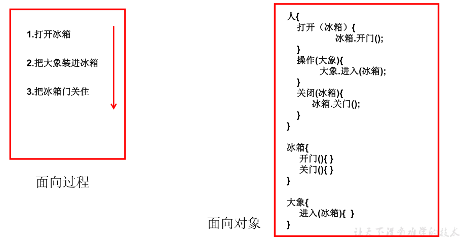
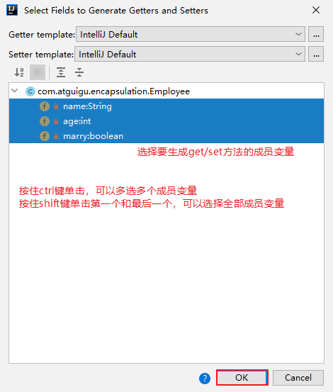
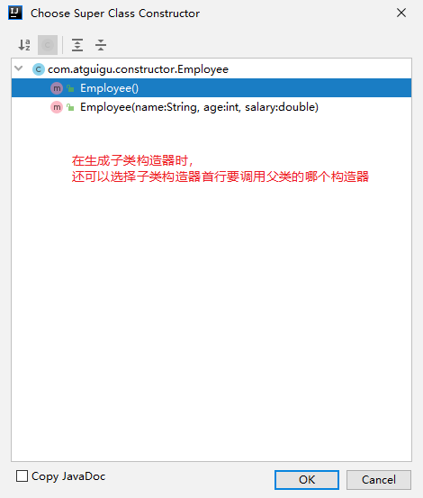

# 第6章 面向对象基础（上） 

## 学习目标

- [ ] 初步了解面向对象的思想
- [ ] 能够明确类与对象关系
- [ ] 能够掌握类的定义格式
- [ ] 能够掌握创建对象格式
- [ ] 理解包的作用
- [ ] 掌握包的声明和导入
- [ ] 能够通过对象访问对象的非静态成员变量和非静态成员方法
- [ ] 能够区别类变量与实例变量
- [ ] 能够区别成员变量与局部变量
- [ ] 熟练掌握实例变量和方法的访问
- [ ] 理解封装的概念
- [ ] 掌握成员变量的私有化
- [ ] 掌握构造器的声明与使用
- [ ] 会声明标准的JavaBean


# 第六章 面向对象基础（上）

## 6.1 面向对象思想概述

### 6.1.1 概述

Java是一种计算机程序设计语言。所有的计算机程序一直都是围绕着两件事在进行的，程序设计就是用某种语言编写代码来完成这两件事，所以程序设计语言又称为编程语言。

1. 如何表示和存储数据
   - 基本数据类型的常量和变量：表示和存储一个个独立的数据
   - 对象：表示和存储与某个具体事物相关的多个数据（例如：某个学生的姓名、年龄、联系方式等）
   - 数据结构：表示和存储一组对象，数据结构有数组、链表、栈、队列、散列表、二叉树、堆......
2. 基于这些数据都有什么操作行为，其实就是实现什么功能
   - 数据的输入和输出
   - 基于一个或两个数据的操作：赋值运算、算术运算、比较运算、逻辑运算等
   - 基于一组数据的操作：统计分析、查找最大值、查找元素、排序、遍历等

**面向对象和面向过程都是一种编程思想**，基于不同的思想会产生不同的程序设计方法。Java语言是在面向对象思想的指引下去设计、开发计算机程序的，所以Java语言是一种面向对象的程序设计语言。而C语言是一种面向过程的程序设计语言。

### 6.1.2 面向对象与面向过程的区别

1. 面向过程的程序设计思想（Process-Oriented Programming），简称POP

   - 关注的焦点是过程：过程就是操作数据的步骤，如果某个过程的实现代码在很多地方重复出现，那么就可以把这个过程抽象为一个函数，这样就可以大大简化冗余代码，也便于维护。
   - 代码结构：以函数为组织单位。独立于函数之外的数据称为全局数据，在函数内部的称为局部数据。
   - **以过程，步骤为主，考虑怎么做，程序员是具体执行者**

   - 制约了软件的可维护性和可扩展性

2. **面向对象的程序设计思想**（ Object Oriented Programming），简称OOP
   - 关注的焦点是类：**面向对象思想**就是在计算机程序设计过程中，参照现实中事物，将事物的**属性特征**、**行为特征**抽象出来，用类来表示。某个事物的一个具体个体称为实例或对象。
   
   - 代码结构：以类为组织单位。每种事物都具备自己的**属性**（即表示和存储数据，在类中用成员变量表示）和**行为/功能**（即操作数据，在类中用成员方法表示）。
     
   - **以对象（谁）为主，考虑谁来做，谁能做，程序员是指挥者**
     
   - 面向对象仍然包含面向过程，只不过关注点变了，关注谁来做
     
   - 软件可重用性、可维护性和可扩展性强
   

面向对象思想是一种更符合我们思考习惯的思想，它可以将复杂的事情简单化，并将我们从执行者变成了指挥者。

例子：吃饭，洗衣服

​	把大象装进冰箱




## 6.2 类和对象

### 6.2.1 类与对象的概念及关系

**万物皆对象**，环顾周围，你会发现很多对象，比如桌子，椅子，同学，老师，顾客，收银员等。

描述身边的对象：


如何描述对象？

**对象的属性**：姓名，年龄，体重，员工编号，部门等对象的静态特征

**对象的行为**：购买商品，收款，打印账单等对象的动态特征或行为特征或者功能

1. **什么是对象？**

   - **对象**：是一个具有特定属性和行为特征的具体事物。

2. **什么是类？**

   - **类**：是一类具有相同特征的事物的抽象描述，是一组相同**属性**和**行为**的对象的集合。

3. **类与对象的关系**

   - 类是对一类事物的描述，是**抽象的**。
   - 对象是一类事物的实例，是**具体的**。
   - **类是对象的模板，对象是类的实体**。

   ```markdown
   上例中的类和对象：
   **顾客**是一类事物的抽象描述，即为类，他们都有姓名，年龄，体重这些属性特征和购买商品的行为特征；**张三**是一个具体的顾客，即为对象。
   **收银员**是另一类事物的抽象描述，他们都有员工号，姓名、部门这些属性特征和收款、打印账单的行为特征；**李四**是一个具体的收银员。
   ```

举例描述类和对象：学生、手机、汽车、猫等

### 6.2.2 类的定义

Java中类的定义，就是把现实中类的概念用Java语言描述。

Java中用**class**关键字定义一个类，并定义类的成员：成员变量（属性）和成员方法（行为）。

**类的定义格式**

```java
public class 类名 {
  //成员变量，描述这类事物的属性
  //成员方法，描述这类事物的行为
}
```

* **成员变量**：和以前定义变量几乎是一样的。只不过位置发生了改变。**在类中，方法外**，用于描述对象的属性特征。
* **成员方法**：和以前写的main方法格式类似。只不过功能和形式更丰富了。在类中，方法外，用于描述对象的行为特征。

定义类的代码举例：

```java
//定义顾客类
public class Customer {
  	//成员变量,描述属性特征
  	String name;//姓名
    int age;//年龄
    int weight;//体重
    
    //成员方法，描述行为特征
    public void shopping(){
        System.out.println("购物...");
    }
}
```

**练习：**

​	定义学生类，汽车类

### 6.2.3 对象的创建与使用

类是对象的模板，所以通过类创建这个类的对象，或者说创建这个类的一个实例，这个过程称为类的实例化：

- **创建对象语法格式：** 

  **类名 对象名= new 类名 ();**

  ```java
  //创建顾客对象
  Customer c=new Customer();
  ```

- **使用对象的成员，使用“. ”操作**：

  使用成员变量：**对象名.属性**
  使用成员方法：**对象名.方法名()**

  ```java
  c.name="张三"; //访问对象的属性，赋值
  c.age=18;
  System.out.println(c.name+"--"+c.age); //访问对象的属性，获取值
  c.shopping(); //访问对象的方法
  ```


**练习：**

​	定义手机类并创建对象再使用

### 6.2.4对象的内存分析

​	**JVM内存结构图：**


| 区域名称   | 作用                                                         |
| ---------- | ------------------------------------------------------------ |
| **栈**     | 虚拟机栈，用于存储正在执行的每个Java方法的局部变量表等。局部变量表存放了编译期可知长度的各种基本数据类型、对象引用，方法执行完，自动释放。 |
| **堆**     | 存储对象（包括数组对象），new来创建的，都存储在堆内存。      |
| **方法区** | 存储已被虚拟机加载的类信息、常量、静态变量、即时编译器编译后的代码等数据。 |
| 程序计数器 | 程序计数器是CPU中的寄存器，它包含每一个线程下一条要执行的指令的地址 |
| 本地方法栈 | 当程序中调用了native的本地方法时，本地方法执行期间的内存区域 |

> jdk1.7之前，HotSpot虚拟机对于方法区的实现称之为“永久代”， Permanent Generation 。
>
>  jdk1.8之后，HotSpot虚拟机对于方法区的实现称之为“元空间”， Meta Space 。 
>
> 方法区是Java虚拟机规范中的定义，是一种规范，而永久代和元空间是 HotSpot 虚拟机不同版本的 两种实现。

**对象名中存储的是什么呢？答：对象地址**

```java
class Student{
    
}
public class TestStudent{
    //Java程序的入口
    public static void main(String[] args){
        System.out.println(new Student());//Student@7852e922

        Student stu = new Student();
        System.out.println(stu);//Student@4e25154f
        
        int[] arr = new int[5];
		System.out.println(arr);//[I@70dea4e
    }
}
//Student和TestStudent没有位置要求，谁在上面谁在下面都可以
//但是如果TestStudent类的main中使用了Student类，那么要求编译时，这个Student已经写好了，不写是不行的
//如果两个类都在一个.java源文件中，只能有一个类是public的
```

发现学生对象和数组对象类似，直接打印对象名和数组名都是显示“类型@对象的hashCode值"，所以说类、数组都是引用数据类型，引用数据类型的变量中存储的是对象的地址，或者说指向堆中对象的首地址。

那么像“Student@4e25154f”是对象的地址吗？不是，因为Java是对程序员隐藏内存地址的，不暴露内存地址信息，所以打印对象时不直接显示内存地址，而是JVM提取了对象描述信息给你现在，默认提取的是对象的运行时类型@代表对象唯一编码的hashCode值。


## 6.3 包（Package）

### 6.3.1 包的作用

（1）可以避免类重名：有了包之后，类的全名称就变为：包.类名

（2）分类组织管理众多的类

例如：

* java.lang----包含一些Java语言的核心类，如String、Math、Integer、 System和Thread等，提供常用功能
* java.net----包含执行与网络相关的操作的类和接口。
* java.io ----包含能提供多种输入/输出功能的类。
* java.util----包含一些实用工具类，如集合框架类、日期时间、数组工具类Arrays，文本扫描仪Scanner，随机值产生工具Random
* java.text----包含了一些java格式化相关的类
* java.sql和javax.sql----包含了java进行JDBC数据库编程的相关类/接口
* java.awt和java.swing----包含了构成抽象窗口工具集（abstract window toolkits）的多个类，这些类被用来构建和管理应用程序的图形用户界面(GUI)。

（3）可以控制某些类型或成员的可见范围

如果某个类型或者成员的权限修饰缺省的话，那么就仅限于本包使用

### 6.3.2 声明包的语法格式

```java
package 包名;
```

> 注意：
>
> (1)必须在源文件的代码首行
>
> (2)一个源文件只能有一个声明包的语句

包的命名规范和习惯：
（1）所有单词都小写，每一个单词之间使用.分割
（2）习惯用公司的域名倒置

例如：com.atguigu.xxx;

> 建议大家取包名时不要使用“java.xx"包

### 6.3.3 如何跨包使用类

前提：被使用的类或成员的权限修饰符是>缺省的，即可见的

（1）使用类型的全名称

例如：java.util.Scanner input = new java.util.Scanner(System.in);

（2）使用import 语句之后，代码中使用简名称

import语句告诉编译器到哪里去寻找类。

import语句的语法格式：

```java
import 包.类名;
import 包.*;
import static 包.类名.静态成员; //后面再讲
```

> 注意：
>
> 使用java.lang包下的类，不需要import语句，就直接可以使用简名称
>
> import语句必须在package下面，class的上面
>
> 当使用两个不同包的同名类时，例如：java.util.Date和java.sql.Date。一个使用全名称，一个使用简名称

示例代码：

```java
package com.atguigu.bean;

public class Student {
	// 成员变量
	private String name;
	private int age;

	// 构造方法
	public Student() {
	}

	public Student(String name, int age) {
		this.name = name;
		this.age = age;
	}

	// 成员方法
	public void setName(String name) {
		this.name = name;
	}

	public String getName() {
		return name;
	}

	public void setAge(int age) {
		this.age = age;
	}

	public int getAge() {
		return age;
	}
}
```

```java
package com.atguigu.test;

import java.util.Scanner;
import java.util.Date;
import com.atguigu.bean.Student;

public class Test{
    public static void main(String[] args){
        Scanner input = new Scanner(System.in);
        Student stu = new Student();
        String str = "hello";
        
        Date now = new Date();
        java.sql.Date d = new java.sql.Date(346724566);        
    }
}
```

## 6.4 成员变量

### 6.4.1 变量的分类

根据定义位置不同分为：

- **局部变量：**定义在方法体内或其他局部区域内的变量（之前所使用的都是main方法中定义的变量，为局部变量）。

- **成员变量：**定义在类的成员位置，在方法体外，与方法（例如main方法）平行的位置。并且有修饰符修饰。

  根据修饰的不同成员变量又分为：

  - **类变量：**或叫**静态变量**，有static修饰的成员变量。（后面再讲）
  - **实例变量：**没有static修饰的成员变量。

### 6.4.2 成员变量的声明

语法格式：

```java
class 类名{
    【修饰符】 数据类型  属性名;  
}
```

格式说明：

- 位置要求：成员变量必须定义在类中，方法外，成员变量与方法是并列的，方法内的变量是局部变量

- 类型要求：数据类型可以是任意基本数据类型和引用数据类型（类，接口，数组等）。

- 修饰符要求：常用修饰符有public、缺省、private、protected、final、static 等（后面讲）

- 名称要求：属性名即变量名，符合标识符的命名规则和规范。

示例：

```java
//定义一个人类
public class Person{
	String name;
    char gender;
    int age;
}
```

### 6.4.3 实例变量

####  1、实例变量的特点

1. 实例变量的值是属于某个对象的

   - 必须通过对象才能访问实例变量
   - 每个对象的实例变量的值是独立的
   
2. **成员变量有默认初始值**（同数组元素默认初始值）

   |         数据类型         |       默认值        |
   | :----------------------: | :-----------------: |
   |  byte，short，int，long  |          0          |
   |      float，double       |         0.0         |
   |           char           | 0或'\u0000'表现为空 |
   |         boolean          |        false        |
   | 数组，类，接口等引用类型 |        null         |

   

#### 2、实例变量的访问

```java
对象.实例变量
```

例如：

```java
public class TestPerson {
    public static void main(String[] args) {
        Person p1 = new Person();
        p1.name = "张三";
        p1.age = 23;
        p1.gender = '男';

        Person p2 = new Person();
        /*
        （1）实例变量的值是属于某个对象的
        - 必须通过对象才能访问实例变量
        - 每个对象的实例变量的值是独立的
        （2）实例变量有默认值
         */
        System.out.println("p1对象的实例变量：");
        System.out.println("p1.name = " + p1.name);
        System.out.println("p1.age = " + p1.age);
        System.out.println("p1.gender = " + p1.gender);

        System.out.println("p2对象的实例变量：");
        System.out.println("p2.name = " + p2.name);
        System.out.println("p2.age = " + p2.age);
        System.out.println("p2.gender = " + p2.gender);
    }
}
```


#### 3、实例变量的内存分析

Java对象保存在内存中时，由以下三部分组成：

- 对象头
  - Mark Word：记录了和当前对象有关的GC、锁等信息。（后面阶段再讲）
  - 指向类的指针：每一个对象需要记录它是由哪个类创建出来的，而Java对象的类数据保存在方法区，指向类的指针就是记录创建该对象的类数据在方法区的首地址。该指针在32位JVM中的长度是32bit，在64位JVM中长度是64bit。
  - 数组长度（只有数组对象才有）
- 实例数据
  - 即实例变量的值
- 对齐填充
  - 因为JVM要求Java对象占的内存大小应该是8bit的倍数，如果不满足该大小，则需要补齐至8bit的倍数，没有特别的功能。


#### 4、小结:实例变量与局部变量的区别

|                  | **实例变量**             | **局部变量**                                                 |
| ---------------- | ------------------------ | ------------------------------------------------------------ |
| **声明的位置**   | 直接声明在类的成员位置   | 声明在方法体中或其他局部区域内（方法声明上，构造方法，代码块等） |
| **修饰符**       | public、private、final等 | 不能使用访问权限修饰符，可以使用final                        |
| **内存加载位置** | 堆                       | 栈                                                           |
| **初始化值**     | 有默认初始化值           | 无默认初始化值                                               |
| **生命周期**     | 同对象的生命周期         | 随着方法的调用而存在，方法调用完毕即消失                     |

### 练习

声明一个圆的图形类，有属性：半径
在测试类的main中，创建圆的2个对象，为半径属性赋值，并显示两个圆的半径值

## 6.5 实例方法

**成员变量是用来存储对象的数据信息的，那么如何表示对象的行为功能呢？就要通过方法来实现**

根据修饰不同方法主要分为两类：

* **静态方法：**有static修饰的方法，也叫类方法，通常用在工具类中，主要特点是可以由类名来方便调用。
* **实例方法：**没有static修饰的方法，用来表示对象的功能，必须通过实例对象来调用。

### 6.5.1 实例方法的调用

**方法必须先声明后使用，不调用不执行，调用一次执行一次。**

**实例方法的调用格式**

```
对象名.实例方法(【实参列表】) 
```

**示例：**

```java
//测试类
public class Demo {
    public static void main(String[] args) {
        Student stu = new Student();
        stu.study();//通过对象调用实例方法

        Student stu2= new Student();
        stu2.study();//通过对象调用实例方法
    }
}
//学生类
class Student{
    public void study(){
        System.out.println("学习...");
    }
}
```


### 6.5.2 本类内的实例变量和方法访问

在实例方法中还可以使用当前对象的其他成员。在Java中当前对象用this表示。

- this：在实例方法中，表示调用该方法的对象

- 如果没有歧义，完全可以省略this。

**使用this**的案例：矩形类 

```java
public class Rectangle {
    int length;
    int width;
	//求面积
    int area() {
        return this.length * this.width;
    }
	//求周长
    int perimeter(){
        return 2 * (this.length + this.width);
    }
	//打印矩形对象信息
    String getInfo(){
        return "长：" + this.length + "，宽：" + this.width +"，面积：" + this.area() +"，周长：" + this.perimeter();
    }
}

```

测试类

```java
public class TestRectangle {
    public static void main(String[] args) {
        Rectangle r1 = new Rectangle();
        Rectangle r2 = new Rectangle();

        System.out.println("r1对象：" + r1.getInfo());
        System.out.println("r2对象：" + r2.getInfo());

        r1.length = 10;
        r1.width = 2;
        System.out.println("r1对象：" + r1.getInfo());
        System.out.println("r2对象：" + r2.getInfo());

    }
}
```

**省略this.**

```java
public class Rectangle {
    int length;
    int width;

    int area() {
        return length * width;
    }

    int perimeter(){
        return 2 * (length + width);
    }

    String getInfo(){
        return "长：" + length + "，宽：" + width +"，面积：" + area() +"，周长：" + perimeter();
    }
}
```

### 练习

**声明一个圆类Circle**

（1）有属性：半径radius

（2）包含3个方法：

1. 求面积、
2. 求周长、
3. 返回圆形对象的信息：半径：xx，面积：xx，周长：xx

（3）在测试类中进行测试


## 6.5 封装encapsulation

面向对象三大特征：封装、继承、多态

### 6.5.1 为什么需要封装？

- 我要用洗衣机，只需要按一下开关和洗涤模式就可以了。有必要了解洗衣机内部的结构吗？有必要碰电动机吗？

- 我们使用的电脑，内部有CPU、硬盘、键盘、鼠标等等，每一个部件通过某种连接方式一起工作，但是各个部件之间又是独立的

- 现实生活中，每一个个体与个体之间是有边界的，每一个团体与团体之间是有边界的，而同一个个体、团体内部的信息是互通的，只是对外有所隐瞒。

面向对象编程语言是对客观世界的模拟，客观世界里每一个事物的内部信息都是隐藏在对象内部的，外界无法直接操作和修改，只能通过指定的方式进行访问和修改。封装可以被认为是一个保护屏障，防止该类的代码和数据被其他类随意访问。适当的封装可以让代码更容易理解与维护，也加强了代码的安全性。

随着我们系统越来越复杂，类会越来越多，那么类之间的访问边界必须把握好，面向对象的开发原则要遵循“高内聚、低耦合”，而“高内聚，低耦合”的体现之一：

- 高内聚：类的内部数据操作细节自己完成，不允许外部干涉；

- 低耦合：仅对外暴露少量的方法用于使用

隐藏对象内部的复杂性，只对外公开简单的接口。便于外界调用，从而提高系统的可扩展性、可维护性。**通俗的讲，把该隐藏的隐藏起来，该暴露的暴露出来。这就是封装性的设计思想。**

通俗的讲，封装就是把该隐藏的隐藏起来，该暴露的暴露出来。那么暴露的程度如何控制呢？就是依赖**访问控制修饰符**，也称为**权限修饰符**来控制。

	便于使用者正确使用系统，防止错误修改属性
	有助于系统之间的松耦合，提高系统独立性
	提高软件的可重用性
	降低了构建大型系统的风险

### 6.5.2 类的封装

1. **类的封装的意义：**

   **隐藏类的实现细节**
   
   > 让使用者只能通过事先预定的方法来访问数据，从而可以在该方法里面加入控制逻辑，限制对成员变量的不合理访问。还可以进行数据检查，从而有利于保证对象信息的完整性。
   >
   > 便于修改，提高代码的可维护性。主要说的是隐藏的部分，在内部修改了，如果其对外可以的访问方式不变的话，外部根本感觉不到它的修改。例如：Java8->Java9，String从char[]转为byte[]内部实现，而对外的方法不变，我们使用者根本感觉不到它内部的修改。

2. **private关键字**

   关键字private，表示私有的，它修饰的成员不能在类的外部直接访问，而只能被同一个类内部的其他成员直接访问。

3. **如何进行类的封装？**

   - 成员变量（field）私有化
   - 提供标准的get/set方法

   ```java
   public class Person {
       //使用 `private` 修饰成员变量
       private String name;
     	private int age;
       private boolean marry;
       
   	//提供 `getXxx`方法 / `setXxx` 方法，可以访问成员变量
   	public void setName(String n) {
   		name = n;
       }
   
       public String getName() {
           return name;
   	}
   
       public void setAge(int a) {
           age = a;
       }
   
       public int getAge() {
           return age;
       }
       
       public void setMarry(boolean m){
           marry = m;
       }
       
       public boolean isMarry(){
           return marry;
       }
   }
   ```

4. **this解决局部变量与成员变量同名问题**

   当局部变量与实例变量（非静态成员变量）同名时，在实例变量前面加“**this.**”

   **this代表当前对象的引用，即当前被创建的对象**

   ```java
   public class Chinese {
       private String name;
     	private int age;
   
   	public void setName(String name) {
   		this.name = name;
       }
   
       public String getName() {
           return name;
   	}
   
       public void setAge(int age) {
           this.age = age;
       }
   
       public int getAge() {
           return age;
       }
   }
   ```


4. **IDEA自动生成get/set方法**

   - 大部分键盘模式按Alt + Insert键。

   - 部分键盘模式需要按Alt + Insert + Fn键。

   - Mac电脑快捷键需要单独设置




### 练习

（1）定义矩形类Rectangle，

​	声明实例变量长和宽

​	全部私有化，并提供相应的get/set方法

（2）在测试类中创建Rectangle对象，并调用相应的方法测试

## 6.6 构造器（Constructor)

我们发现我们new完对象时，所有成员变量都是默认值，如果我们需要赋别的值，需要挨个为它们再赋值，太麻烦了。我们能不能在new对象时，直接为当前对象的某个或所有成员变量直接赋值呢。

可以，Java给我们提供了构造器。

### 6.6.1 构造器的作用

new对象，并在new对象的时候为实例变量赋值。

### 6.6.2 构造器的语法格式

**语法格式：**

```java
【修饰符】 class 类名{
    【修饰符】 构造器名(){
    	// 实例初始化代码
    }
    【修饰符】 构造器名(参数列表){
        // 实例初始化代码
    }
}
```

**格式说明：**

构造器又称为**构造方法**，那是因为它长的很像方法。但是和方法还是有所区别的。

- 构造器名必须与它所在的类名必须相同。
- 它没有返回值，所以不需要返回值类型，甚至不需要void
- 构造器的修饰符只能是权限修饰符，不能被其他任何修饰

**示例代码：**

```java
package com.atguigu.constructor;

public class Student {
    private String name;
    private int age;

    // 无参构造
    public Student() {}

    // 有参构造
    public Student(String name,int age) {
        this.name = name;
        this.age = age;
    }

    public String getName() {
        return name;
    }
    public void setName(String name) {
        this.name = name;
    }
    public int getAge() {
        return age;
    }
    public void setAge(int age) {
        this.age = age;
    }

    public String getInfo(){
        return "姓名：" + name +"，年龄：" + age;
    }
}

```

### 6.6.3 构造器使用注意事项

1. 如果你不提供构造器，系统会给出隐藏的无参数构造器，并且该构造器的修饰符默认与类的修饰符相同
2. 如果你提供了构造器，系统将不再提供无参数构造器，除非你自己再显示定义。
3. 构造器是可以重载的，既可以定义参数，也可以不定义参数。

```java
package com.atguigu.constructor;

public class TestStudent {
    public static void main(String[] args) {
        //调用无参构造创建学生对象
        Student s1 = new Student();

        //调用有参构造创建学生对象
        Student s2 = new Student("张三",23);

        System.out.println(s1.getInfo());
        System.out.println(s2.getInfo());
    }
}
```

### 6.6.4 this调用本类其他构造器

同一个类中，使用**`this(【实参列表】)`**可以实现构造器之间的相互调用。

- this()：调用本类的无参构造

- this(实参列表)：调用本类的有参构造

- this(【实参列表】)只能出现在构造器内首行

  注意：不能出现构造器递归调用

```java
package com.atguigu.constructor;

public class Student {
    private String name;
    private int age;

    // 无参构造
    public Student() {
//        this("",18);//调用本类有参构造
    }

    // 有参构造
    public Student(String name,int age) {
        this();//调用本类无参构造
        this.name = name;
        this.age = age;
    }

    public String getName() {
        return name;
    }
    public void setName(String name) {
        this.name = name;
    }
    public int getAge() {
        return age;
    }
    public void setAge(int age) {
        this.age = age;
    }

    public String getInfo(){
        return "姓名：" + name +"，年龄：" + age;
    }
}
```

### 6.6.5 IDEA快捷生成构造器：Alt + Insert




### 6.2.6 IDEA查看构造器和方法形参列表快捷键：Ctrl + P


## 6.7 标准JavaBean

`JavaBean` 是 Java语言编写类的一种标准规范。标准的 JavaBean —般需遵循以下规范：	

（1）类必须是具体的和公共的，

（2）并且具有无参数的构造方法，

（3）成员变量私有化，并提供用来操作成员变量的`set` 和`get` 方法。

> （4）实现 `java.io.Serializable` 接口 

```java
public class ClassName{
  //成员变量
    
  //构造方法
  	//无参构造方法【必须】
  	//有参构造方法【建议】
  	
  //getXxx()
  //setXxx()
  //其他成员方法
}
```

 编写符合`JavaBean` 规范的类，以学生类为例，标准代码如下：

```java
public class Student {
	// 成员变量
	private String name;
	private int age;

	// 构造方法
	public Student() {
	}

	public Student(String name, int age) {
		this.name = name;
		this.age = age;
	}

	// get/set成员方法
	public void setName(String name) {
		this.name = name;
	}

	public String getName() {
		return name;
	}

	public void setAge(int age) {
		this.age = age;
	}

	public int getAge() {
		return age;
	}
    
}
```

练习：

```
声明一个MyDate类型，有属性：年，月，日
声明另一个Employee类型，有属性：姓名（String类型），生日（MyDate类型）
在测试类中的main中，创建两个员工对象，并为他们的姓名和生日赋值，并显示
```


