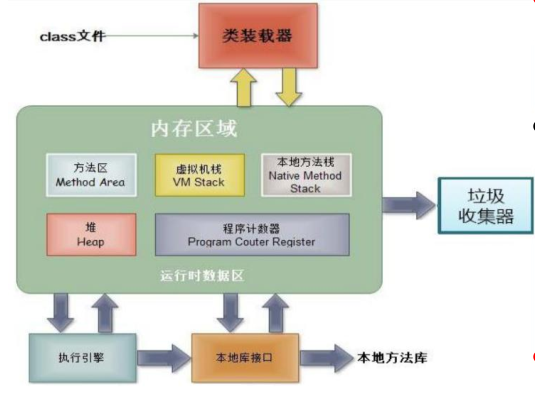
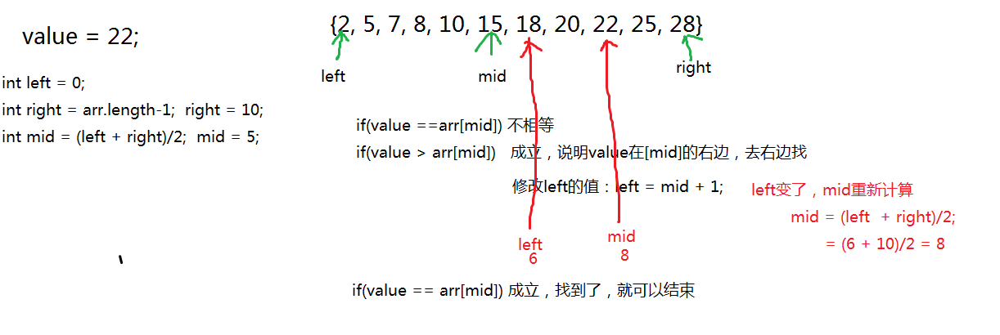
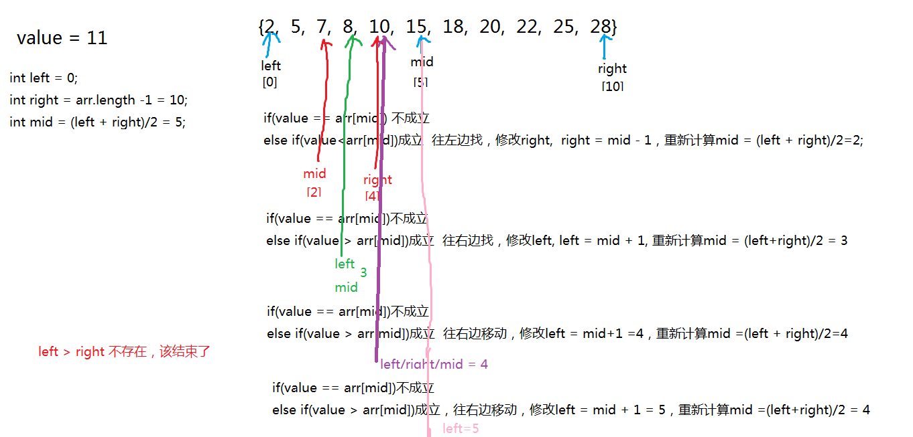
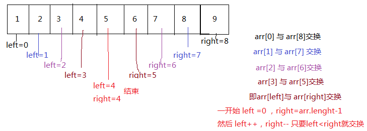
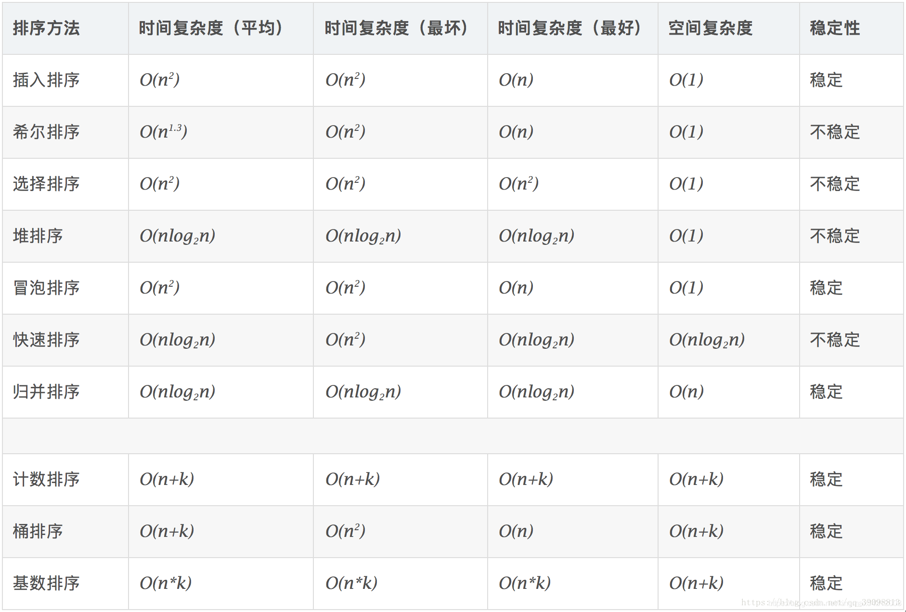

# 第4章【数组】

## 学习目标

- [ ] 理解数组的概念
- [ ] 掌握数组的声明和初始化
- [ ] 使用索引访问数组的元素
- [ ] 了解数组的内存图解
- [ ] 避免空指针和越界异常
- [ ] 掌握数组的遍历
- [ ] 掌握数组元素的统计
- [ ] 掌握数组最大值的获取
- [ ] 掌握数组元素的查找
- [ ] 掌握数组的冒泡排序

# 第四章 数组

## 4.1数组概述

1. **数组的概念：**

   - **数组(array)，就是多个相同类型的数据按一定顺序排列的集合，并使用一个名字命名，然后用编号区分这些数据。**
   - 数组就是一个数据容器。

2. **相关概念：**

   - **数组名**
   - **下标（或脚标、索引）**(index)
   - **元素**(element)
   - **数组的长度**(length)

   

3. **数组的特点：**

   - 数组的长度一旦确定就不能修改（重要）
   - 创建数组时会在内存中开辟一整块连续的空间。
   - 存取元素的速度快，因为可以通过[下标]，直接定位到任意一个元素。

## 4.2 数组的声明与初始化

数组在使用之前需要先进行声明并初始化

### 4.2.1 数组的声明

数组的声明，即声明一个数组类型的变量。

```java
//推荐
元素的数据类型[] 数组的名称;
int[] age;
//不推荐
元素的数据类型  数组名[];
int age[];
```

### 4.2.2 数组的初始化

数组使用之前需要先初始化，什么是数组初始化？就是给数组分配内存空间，并给元素赋值。

数组有两种初始化方式：

1. **方式一：静态初始化**

   定义数组的同时为数组分配内存空间，并赋值。程序员只给定数组元素的初始值，不指定数组长度，由系统决定数组的长度

   - **格式：**

   ```java
   数据类型[] 数组名 = new 数据类型[]{元素1,元素2,元素3...};
   或
   数据类型[] 数组名;
   数组名 = new 数据类型[]{元素1,元素2,元素3...};
   
   简化方式：
   数据类型[] 数组名 = {元素1,元素2,元素3...};//必须在一个语句中完成，不能分开两个语句写
   ```

   - **举例：**

     定义存储1，2，3，4，5整数的数组容器。

     ```java
     int[] arr = new int[]{1,2,3,4,5};//正确
     
     int[] arr;
     arr = new int[]{1,2,3,4,5};//正确
     
     int[] arr = new int[5]{1,2,3,4,5};//错误的，后面有{}指定元素列表，就不需要在[长度]指定长度。
     
     //简化方式：
     int[] arr = {1,2,3,4,5};//正确
     
     int[] arr;
     arr = {1,2,3,4,5};//错误
     ```


2. **方式二：动态初始化**

   程序员只给定数组的长度，后期再给给元素赋值（实际系统会先给出元素的默认值）

   - **格式：**

   ```java
    数据类型[] 数组名字 = new 数据类型[长度];
   
     或
   
    数据类型[] 数组名字;
    数组名字 = new 数据类型[长度];
   ```

   - **格式详解：**
     - 数据类型： 指定创建的数组容器可以存储什么数据类型的数据。
     - [] : 表示数组。
     - 数组名字：为定义的数组起个变量名，满足标识符规范，可以使用名字操作数组。
     - new：关键字，理解为开辟内存空间。因为数组本身是引用数据类型，所以要用new创建数组对象。
     - [长度]：数组的长度，表示数组容器中可以存储多少个元素。
       - **注意：数组有定长特性，长度一旦指定，不可更改。**
       - 和水杯道理相同，买了一个2升的水杯，总容量就是2升，不能多也不能少。

   - **举例：**

     定义可以存储5个整数的数组容器，代码如下：

     ```java
     int[] arr = new int[5];
     
     int[] arr;
     arr = new int[5];
     ```

## 4.3 数组的基本操作

### 4.3.1 数组元素的访问

- **索引：** 每一个存储到数组的元素，都会自动的拥有一个编号，从0开始，这个自动编号称为**数组索引(index)**，可以通过数组的索引访问到数组中的元素。

- **索引范围：**[0, 数组的长度-1]

- **格式：**

  ```java
  数组名[索引]
  ```


- **访问数组元素：**

  - 数组名[索引]，表示指定索引位置的元素

  - 数组名[索引]=值，表示为数组中指定索引位置的元素赋值

    ```java
    public static void main(String[] args) {
        //定义存储int类型数组，赋值元素1，2，3，4，5
        int[] arr = {1,2,3,4,5};
        //为0索引元素赋值为6
        arr[0] = 6;
        //获取数组0索引上的元素
        int i = arr[0];
        System.out.println(i);
        //直接输出数组0索引元素
        System.out.println(arr[0]);
    }
    ```


### 4.3.2 数组的遍历

* **数组遍历：** 就是将数组中的每个元素分别获取出来，就是遍历。遍历也是数组操作中的基石。

* **数组的长度属性：** 每个数组都具有长度，而且是固定的，Java中赋予了数组的一个属性，可以获取到数组的长度，语句为：`数组名.length` ，属性length的执行结果是数组的长度，int类型结果。由次可以推断出，数组的最大索引值为`数组名.length-1`。

  ```java
  public static void main(String[] args) {
      int[] arr = {11, 22, 33, 44, 55};
      //打印输出数组的长度
      System.out.println("数组长度："+arr.length);//5
      //数组遍历（正序）：
      System.out.println("数组遍历：");
      for (int i = 0; i < arr.length; i++) {
          System.out.println(arr[i]);
      }
      //数组遍历（逆序）：
      System.out.println("数组逆序遍历：");
      for (int i = arr.length-1; i >=0 ; i--) {
          System.out.println(arr[i]);
      }
  }
  ```

  

## 4.4 数组元素的默认值

当我们使用动态初始化创建数组时：

```java
数据类型[] 数组名字 = new 数据类型[长度];
```

此时只确定了数组的长度，那么数组的元素是什么值呢？

数组的元素有默认值：


## 4.5 数组内存图

### 4.5.1 内存概述

内存是计算机中重要的部件之一，它是与CPU进行沟通的桥梁。其作用是用于暂时存放CPU中的运算数据，以及与硬盘等外部存储器交换的数据。只要计算机在运行中，CPU就会把需要运算的数据调到内存中进行运算，当运算完成后CPU再将结果传送出来。我们编写的程序是存放在硬盘中的，在硬盘中的程序是不会运行的，必须放进内存中才能运行，运行完毕后会清空内存。

Java虚拟机要运行程序，必须要对内存进行空间的分配和管理。

### 4.5.2 Java虚拟机的内存划分

为了提高运算效率，就对空间进行了不同区域的划分，因为每一片区域都有特定的处理数据方式和内存管理方式。



| 区域名称   | 作用                                                      |
| ----------| ---------------------------------------------------------|
| 程序计数器 | 程序计数器是CPU中的寄存器，它包含每一个线程下一条要执行的指令的地址 |
| 本地方法栈 | 当程序中调用了native的本地方法时，本地方法执行期间的内存区域 |
| 方法区     | 存储已被虚拟机加载的类信息、常量、静态变量、即时编译器编译后的代码等数据。 |
| 堆内存     | 存储对象（包括数组对象），new来创建的，都存储在堆内存。      |
| 虚拟机栈   | 用于存储正在执行的每个Java方法的局部变量表等。<br />局部变量表存放了编译期可知长度的各种基本数据类型、对象引用，方法执行完，自动释放。 |

### 4.5.3 数组内存图分析

**（1）一个数组内存图**

```java
public static void main(String[] args) {
  	int[] arr = new int[3];
  	System.out.println(arr);//[I@5f150435
}

```


> 思考：打印arr为什么是[I@5f150435，它是数组的地址吗？
>
> 答：它不是数组的地址。
>
> 问？不是说arr中存储的是数组对象的首地址吗？
>
> 答：arr中存储的是数组的首地址，但是因为数组是引用数据类型，打印arr时，会自动调用arr数组对象的toString()方法，默认该方法实现的是对象类型名@该对象的hashCode()值的十六进制值。
>
> 问？对象的hashCode值是否就是对象内存地址？
>
> 答：不一定，因为这个和不同品牌的JVM产品的具体实现有关。例如：Oracle的OpenJDK中给出了5种实现，其中有一种是直接返回对象的内存地址，但是OpenJDK默认没有选择这种方式。

**（2）两个数组内存图**

```java
public static void main(String[] args) {
    int[] arr = new int[3];
    int[] arr2 = new int[2];
    System.out.println(arr);
    System.out.println(arr2);
}

```


**（3）两个变量指向一个数组**

```java
public static void main(String[] args) {
    // 定义数组，存储3个元素
    int[] arr = new int[3];
    //数组索引进行赋值
    arr[0] = 5;
    arr[1] = 6;
    arr[2] = 7;
    //输出3个索引上的元素值
    System.out.println(arr[0]);
    System.out.println(arr[1]);
    System.out.println(arr[2]);
    //定义数组变量arr2，将arr的地址赋值给arr2
    int[] arr2 = arr;
    arr2[1] = 9;
    System.out.println(arr[1]);
}

```

 

练习题

1. 练习1：用一个数组存储26个小写英文字母，并遍历显示，显示要求如：a->A

2. 练习2：用一个数组存储本组学员的年龄，从键盘输入，并遍历显示

3. 练习3：用一个数组存储本组学员的姓名，从键盘输入，并遍历显示

4. 练习4：用数组存储一个星期的7个英文单词，然后从键盘输入星期的值[1-7]，输出对应的英文单词

   

## 4.6 数组的相关算法

### 4.6.1 查找最大/最小元素


1. **查找出数组中元素的最大值或最小值**

   思路：

   （1）先假设第一个元素为最大/最小，用max/min变量表示最大/小值，

   （2）然后用max/min与后面的每个元素一一比较

   示例代码：

   ```java
   int[] arr = {4,5,6,1,9};
   //找最大值
   int max = arr[0];
   for(int i=1; i<arr.length; i++){
       if(arr[i] > max){
           max = arr[i];
       }
   }
   ```

2. **查找最值及其第一次出现的下标**

   思路：

   （1）先假设第一个元素最大/最小，用变量index表示其位置，

   （2）然后用index位置的元素与后面的元素一一比较

   （3）用变量index时刻记录目前比对的最大/小的下标

   示例代码：

   ```java
   //求最大值及其位置
   int[] arr = {4, 5, 6, 1, 9};
   int maxIndex=0;//假定索引0位置的元素最大
   for (int i = 1; i < arr.length; i++) {
       if(arr[i]>arr[maxIndex]){
           maxIndex=i;
       }
   }
   System.out.println("最大值：" + arr[maxIndex]);
   ```

3. **查找找最值及其所有下标位置（自选）**

   思路：

   （1）先找到最大值

   （2）遍历数组，看哪些元素和最大值是一样的

   示例代码：

   ```java
   int[] arr = {4,9,5,6,1,9};
   //找最大值
   int max = arr[0];
   for(int i=1; i<arr.length; i++){
       if(arr[i] > max){
           max = arr[i];
       }
   }
   
   //遍历数组，看哪些元素和最大值是一样的
   for(int i=0; i<arr.length; i++){
       if(max == arr[i]){
           System.out.print(i+"\t");
       }
   }
   ```


### 4.6.2  查找指定元素

查找某个指定元素在数组中的首次出现的位置（索引）

常见查找算法有**顺序查找**，**二分查找**（折半查找，前提要求数组中元素是按照大小顺序排序的）

#### 1、顺序查找

从数组的起始索引位置开始依次查找到目标元素，确定其第一次出现的位置。

示例代码：

```java
//查找value第一次在数组中出现的位置index
public static void main(String[] args){
    int[] arr = {4,5,6,1,9};
    int value = 1;//目标元素
    int index = -1;

    for(int i=0; i<arr.length; i++){
        if(arr[i] == value){
            index = i;
            break;
        }
    }
	//根据index值可以判断目标元素是否存在
    if(index == -1){
        System.out.println(value + "不存在");
    }else{
        System.out.println(value + "的下标是" + index);
    }
}
```

#### 2、二分查找

二分查找，也称为折半查找，**前提条件是有序的数组**

要求：要求数组元素必须支持比较大小，并且数组中的元素已经按大小排好序

示例：

```java
class Exam2{
    public static void main(String[] args){
        int[] arr = {2,5,7,8,10,15,18,20,22,25,28};//数组是有序的	
        //二分查找
        int num = 18;//目标值
        int index = -1;//目标的位置默认为-1表示不存在
        int left = 0;//左边位置默认为最小索引位置
        int right = arr.length - 1;//右边位置默认为最大索引位置
        int mid;//中间位置
        //循环查找，每次查找left与right之间的数据，并比较中间位置元素与目标元素的大小
        do {
            //每次计算中间位置
            mid = (left + right) / 2;
            if (num == arr[mid]) {//目标元素等于中间位置元素时，找到
                index = mid;//保存找到的元素位置
                break;//跳出循环
            }
            if (num > arr[mid])//目标元素比中间位置元素大时
                left = mid + 1;//修改新的左边位置
            if (num < arr[mid])//目标元素比中间位置元素小时
                right = mid - 1;//修改新的右边位置
        } while (left <= right);//当左右位置重合时说明已经找遍了整个数组。

        if(index==-1){
            System.out.println(value + "不存在");
        }else{
            System.out.println(value + "的下标是" + index);
        }

    }
}
```





### 4.6.3 数组的反转

**实现思想：**数组对称位置的元素互换。


```java
    public class Test17ArrayReverse {
    public static void main(String[] args) {
        int[] arr = {1,2,3,4,5};
        System.out.println("反转之前：");
        for (int i = 0; i < arr.length; i++) {
            System.out.println(arr[i]);
        }

        //反转
         /*
        思路：首尾对应位置的元素交换
        （1）确定交换几次
           次数 = 数组.length / 2
        （2）谁和谁交换
        for(int i=0; i<次数; i++){
             int temp = arr[i];
             arr[i] = arr[arr.length-1-i];
             arr[arr.length-1-i] = temp;
        }
         */
        for(int i=0; i<arr.length/2; i++){
            int temp = arr[i];
            arr[i] = arr[arr.length-1-i];
            arr[arr.length-1-i] = temp;
        }

        System.out.println("反转之后：");
        for (int i = 0; i < arr.length; i++) {
            System.out.println(arr[i]);
        }
    }

}
```

或



```java
public class Test17ArrayReverse2 {
    public static void main(String[] args) {
        int[] arr = {1,2,3,4,5};
        System.out.println("反转之前：");
        for (int i = 0; i < arr.length; i++) {
            System.out.println(arr[i]);
        }

        //反转
        //左右对称位置交换
        for(int left=0,right=arr.length-1; left<right; left++,right--){
            //首  与  尾交换
            int temp = arr[left];
            arr[left] = arr[right];
            arr[right] = temp;
        }

        System.out.println("反转之后：");
        for (int i = 0; i < arr.length; i++) {
            System.out.println(arr[i]);
        }
    }
}
```


### 4.6.4 排序算法

#### 1、排序算法概述

数组的排序算法很多，实现方式各不相同，时间复杂度、空间复杂度、稳定性也各不相同：



- 时间复杂度：

常见的算法时间复杂度由小到大依次为：Ο(1)＜Ο(log~2~n)＜Ο(n)＜Ο(nlog~2~n)<O(n<sup>1.3</sup>)＜Ο(n<sup>2</sup>)＜Ο(n<sup>3</sup>)＜…＜Ο(2<sup>n</sup>)＜Ο(n!)

	一个算法执行所耗费的时间，从理论上是不能算出来的，必须上机运行测试才能知道。但我们不可能也没有必要对每个算法都上机测试，只需知道哪个算法花费的时间多，哪个算法花费的时间少就可以了。一个算法花费的时间与算法中语句的执行次数成正比例，哪个算法中语句执行次数多，它花费时间就多。一个算法中的语句执行次数称为语句频度或时间频度。记为T(n)。n称为问题的规模，当n不断变化时，时间频度T(n)也会不断变化。但有时我们想知道它变化时呈现什么规律。为此，我们引入时间复杂度概念。 一般情况下，算法中基本操作重复执行的次数是问题规模n的某个函数，用T(n)表示，若有某个辅助函数f(n),使得当n趋近于无穷大时，T(n)/f(n)的极限值为不等于零的常数，则称f(n)是T(n)的同数量级函数。记作T(n)=Ｏ(f(n)),称Ｏ(f(n)) 为算法的渐进时间复杂度，简称时间复杂度。

- 空间复杂度：

```
类似于时间复杂度的讨论，一个算法的空间复杂度(Space Complexity)S(n)定义为该算法所耗费的存储空间，它也是问题规模n的函数。
```

- 稳定性：

```
排序一定会涉及到数组元素位置的交换。如果两个元素相等，无论它们原来是否相邻，在排序过程中，最后它们变的相邻，但是它们前后顺序并没有改变，就称为稳定的，否则就是不稳定的。
```


#### 2、冒泡排序

Java中的经典算法之冒泡排序（Bubble Sort）

原理：比较两个相邻的元素，将值大的元素交换至右端。

思路：依次比较相邻的两个数，将小数放到前面，大数放到后面。

​	即第一趟，首先比较第1个和第2个元素，将小数放到前面，大数放到后面。

​			然后比较第2个和第3个元素，将小数放到前面，大数放到后面。

​			如此继续，直到比较最后两个数，将小数放到前面，大数放到后面。

​	重复第一趟步骤，直至全部排序完成。

```java
/*
1、冒泡排序（最经典）
思想：每一次比较“相邻（位置相邻）”元素，如果它们不符合目标顺序（例如：从小到大），
     就交换它们，经过多轮比较，最终实现排序。
	 （例如：从小到大）	 每一轮可以把最大的沉底，或最小的冒顶。
	 
过程：arr{6,9,2,9,1}  目标：从小到大

第一轮：
	第1次，arr[0]与arr[1]，6>9不成立，满足目标要求，不交换
	第2次，arr[1]与arr[2]，9>2成立，不满足目标要求，交换arr[1]与arr[2] {6,2,9,9,1}
	第3次，arr[2]与arr[3]，9>9不成立，满足目标要求，不交换
	第4次，arr[3]与arr[4]，9>1成立，不满足目标要求，交换arr[3]与arr[4] {6,2,9,1,9}
	第一轮所有元素{6,9,2,9,1}已经都参与了比较，结束。
	第一轮的结果：第“一”最大值9沉底（本次是后面的9沉底），即到{6,2,9,1,9}元素的最右边

第二轮：
	第1次，arr[0]与arr[1]，6>2成立，不满足目标要求，交换arr[0]与arr[1] {2,6,9,1,9}
	第2次，arr[1]与arr[2]，6>9不成立，满足目标要求，不交换
	第3次：arr[2]与arr[3]，9>1成立，不满足目标要求，交换arr[2]与arr[3] {2,6,1,9,9}
	第二轮未排序的所有元素 {6,2,9,1}已经都参与了比较，结束。
	第二轮的结果：第“二”最大值9沉底（本次是前面的9沉底），即到{2,6,1,9}元素的最右边
第三轮：
	第1次，arr[0]与arr[1]，2>6不成立，满足目标要求，不交换
	第2次，arr[1]与arr[2]，6>1成立，不满足目标要求，交换arr[1]与arr[2] {2,1,6,9,9}
	第三轮未排序的所有元素{2,6,1}已经都参与了比较，结束。
	第三轮的结果：第三最大值6沉底，即到 {2,1,6}元素的最右边
第四轮：
	第1次，arr[0]与arr[1]，2>1成立，不满足目标要求，交换arr[0]与arr[1] {1,2,6,9,9}
	第四轮未排序的所有元素{2,1}已经都参与了比较，结束。
	第四轮的结果：第四最大值2沉底，即到{1,2}元素的最右边

*/
public class Test19BubbleSort{
    public static void main(String[] args){
        int[] arr = {6,9,2,9,1};

        //目标：从小到大
        //冒泡排序的轮数 = 元素的总个数 - 1
        //轮数是多轮，每一轮比较的次数是多次，需要用到双重循环，即循环嵌套
        //外循环控制 轮数，内循环控制每一轮的比较次数和过程
        for(int i=1; i<arr.length; i++){ //循环次数是arr.length-1次/轮
			/*
			假设arr.length=5
			i=1,第1轮，比较4次
				arr[0]与arr[1]
				arr[1]与arr[2]
				arr[2]与arr[3]
				arr[3]与arr[4]
				
				arr[j]与arr[j+1]，int j=0;j<4; j++
				
			i=2,第2轮，比较3次
				arr[0]与arr[1]
				arr[1]与arr[2]
				arr[2]与arr[3]
				
				arr[j]与arr[j+1]，int j=0;j<3; j++
				
			i=3,第3轮，比较2次
				arr[0]与arr[1]
				arr[1]与arr[2]
				
				arr[j]与arr[j+1]，int j=0;j<2; j++
			i=4,第4轮，比较1次
				arr[0]与arr[1]
			
				arr[j]与arr[j+1]，int j=0;j<1; j++
				
				int j=0; j<arr.length-i; j++
			*/
            for(int j=0; j<arr.length-i; j++){
                //希望的是arr[j] < arr[j+1]
                if(arr[j] > arr[j+1]){
                    //交换arr[j]与arr[j+1]
                    int temp = arr[j];
                    arr[j] = arr[j+1];
                    arr[j+1] = temp;
                }
            }
        }

        //完成排序，遍历结果
        for(int i=0; i<arr.length; i++){
            System.out.print(arr[i]+"  ");
        }
    }
}
```

冒泡排序优化（自选）

```java
/*
思考：冒泡排序是否可以优化
*/
class Test19BubbleSort2{
	public static void main(String[] args){
		int[] arr = {1,3,5,7,9};
		
		//从小到大排序
		//int lun = 0;//声明lun变量，统计比较几轮
		//int count = 0;//声明count变量，统计比较的次数
		for(int i=1; i<arr.length; i++){ 
			//lun++;
			boolean flag = true;//假设数组已经是有序的
			for(int j=0; j<arr.length-i; j++){
				//count++;
				//希望的是arr[j] < arr[j+1]
				if(arr[j] > arr[j+1]){
					//交换arr[j]与arr[j+1]
					int temp = arr[j];
					arr[j] = arr[j+1];
					arr[j+1] = temp;
					
					flag = false;//如果元素发生了交换，那么说明数组还没有排好序
				}
			}
			if(flag){
				break;
			}
		}
		
		//System.out.println("一共比较了" + lun +"轮");
		//System.out.println("一共比较了" + count +"次");
		
		//完成排序，遍历结果
		for(int i=0; i<arr.length; i++){
			System.out.print(arr[i]+"  ");
		}
	}
}
```

#### 3、直接选择排序（自选）

```java
/*
1、直接选择排序

思想：每一轮找出本轮的最大值/最小值，然后看它是否在它应该在的位置。
      如果不在正确的位置，就与这个位置的元素交换。

过程：arr{6,9,2,9,1}  目标：从小到大
第1轮：最大值是9，它现在在arr[1]，它应该在arr[4]，不对，交换arr[1]和arr[4]，{6,1,2,9,9}
第2轮：最大值是9，它现在在arr[3]，它应该在arr[3]，对，不动
第3轮：最大值是6，它现在在arr[0]，它应该在arr[2]，不对，交换arr[0]和arr[2]，{2,1,6,9,9}
第4轮：最大值是2，它现在在arr[0]，它应该在arr[1]，不对，交换arr[0]和arr[1]，{1,2,6,9,9}

过程：arr{6,9,2,9,1}  目标：从小到大
第1轮：最小值是1，它现在在arr[4]，它应该在arr[0]，不对，交换arr[4]和arr[0]，{1,9,2,9,6}
第2轮：最小值是2，它现在在arr[2]，它应该在arr[1]，不对，交换arr[2]和arr[1]，{1,2,9,9,6}
第3轮：最小值是6，它现在在arr[4]，它应该在arr[2]，不对，交换arr[4]和arr[2]，{1,2,6,9,9}
第4轮：最小值是7，它现在在arr[3]，它应该在arr[3]，对，不动

*/
public class Test18SelectSort{
    public static void main(String[] args){
        int[] arr = {6,9,2,9,1};

        //直接选择排序，轮数 = 数组的元素总个数-1
		/*
		arr.length=5
		i=0
		i=1
		i=2
		i=3
		*/
        for(int i=0; i<arr.length-1; i++){
            //找出本轮的最小值，及其下标
			/*
			i=0，第1轮，查找的范围是[0,4]，一开始假设arr[0]最小
			i=1，第2轮，查找的范围是[1,4]，一开始假设arr[1]最小
			i=2，第3轮，查找的范围是[2,4]，一开始假设arr[2]最小
			i=3，第4轮，查找的范围是[3,4]，一开始假设arr[3]最小
			int min = arr[i];
			*/
            int min = arr[i];
            int index = i;
            //用[i+1,  arr.length-1]范围的元素与min比较
            for(int j=i+1; j<arr.length; j++){
                if(arr[j] < min){
                    min = arr[j];
                    index = j;
                }
            }

            //判断min是否在它应该在的位置
			/*
			i=0，第1轮，最小值应该在arr[0]位置，它现在在arr[index]位置
			i=1，第2轮，最小值应该在arr[1]位置，它现在在arr[index]位置
			i=2，第3轮，最小值应该在arr[2]位置，它现在在arr[index]位置
			i=3，第4轮，最小值应该在arr[3]位置，它现在在arr[index]位置
			
			最小值应该在arr[i]位置,	如果index!=i，说明它不在应该在的位置，
			就交换arr[i]和arr[index]位置
			*/
            if(index!=i){
                int temp = arr[i];
                arr[i] = arr[index];
                arr[index] = temp;
            }

        }

        //完成排序，遍历结果
        for(int i=0; i<arr.length; i++){
            System.out.print(arr[i]+"  ");
        }

    }
}
```


练习

1、随机产生10个[0,100)之间整数，统计3的倍数的个数

2、随机产生10个[0,150)之间整数，统计既是3又是5，但不是7的倍数的个数

3、随机产生10个[0,100)之间整数，统计素数的个数

4、已知本组学员有：String[] names = {"张三","李四","王五","赵六","钱七"};，从键盘输入一个学生姓名，查看他是否是本组学员

5、声明两个数组，一个存储本组学员姓名，一个存储本组学员成绩，找出最高分同学的姓名

### 4.6.5 其他算法（自选）

#### 1、 数组的扩容

示例：当原来的数组长度不够了需要扩容，例如需要新增位置来存储10

```java
int[] arr = {1,2,3,4,5,6,7,8,9};

//如果要把arr数组扩容，增加1个位置
//(1)先创建一个新数组，它的长度 = 旧数组的长度+1，或者也可以扩大为原来数组长度的1.5倍，2倍等
int[] newArr = new int[arr.length + 1];

//(2)复制元素
//注意：i<arr.length   因位arr比newArr短，避免下标越界
for(int i=0; i<arr.length; i++){
    newArr[i] = arr[i];
}

//(3)把新元素添加到newArr的最后
newArr[newArr.length-1] = 10;

//(4)如果下面继续使用arr，可以让arr指向新数组
arr = newArr;

//(4)遍历显示
for(int i=0; i<arr.length; i++){
    System.out.println(arr[i]);
}
```

> （1）至于新数组的长度定义多少合适，看实际情况，如果新增的元素个数确定，那么可以增加指定长度，如果新增元素个数不确定，那么可以扩容为原来的1.5倍、2倍等
>
> （2）数组扩容太多会造成浪费，太少会导致频繁扩容，效率低下

#### 2、 数组元素的插入

示例：在原数组的某个[index]插入一个元素

```java
//在索引index位置插入一个整数5
int index=1;
int[] arr={1,2,3,4};
//创建新数组扩容
int[] newArr=new int[5];
//复制数组
for (int i = 0; i < arr.length; i++) {
    newArr[i]=arr[i];
}
//向后移动插入位置之后的每个元素
for (int i = newArr.length - 1; i >= 0; i--) {
    if(i>index){
        newArr[i]=newArr[i-1];
    }
}
//插入新元素
newArr[index]=5;
arr=newArr;
//遍历显示
for(int i=0; i<arr.length; i++){
    System.out.println(arr[i]);
}
```

情形一：原数组未满（暂）

```java
String[] arr = new String[5];
arr[0]="张三";
arr[1]="李四";
arr[2]="王五";

那么目前数组的长度是5，而数组的实际元素个数是3，如果此时需要在“张三”和“李四”之间插入一个“赵六”，即在[index=1]的位置插入“赵六”，需要怎么做呢？
```

```java
String[] arr = new String[5];
arr[0]="张三";
arr[1]="李四";
arr[2]="王五";

//（1）移动2个元素，需要移动的起始元素下标是[1]，它需要移动到[2]，一共一共2个
System.arraycopy(arr,1,arr,2,2);
//（2）插入新元素
arr[1]="赵六";

//(3)遍历显示
for(int i=0; i<arr.length; i++){
    System.out.println(arr[i]);
}
```

情形二：原数组已满（暂）

```java
String[] arr = new String[3];
arr[0]="张三";
arr[1]="李四";
arr[2]="王五";

那么目前数组的长度是3，而数组的实际元素个数是3，如果此时需要在“张三”和“李四”之间插入一个“赵六”，即在[index=1]的位置插入“赵六”，需要怎么做呢？
```

```java
String[] arr = new String[3];
arr[0]="张三";
arr[1]="李四";
arr[2]="王五";

//（1）先扩容
String[] newArr = new String[4];
for(int i=0; i<arr.length; i++){
	newArr[i] = arr[i];
}
arr=newArr;

//（2）移动2个元素，需要移动的起始元素下标是[1]，它需要移动到[2]，一共2个
System.arraycopy(arr,1,arr,2,2);
//（3）插入新元素
arr[1]="赵六";

//(4)遍历显示
for(int i=0; i<arr.length; i++){
    System.out.println(arr[i]);
}
```

#### 3、 数组元素的删除

```java
//删除索引1位置的元素
int[] arr={1,2,3,4,5};
//把删除位置之后的每个元素向前移动
for (int i = 0; i < arr.length-1; i++) {
    if(i>=1){
        arr[i]=arr[i+1];
    }
}
//根据实际业务需求，把最后位置的元素修改为某个值
arr[arr.length-1]=0;
//遍历显示
for(int i=0; i<arr.length; i++){
    System.out.println(arr[i]);
}
```

示例：

```java
String[] arr = new String[3];
arr[0]="张三";
arr[1]="李四";
arr[2]="王五";

现在需要删除“李四”，我们又不希望数组中间空着元素，该如何处理呢？
```

```java
String[] arr = new String[3];
arr[0]="张三";
arr[1]="李四";
arr[2]="王五";

//（1）移动元素，需要移动元素的起始下标[2]，该元素需要移动到[1]，一共需要移动1个元素
System.arraycopy(arr,2,arr,1,1);

//（2）因为数组元素整体往左移动，这里本质上是复制，原来最后一个元素需要置空
arr[2]=null;//使得垃圾回收尽快回收对应对象的内存
```


##  4.7 二维数组（理解）

* **二维数组：本质上就是元素为一维数组的一个数组。**

* 二维数组的标记：\[\]\[\]

```java
int[][] arr; //arr是一个二维数组，可以看成元素是int[]一维数组类型的一个数组
```

二维数组也可以看成一个二维表，行*列组成的二维表，只不过这个二维表，每一行的列数还可能不同。但是每一个单元格中的元素的数据类型是一致的，例如：都是int，都是String等


### 4.12.1 二维数组的声明与初始化

**（1）声明语法格式**

```java
//推荐
元素的数据类型[][] 二维数组的名称;

//不推荐
元素的数据类型  二维数组名[][];
//不推荐
元素的数据类型[]  二维数组名[];
```

```java
//声明一个二维数组
int[][] arr; 
```

**（2）静态初始化**

程序员给定元素初始值，由系统决定数组长度

```java
//1.先声明，再静态初始化
元素的数据类型[][] 二维数组名;
二维数组名 = new 元素的数据类型[][]{
			{元素1，元素2，元素3 。。。}, 
			{第二行的值列表},
			...
			{第n行的值列表}
		};
//2.声明并同时静态初始化
元素的数据类型[][] 二维数组名 = new 元素的数据类型[][]{
			{元素1，元素2，元素3 。。。}, 
			{第二行的值列表},
			...
			{第n行的值列表}
		};

		
//3.声明并同时静态初始化的简化写法
元素的数据类型[][] 二维数组的名称 = {
			{元素1，元素2，元素3 。。。}, 
			{第二行的值列表},
			...
			{第n行的值列表}
		};
```

> **如果是静态初始化，右边new 数据类型\[\]\[\]中不能写数字，因为行数和列数，由{}的元素个数决定**

示例：

```java
//声明二维数组
int[][] arr;
//静态初始化
arr = new int[][]{{1,2,3},{4,5,6},{7,8,9}};
//arr = new int[3][3]{{1,2,3},{4,5,6},{7,8,9}};//错误，静态初始化，右边new 数据类型[]中不能指定长度

//声明并同时初始化
int[][] arr = new int[][]{{1,2,3},{4,5,6},{7,8,9}};

//声明并同时初始化的简化写法
int[][] arr = {{1,2,3},{4,5,6},{7,8,9}};//声明与初始化必须在一句完成
```

```java
public class Array2Demo1 {
	public static void main(String[] args) {
		//定义数组
		int[][] arr = {{1,2,3},{4,5},{6}};
		
		System.out.println(arr);
		System.out.println(arr[0]);
		System.out.println(arr[1]);
		System.out.println(arr[2]);
		
		System.out.println(arr[0][0]); //1
		System.out.println(arr[1][0]); //4
		System.out.println(arr[2][0]); //6
		
		System.out.println(arr[0][1]); //2
		System.out.println(arr[1][1]); //5
		//越界
		System.out.println(arr[2][1]); //错误
	}
}
```

**（3）动态初始化（规则二维表）**

程序员指定数组的长度，后期再赋值（系统会先给定元素默认初始值）

规则二维表：每一行的列数是相同的

```java
//（1）确定行数和列数
元素的数据类型[][] 二维数组名 = new 元素的数据类型[m][n];
	m:表示这个二维数组有多少个一维数组。或者说一共二维表有几行
	n:表示每一个一维数组的元素有多少个。或者说每一行共有一个单元格

//此时创建完数组，行数、列数确定，而且元素也都有默认值

//（2）再为元素赋新值
二维数组名[行下标][列下标] = 值;
```

```java
public static void main(String[] args) {
    //定义一个二维数组
    int[][] arr = new int[3][2];
    
    //定义了一个二维数组arr
    //这个二维数组有3个一维数组的元素
    //每一个一维数组有2个元素
    //输出二维数组名称
    System.out.println(arr); //地址值	[[I@175078b
    
    //输出二维数组的第一个元素一维数组的名称
    System.out.println(arr[0]); //地址值	[I@42552c
    System.out.println(arr[1]); //地址值	[I@e5bbd6
    System.out.println(arr[2]); //地址值	[I@8ee016
    
    //输出二维数组的元素
    System.out.println(arr[0][0]); //0
    System.out.println(arr[0][1]); //0
    
    //...
}	 
```

**（4）动态初始化（不规则二维表）**

不规则二维表：每一行的列数可能不一样

```java
//（1）先确定总行数
元素的数据类型[][] 二维数组名 = new 元素的数据类型[总行数][];

//此时只是确定了总行数，每一行里面现在是null

//（2）再确定每一行的列数，创建每一行的一维数组
二维数组名[行下标] = new 元素的数据类型[该行的总列数];

//此时已经new完的行的元素就有默认值了，没有new的行还是null

//(3)再为元素赋值
二维数组名[行下标][列下标] = 值;
```

```java
	public static void main(String[] args) {
		//定义数组
		int[][] arr = new int[3][];
        
        System.out.println(arr);	//[[I@175078b
        
        System.out.println(arr[1][0]);//NullPointerException
		System.out.println(arr[0]); //null
		System.out.println(arr[1]); //null
		System.out.println(arr[2]); //null
		
		//动态的为每一个一维数组分配空间
		arr[0] = new int[2];
		arr[1] = new int[3];
		arr[2] = new int[1];
		
		System.out.println(arr[0]); //[I@42552c
		System.out.println(arr[1]); //[I@e5bbd6
		System.out.println(arr[2]); //[I@8ee016
		
		System.out.println(arr[0][0]); //0
		System.out.println(arr[0][1]); //0
		//ArrayIndexOutOfBoundsException
		//System.out.println(arr[0][2]); //错误
		
		arr[1][0] = 100;
		arr[1][2] = 200;
	}
```

### 4.12.2  二维数组的遍历

```java
for(int i=0; i<二维数组名.length; i++){
    for(int j=0; j<二维数组名[i].length; j++){
        System.out.print(二维数组名[i][j]);
    }
    System.out.println();
}
```


### 4.12.3 二维数组的内存图分析

**1、示例一**

```java
        int[][] arr = {
            {1},
            {2,2},
            {3,3,3},
            {4,4,4,4},
            {5,5,5,5,5}
        };
```


**2、示例二**

```java
		//1、声明二维数组，并确定行数和列数
		int[][] arr = new int[4][5];
		
		//2、确定元素的值
		for (int i = 0; i < arr.length; i++) {
			for (int j = 0; j < arr.length; j++) {
				arr[i][j] = i + 1;
			}
		}
```


**3、示例三**

```java
		//1、声明一个二维数组，并且确定行数
		//因为每一行的列数不同，这里无法直接确定列数
		int[][]  arr = new int[5][];
		
		//2、确定每一行的列数
		for(int i=0; i<arr.length; i++){
			/*
			arr[0] 的列数是1
			arr[1] 的列数是2
			arr[2] 的列数是3
			arr[3] 的列数是4
			arr[4] 的列数是5
			*/
			arr[i] = new int[i+1];
		}
		
		//3、确定元素的值
		for(int i=0; i<arr.length; i++){
			for(int j=0; j<arr[i].length; j++){
				arr[i][j] = i+1;
			}
		}
```


### 4.12.4 数组操作的常见异常

**1 、数组越界异常**

观察一下代码，运行后会出现什么结果。

```java
public static void main(String[] args) {
    int[] arr = {1,2,3};
    System.out.println(arr[3]);
}

```

创建数组，赋值3个元素，数组的索引就是0，1，2，没有3索引，因此我们不能访问数组中不存在的索引，程序运行后，将会抛出 `ArrayIndexOutOfBoundsException`  数组越界异常。在开发中，数组的越界异常是**不能出现**的，一旦出现了，就必须要修改我们编写的代码。


**2、 数组空指针异常**

观察一下代码，运行后会出现什么结果。

```java
	public static void main(String[] args) {
		//定义数组
		int[][] arr = new int[3][];
        
        System.out.println(arr[0][0]);//NullPointerException
    }
```

因为此时数组的每一行还未分配具体存储元素的空间，此时arr\[0\]是null，此时访问arr\[0\]\[0\]会抛出`NullPointerException` 空指针异常。


**空指针异常在内存图中的表现**


###  二维数组练习

**1、练习1**

1、请使用二维数组存储如下数据，并遍历显示

 1

 2 2

 3 3 3

 4 4 4 4

 5 5 5 5 5

```java
	public static void main(String[] args){
		//1、声明一个二维数组，并且确定行数
		//因为每一行的列数不同，这里无法直接确定列数
		int[][]  arr = new int[5][];
		
		//2、确定每一行的列数
		for(int i=0; i<arr.length; i++){
			/*
			arr[0] 的列数是1
			arr[1] 的列数是2
			arr[2] 的列数是3
			arr[3] 的列数是4
			arr[4] 的列数是5
			*/
			arr[i] = new int[i+1];
		}
		
		//3、确定元素的值
		for(int i=0; i<arr.length; i++){
			for(int j=0; j<arr[i].length; j++){
				arr[i][j] = i+1;
			}
		}
		
		//4、遍历显示
		for(int i=0; i<arr.length; i++){
			for(int j=0; j<arr[i].length; j++){
				System.out.print(arr[i][j] + " ");
			}
			System.out.println();
		}
		
	}
```

```java
	public static void main(String[] args){
		//1、声明一个二维数组，并且初始化
        int[][] arr = {
            {1},
            {2,2},
            {3,3,3},
            {4,4,4,4},
            {5,5,5,5,5}
        };
		
		
		//2、遍历显示
		for(int i=0; i<arr.length; i++){
			for(int j=0; j<arr[i].length; j++){
				System.out.print(arr[i][j] + " ");
			}
			System.out.println();
		}
		
	}
```


**2、练习2**

请使用二维数组存储如下数据，并遍历显示

 1 1 1 1 1

 2 2 2 2 2

 3 3 3 3 3

 4 4 4 4 4

```java
public static void main(String[] args){
		int[][] arr = {
			{1,1,1,1,1},
			{2,2,2,2,2},
			{3,3,3,3,3},
			{4,4,4,4,4}
		};
		
		for(int i=0; i<arr.length; i++){
			for(int j=0; j<arr[i].length; j++){
				System.out.print(arr[i][j]+" ");
			}
			System.out.println();
		}
	}
```

```java
	public static void main(String[] args) {
		//1、声明二维数组，并确定行数和列数
		int[][] arr = new int[4][5];
		
		//2、确定元素的值
		for (int i = 0; i < arr.length; i++) {
			for (int j = 0; j < arr[i].length; j++) {
				arr[i][j] = i + 1;
			}
		}
		
		//3、遍历显示
		for(int i=0; i<arr.length; i++){
			for(int j=0; j<arr[i].length; j++){
				System.out.print(arr[i][j] + " ");
			}
			System.out.println();
		}
	}
```

**3、练习3**

3、请使用二维数组存储如下数据，并遍历显示

```java
String[][] employees = {
    {"10", "1", "段誉", "22", "3000"},
    {"13", "2", "令狐冲", "32", "18000", "15000", "2000"},
    {"11", "3", "任我行", "23", "7000"},
    {"11", "4", "张三丰", "24", "7300"},
    {"12", "5", "周芷若", "28", "10000", "5000"},
    {"11", "6", "赵敏", "22", "6800"},
    {"12", "7", "张无忌", "29", "10800","5200"},
    {"13", "8", "韦小宝", "30", "19800", "15000", "2500"},
    {"12", "9", "杨过", "26", "9800", "5500"},
    {"11", "10", "小龙女", "21", "6600"},
    {"11", "11", "郭靖", "25", "7100"},
    {"12", "12", "黄蓉", "27", "9600", "4800"}
};
```

其中"10"代表普通职员，"11"代表程序员，"12"代表设计师，"13"代表架构师


```java
	public static void main(String[] args) {
		String[][] employees = {
		        {"10", "1", "段誉", "22", "3000"},
		        {"13", "2", "令狐冲", "32", "18000", "15000", "2000"},
		        {"11", "3", "任我行", "23", "7000"},
		        {"11", "4", "张三丰", "24", "7300"},
		        {"12", "5", "周芷若", "28", "10000", "5000"},
		        {"11", "6", "赵敏", "22", "6800"},
		        {"12", "7", "张无忌", "29", "10800","5200"},
		        {"13", "8", "韦小宝", "30", "19800", "15000", "2500"},
		        {"12", "9", "杨过", "26", "9800", "5500"},
		        {"11", "10", "小龙女", "21", "6600"},
		        {"11", "11", "郭靖", "25", "7100"},
		        {"12", "12", "黄蓉", "27", "9600", "4800"}
		    };
		System.out.println("员工类型\t编号\t姓名\t年龄\t薪资\t奖金\t股票\t");
		for (int i = 0; i < employees.length; i++) {
			switch(employees[i][0]){
			case "10":
				System.out.print("普通职员");
				break;
			case "11":
				System.out.print("程序员");
				break;
			case "12":
				System.out.print("设计师");
				break;
			case "13":
				System.out.print("架构师");
				break;
			}
			for (int j = 1; j < employees[i].length; j++) {
				System.out.print("\t" + employees[i][j]);
			}
			System.out.println();
		}
	}
```

